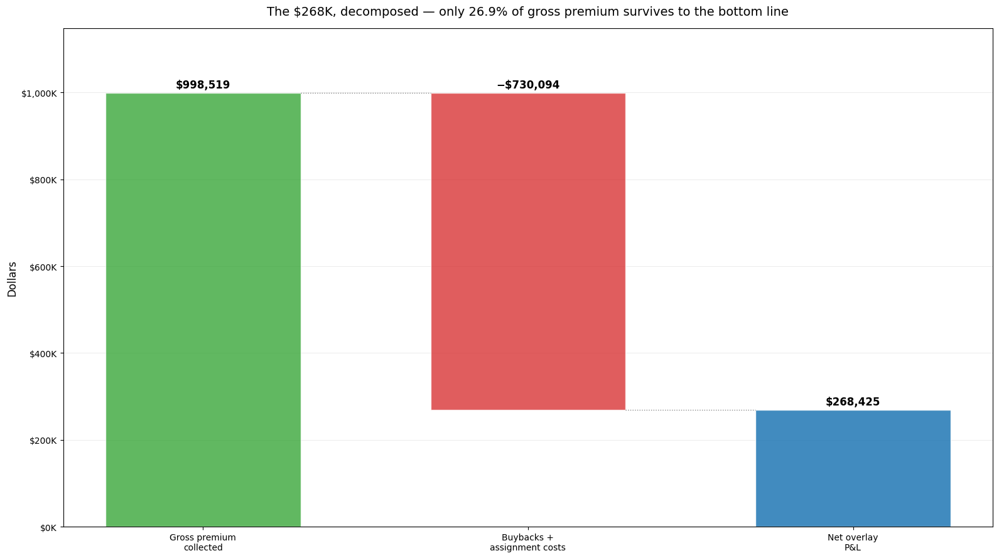

# I Built a Backtest That "Made" $268,000. Then I Proved It Was Luck

*The first skill in quantitative investing isn't finding an edge. It's learning to distrust the one you think you found.*

I ran a simulation last month that turned $100,000 into roughly $1.01 million. Same starting cash, same stock, same ten years — but instead of just buying Microsoft and holding it, I layered a simple options strategy on top, and that overlay alone added **$268,000** beyond what holding the stock would have made. An 81% win rate across 181 trades. On paper, it looks like a money printer.

It wasn't. And the most useful thing I did all month was figure out exactly how I knew that.

*The seduction. This is the chart that sells the strategy: ten years, a real stock, and a line that ends a quarter-million dollars above just holding it. Hold this image in your head — the last post shows you the exact same chart and it means the opposite.*

## What I was testing

The strategy is a **covered call**, and the idea is older and duller than anything you'd see pitched on YouTube. You own shares of a stock. Each month, you sell someone else the right to buy those shares from you at a price above where they trade today. They pay you a small fee — the premium — for that right. If the stock stays put or drifts down, the right expires worthless and you keep the fee. If the stock rockets past the agreed price, you hand over the shares at that price and miss the extra upside.

Think of it as owning a house, renting it out, and also selling your neighbor an option to buy it at a set price. Most months nobody exercises that option, and you just collect checks. Occasionally someone does, and you sell the house for a fair price you agreed to in advance. You're not trying to hit a home run. You're collecting small, frequent payments while the asset does its normal thing.

It's a real strategy that real funds run. I wanted to know: over the last decade, would layering it on Microsoft have beaten just holding Microsoft? So I built a backtest.

## A backtest is a time machine with rules

A backtest is exactly what it sounds like — a time machine with rules. You rewind to a start date, feed your program the price history one day at a time, and force it to make every decision using only the information it would actually have had on that day. No peeking forward. At the end you tally what would have happened.

It is the single best tool an individual investor has for asking "does this idea survive contact with reality?" before risking money on it. It is also, in the hands of anyone motivated to like the answer, a superb instrument for lying to yourself.

## Why most backtests lie

I've come to treat a clean backtest result the way I treat a too-good restaurant review: my first question isn't "how good?" but "who wrote it, and what did they leave out?" Three failure modes cause almost all of the damage, and a backtest can suffer from any of them without throwing a single error.

The first is **look-ahead bias** — letting tomorrow's information leak into today's decision. In a covered-call test, this is as subtle as deciding not to sell an option on a day you happen to know the stock is about to drop. The code looks innocent. The returns look spectacular. The strategy is unrunnable, because in real life you don't know.

The second is **survivorship bias** — testing only the names that lived. Backtest your strategy on Apple, Microsoft, and Nvidia and it will look brilliant, because you've quietly excluded every company whose stock went to zero. The strategy didn't survive the last decade; the stocks you fed it did.

The third, and the one that ruins the most strategies, is **overfitting**. There are several knobs on a covered-call strategy: how far out of the money to sell, how long until the option expires, when to close early. Turn them long enough and you will find a combination that produced enormous returns from 2016 to 2020 — and produces nothing from 2021 on, because you didn't tune a strategy, you memorized the noise in one stretch of history.

Those three corrupt the backtest itself. There's a fourth, different in kind: it corrupts the statistic you'd use to catch the other three. That one is where the series ends — set it aside for now.

I engineered the first one out — every decision uses only past data. The second I don't avoid so much as sidestep: this is one survivor, Microsoft, but survivorship can't bias what I'm actually measuring — the overlay's excess *over the same stock*, where picking a winner inflates both sides and cancels out. Single-stock is still a real limitation, and the finale takes it head-on. The third is where the story turns.

## The number that didn't fit

My backtest cleared the obvious traps. It made every decision using only past data. And it still reported that $268,000 of added profit, with an 81% win rate, over a full decade.

Then I looked at one more line of output — a statistic that asks a different question than "how much did it make?" It asks: *if the overlay added no real value, how often would pure chance hand you a result at least this good over a sample this size?* There's a standard number for that. Above roughly 2, you can argue the result is unlikely to be luck. My backtest came back at **0.46.** In plain odds: if the overlay added nothing, pure chance would still have handed me a result this good or better about two times in three.

Both of these things are true at the same time. The strategy made real money in the simulation, and the evidence that the overlay itself — as opposed to simply owning a stock that went up 646% — added anything is statistically indistinguishable from noise. Microsoft did the heavy lifting. The $268,000 sitting on top of it is the part under suspicion, and the suspicion holds.

It helps to see where that $268,000 even comes from. The strategy collected nearly a million dollars in option premium over the decade — but almost three-quarters of it went right back out the door buying calls back and capping upside on the trades that got assigned.

*The income number that gets quoted in pitches is the first bar. The number you actually keep is the third. The gap between them is the part nobody puts on the slide.*

## Why this is the whole game

Here's the part I want you to take to dinner and explain to someone.

A profit and an edge are not the same claim. A profit is "this made money in this particular run of history." An edge is "this has a repeatable advantage that will probably show up again." Every strategy being sold to you reports the first number in large type. Almost none of them report the second, because the second is usually embarrassing.

The skill that separates someone who can evaluate a strategy from someone who just gets sold one is the reflex to ask the second question — and to ask it hardest about your own ideas, when the answer you want is right there and the math is the only thing standing between you and believing it.

What the exercise produced instead was the more valuable thing: a clear, defensible reason to *not* believe an attractive number I generated myself.

## What's still unanswered

There's a loose end. A 0.46 isn't random — it's roughly what the academic literature predicts when you run this strategy on a single stock rather than a broad index, and the reason why is genuinely interesting. There's also the fourth trap I flagged earlier, and it's different in kind from the first three: those corrupt the backtest, while this one corrupts the statistic you use to judge it. The textbook formula for that statistic quietly assumes something untrue for a strategy held for weeks at a time, and most amateur backtests never correct for it.

The pricing engine comes next — where those option prices came from, and why that's exactly where optimism sneaks in. After that, how you stress-test a strategy against overfitting. The series ends back here: why 0.46 is what the single-stock literature predicts, and that fourth trap in how the number is computed. For now, the takeaway is small and load-bearing: when a backtest hands you a beautiful number, the interesting work hasn't started yet.

---

*This is an educational walkthrough, not investment advice. The full model, the math, and a runnable version are [open-source on GitHub](https://github.com/l3a0/covered-call-backtesting) for anyone who wants to point it at their own stock and try to break it — the next post opens the engine up.*[^1]

[^1]: Everything in this series runs from that code; the numbers above come straight out of its sample output on Microsoft, April 2016 to April 2026.
