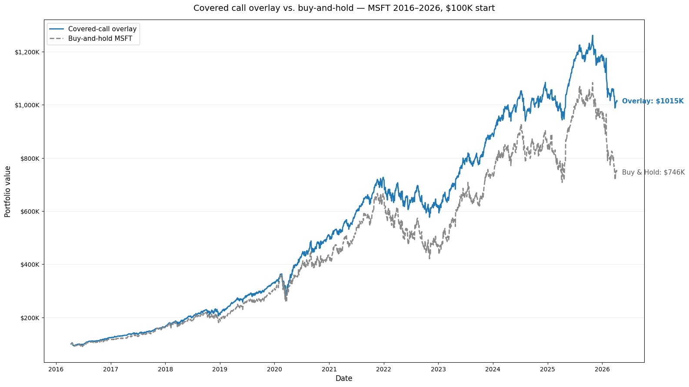
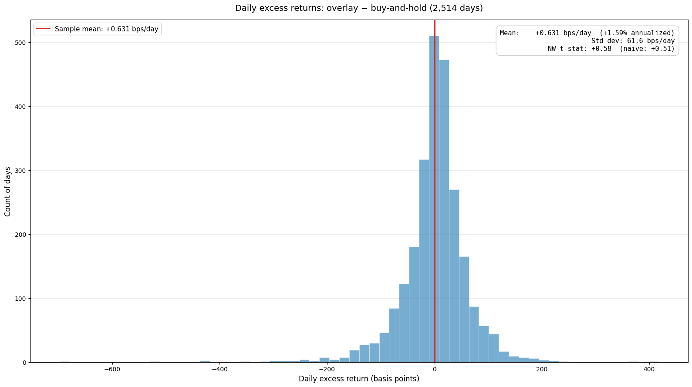

# A Profit Is Not an Edge

*My covered-call backtest made $268,000 and passed every test I could throw at it. One honest statistic still says the edge is indistinguishable from luck.*

Here is the paradox I opened this series with, now stated in full.

The covered-call overlay added **$268,000** on top of buy-and-hold Microsoft over ten years. It kept ~86% of its return when tested out-of-sample with no hindsight. It beat all five hundred scrambled price paths. It shrugged off parameter nudges. It made money in bull, bear, and sideways markets. By the standards most strategies are sold on, it is bulletproof.

And the evidence that the overlay itself added anything — as opposed to riding a stock that happened to go up 646% — is **statistically indistinguishable from zero.**

*This is the exact chart from the first post — same axes, same numbers, same quarter-million-dollar gap. Nothing about the picture changed. Everything about what it means is about to.*

Both of those are true. This post is about the one number that reconciles them, why the textbook way of computing it quietly lies for strategies like this one, and what's left standing once you compute it honestly.

## A profit and an edge are different claims

Start with the distinction the post rests on, because almost every strategy you'll be pitched depends on you not making it.

**A profit** is a statement about one run of history: *this made money on this stock over these ten years.* **An edge** is a statement about the future: *this has a repeatable advantage that will probably show up again.* The first is a fact about the past. The second is a claim about a distribution — and claims about distributions need a measure of uncertainty attached, or they're just storytelling with a dollar sign in front.

The t-statistic is that measure. It asks the second question directly: if the overlay added nothing, and the $268,000 was pure luck, how often would a sample this size hand you a result at least this good by chance alone? Above roughly 2, the answer is "rarely enough to take seriously." Below it, you're looking at noise wearing a nice suit.

The number that matters isn't the overlay's raw return. It's the overlay's return *over the benchmark you'd otherwise hold* — the excess. Stock drift cancels out of that subtraction, which is the entire point: it isolates what the strategy did, separate from what the stock did.

## Why the textbook formula lies here

The formula for a t-statistic that everyone learns is `mean ÷ (standard deviation ÷ √n)`. It is correct under one assumption: that your observations are independent of each other. Each day's result tells you nothing about the next day's.

For a covered-call overlay, that assumption is simply false, and it's worth seeing exactly why. When you sell a one-month call, you hold that same position for twenty-some trading days. Every one of those days, the position's mark-to-market profit is driven by the *same* contract reacting to the *same* underlying stock. Monday's gain and Tuesday's gain aren't two independent draws. They're two readings off one slowly-evolving bet.

Treat correlated observations as independent and you fool yourself about how much information you really have. Thirty days of readings off one option position is not thirty independent facts — it's closer to one or two. The textbook formula doesn't know that. It counts every day as a fresh, independent vote, so it thinks your sample is far larger and your estimate far more certain than it is. In the common case — where holding a position creates *positive* day-to-day correlation — the result is a standard error that's too small and a t-statistic that's inflated, sometimes substantially, occasionally enough to shove a pure-noise strategy across the significance line.

That is a fourth way to fool yourself, on top of the three from the first post — and it strikes at the one number you were trusting to catch the other three.

## Newey-West, in plain language

The fix is a standard-error correction called **Newey-West**. The plain-language version: instead of assuming each day is independent, it measures how much consecutive days actually move together, and widens the error bars to account for the dependence it finds. You end up with an honest estimate of uncertainty — one that knows thirty days of one position isn't thirty independent facts.

It's a well-worn tool. Andrews (1991) and Newey & West (1994) set the framework; it's standard equipment in any serious empirical-finance paper. The engine picks the lag window by their formula and reports both numbers side by side, so you can see what the correction did.

*The correction has one knob — how many days of dependence to look back over. Too few and you miss the dependence; too many and the estimate gets noisy. There's a sweet spot, and the standard formula lands near it without you having to tune anything. That's why "use Newey-West" is a recipe, not a judgment call.*

Here's what it did. The honest version is more interesting than the tidy one. The naive t-stat on the overlay's excess return is **0.40**. The Newey-West-corrected t-stat is **0.46**. The correction barely moved it — and it nudged it slightly *up*, not down.

That deserves an explanation, not a glossover. The textbook danger is positive autocorrelation inflating a naive t-stat toward a fake "significant." This strategy's excess returns happen to carry mild *negative* net autocorrelation instead — the short call's daily mark-to-market partly reverses itself day to day — so here the correction's effect is tiny and runs the other way. The lesson is not "Newey-West rescued me from a fake 2.0." On this sample it didn't have to. The lesson is that **you only know that because you computed it.** The correction is the instrument that tells you which case you're in. Skip it and you're trusting a number that, on a different strategy, would have lied to you confidently.

*What the textbook formula assumes is all-zero. Holding one option for weeks makes these bars non-zero — but here they lean slightly negative, not positive, especially across the eight-day window the correction actually uses. That negative lean is the whole reason 0.40 became 0.46 instead of something smaller.*

Either way the verdict is the same: 0.46, against a bar of 2, and a stricter bar of 3 once you account for having tested twenty-seven parameter combinations to find this one. It helps to put these in the currency statisticians actually use — a *p-value*, the probability pure chance hands you a result at least this good. The bar of 2 is roughly a 1-in-20 event; the multiple-testing bar of 3 is about 1 in 370. This backtest's 0.46 is a p-value near 0.65 — chance alone would match or beat it about two times in three. The edge is indistinguishable from zero, before the correction and after it.

## The honest verdict

So is the strategy worthless? No — and the precise shape of that answer is the part worth getting right.

On an *absolute* basis, the overlay is genuinely good. Its risk-adjusted return — Sharpe ratio against cash — is about **1.12**, versus roughly **0.72** for just buying and holding Microsoft over the same window. Lower volatility, smoother ride, real income. If your alternative were a savings account, this strategy beat it on a risk-adjusted basis and it isn't close.

The t-stat isn't measuring that. It's measuring something stricter and more honest: the overlay's excess return *over holding the same stock*. And on this one stock, over this one decade, that excess is noise. Microsoft did the heavy lifting. The premium income is real, but it's roughly offset by the upside you forfeited every time the stock got called away, and what's left over is statistically a wash.

*This is the $268,000, viewed as the thing the t-stat actually sees: a daily excess pile sitting on zero. The mean is positive by a hair — that hair, compounded over a decade, is the quarter-million dollars. A hair this far inside the noise is not an edge.*

This is not a surprising result, and that's the point. It's almost exactly what the academic literature on the volatility risk premium predicts: the effect is real and harvestable at the *index* level, where it's been measured over many decades, and it's far weaker and noisier on any *single* name, where one stock's idiosyncratic path swamps the premium. A single-stock covered call on a ten-year sample is the setup most likely to show a strong dollar number and a t-stat that can't clear the bar. That's the established finding. This backtest's 0.46 is one specific, well-behaved instance of it.

## The cleanest version still doesn't clear the bar

There's a sharper way to make the point. The overlay's excess return mixes two different things: the volatility premium you're actually trying to harvest, and an equity-timing "wiggle" that comes from the call's delta drifting as the stock moves. That wiggle has zero expected value but a lot of variance — noise you never signed up for, layered on top of the signal you did.

You can hedge it away. Dynamically rebalance the share position so the portfolio's net exposure stays pinned to plain buy-and-hold, and the same calls and the same premium now isolate the premium cleanly. Do that and the Sharpe of the excess return roughly triples — from about **0.13** to **0.46** — and the Newey-West t-stat climbs from the **0.46** we've been living with to about **1.63**, a 3.5× improvement on the unhedged version. And it is *still* short of the t = 2 bar.

It's the single-stock weakness reasserting itself even after you've stripped out every source of noise you can name. The honest path to a confident answer was never a longer single-stock backtest — at this effect size that would take roughly 250 years of data. It's the same framework run on a broad index over decades, which is exactly what the academic literature does.

*Why "just run a longer backtest" doesn't save this. At this strategy's effect size, the expected t-stat crawls upward with the square root of time — the dot is where ten years of Microsoft puts you, and the conventional bar is two and a half centuries away. The fix is a bigger edge, not more years.*

## So what

When someone shows you a strategy's returns, the return is the least interesting number on the page. Ask two questions instead. First: *what's the t-statistic on the excess return over the benchmark I'd actually hold otherwise?* — not over cash, not over zero, over the realistic alternative. Second: *was it computed with a correction for autocorrelation?*

Most marketing decks can answer neither. They report a profit, in large type, over a single favorable history, against no benchmark or a flattering one, with no measure of uncertainty at all. Now you know that's not an oversight. It's the whole pitch — because the honest numbers are usually the embarrassing ones, and the people selling know it.

## What the win actually was

The win was never the $268,000. The strategy didn't have an edge over the thing it was supposed to beat, and four posts of increasingly hostile testing is how I came to know that with confidence instead of suspecting it with hope. The thing I actually built wasn't a money printer. It was an instrument honest enough to tell me, in a single number it had every opportunity to fudge, that the money printer wasn't one.

That instrument is worth more than any backtest it will ever evaluate. Learning to build it, and to believe it when the answer disappoints you, is the entire skill. It's the whole series.

---

*This is an educational walkthrough, not investment advice. The significance code, the full tutorial, and a runnable notebook are [open-source on GitHub](https://github.com/l3a0/trading-strategies) — point it at your own ticker, compute the honest t-stat, and see what survives.*
