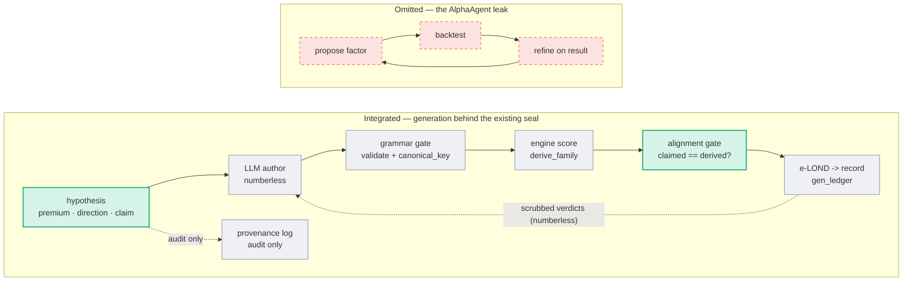

# Integrating AlphaAgent — design plan

> **Status: DESIGN, not yet built.** This plan describes how to fold the useful ideas from AlphaAgent
> ([arXiv:2502.16789](https://arxiv.org/abs/2502.16789), KDD 2025) into this repo's proposer **without**
> importing its central flaw. Nothing here changes promotion: a survivor stays EXPLORATORY until the
> Phase-C time-axis holdout exists ([docs/read_gate.md](read_gate.md), [docs/generative_grammar_plan.md](generative_grammar_plan.md)).

## Thesis

AlphaAgent is the field's closest public cousin to this repo — it explicitly targets "overfitting,
selection bias through p-hacking, and multiple testing" in LLM-driven factor mining. But its **Eval Agent
is a feedback loop**: propose → backtest → *refine on the result* → repeat. That loop is precisely the
leak this repo's numberless oracle exists to forbid — the proposer optimizing against the test. So we do
**not** integrate AlphaAgent's loop. We lift its two genuinely good ideas — **hypothesis-first generation**
and **hypothesis-factor alignment** — run them behind the existing seal, and let our machinery (e-LOND,
content-addressed dedup, the holdout) do the regularizing AlphaAgent does with "ad hoc" patches.

The integration is **additive**: roughly 90% of it is wiring modules we already have; the new code is a
`Hypothesis` schema, an alignment gate, and a hypothesis-first prompt.

## 1. The current system

The Phase-4 proposer is a one-directional spine, sealed at both ends:

1. **LLM author** emits coordinates `{overlay|legs, ticker, params, predicted_sign, reasoning}` from a
   **numberless** prompt (`build_composition_prompt`, `ClaudeProposer`).
2. **Grammar gate** validates against the closed grammar and dedups by `canonical_key`
   (`gate_compositions`, `validate_composition`).
3. **Engine score** runs the overlay and types its mechanism with `derive_family` on the real entry
   signature (`score_composition`, `_entry_signature`).
4. **e-LOND** judges the cell over the lifetime stream and **records** it to `gen_ledger.jsonl`
   (`run_composition_round`, `judge_compositions_against_published`, `evalue_fdr`).
5. The proposer's only feedback is the **scrubbed corpus** — one-bit KILLED/SURVIVED verdicts, never a
   number (the seal: `score_and_record`, `assert_numberless`, `SAFE_FIELDS`).

## 2. The new system

Two insertions, plus one deliberate omission:

- **Hypothesis stage (new).** Before the composition, the author states a falsifiable economic claim
  naming a grammar mechanism. It is generated numberless and rides the provenance log only — it never
  re-enters scoring (the same treatment as today's `reasoning`).
- **Alignment gate (new).** After scoring, the engine's *derived* family (`derive_family`) must match the
  hypothesis's *claimed* family, or the cell is killed as a mismatch. This is the rigorous form of
  AlphaAgent's "hypothesis-factor alignment" — and the direct cure for the foil-paper failure mode (a
  persuasive rationale bolted onto a trade that does something else).
- **Omitted: the Eval-Agent backtest→refine loop.** Importing it would re-introduce in-loop p-hacking.
  Our seal (proposer never sees a result) plus e-LOND already do what AlphaAgent's loop + regularization
  attempt, more cheaply and more honestly.

## 3. Diagram — current vs new



Gray is the current system (unchanged); teal is what this design adds; red is what we keep out.

## 4. Agent mapping

| AlphaAgent agent | What it does | Repo equivalent | Change |
| --- | --- | --- | --- |
| Idea Agent | proposes market hypotheses | *(none yet)* | **ADD** the `Hypothesis` stage |
| Factor Agent | constructs factors + regularizes | `gate_compositions` / `validate_composition` / `canonical_key` | **KEEP**; add the alignment check |
| Eval Agent | backtest → refine in a loop | the numberless oracle + e-LOND + holdout | **REPLACE**; the loop is cut |

## 5. The hypothesis stage and the alignment gate

**The `Hypothesis` schema** (generated numberless):

```text
{ premium_family : VARIANCE | SKEW | TERM | CARRY,   # the mechanism claimed
  direction      : earn | pay,                        # -> predicted_sign
  conditioning   : "<which name / regime, and why>",
  claim          : "<one-sentence falsifiable statement>" }
```

Add `HYPOTHESIS_FIELDS` to the dependency-free `read_gate_wire.py` so the contract is explicit and
`assert_numberless` covers it. Like `reasoning`, the hypothesis is INSIGHT, not EVIDENCE: it is recorded
to `proposal_provenance.jsonl` (lineage-adjacent) and excluded from the ledger, the scrubbed corpus, and
the oracle reply — so a persuasive story can never reach a scoring or feedback sink.

**The alignment gate is oracle-side.** Checking it needs the engine, which the proposer cannot see, so the
proposer *claims* a family blind and the trusted scorer *verifies* it: `score_composition` computes
`derive_family` on the real entry signature and rejects the cell if the derived family differs from the
claimed one. The proposer learns only the one-bit verdict (`KILLED: alignment`), never a number — so even
this feedback is seal-clean. This upgrades the existing mechanism gate from "is the structure coherent?"
to "does the structure do what the author *said* it would?".

## 6. Libraries and modules reused

**Internal (the option-domain integration reuses almost the whole stack as-is):**

| Module | Provides | Reuse |
| --- | --- | --- |
| `read_gate_wire.py` | the seal contract (`assert_numberless`, `BANNED_RESULT_FIELDS`, field allow-lists) | as-is; add `HYPOTHESIS_FIELDS` |
| `evalue_fdr.py` | e-LOND lifetime FDR (`online_fdr_survivors`, `next_flag_threshold`) — AlphaAgent's "regularization", done rigorously | as-is |
| `generative_grammar.py` | `canonical_key` (= AlphaAgent's AST dedup, but exact) + `validate_composition` | as-is |
| `generative_engine.py` | `score_composition`, `derive_family`, `_entry_signature`, `run_composition_round` | extend `score_composition` with the alignment check |
| `edge_search.py` | the numberless oracle + LLM-author plumbing (`ClaudeProposer`, `llm_propose_candidates`, `score_and_record`, `record_provenance`, `build_proposer_corpus`) | extend the prompt + the proposal schema |
| `vol_premium.py` | `structure_greek_signature`, `bs_vega`, `implied_vol` — what the alignment gate checks against | as-is |
| `anthropic` (external, optional) | the Claude SDK for `ClaudeProposer`; or none, via `ClaudeCodeProposer` (`claude -p`) | as-is |

**External (only if extending to the factor domain — not needed for the option integration):**

| Library | License | Provides | Role |
| --- | --- | --- | --- |
| Microsoft Qlib | MIT | expression engine (operator set), data layer, backtest | the factor grammar + engine — replaces `generative_grammar` + `vol_premium` for factors |
| AlphaGen | (permissive) | formula-tree types, bundled `gplearn`/`dso` baselines | a ready tree representation + deterministic search |
| gplearn / DEAP | BSD | genetic-programming symbolic regression | the deterministic factor search (menu-walker analog) |
| alphalens | Apache | factor IC / quantile-return tearsheets | factor evaluation, if not rolling the t by hand |
| zipline-reloaded / vectorbt / backtrader | permissive | backtest engines | alternatives to Qlib's backtest |

**What no library ships (build it yourself, in either domain):** the honest layer — the seal, e-LOND over
a *lifetime* stream, the numberless oracle, the time-axis holdout; for factors additionally a `canonical_key`
analog (formula canonicalization — Qlib evaluates but does not normalize) and the hypothesis-alignment gate.

## 7. Code surface (small, additive)

- `read_gate_wire.py` — `HYPOTHESIS_FIELDS`.
- `generative_proposer.build_composition_prompt` — a hypothesis-first variant (still numberless).
- `gate_compositions` / `score_composition` — parse `{hypothesis, composition}`; enforce
  `derive_family == claimed family` at score time.
- `record_provenance` — record the hypothesis (lineage-adjacent).
- `score_and_record` — unchanged; the hypothesis is excluded from the reply, like `reasoning`.

The deterministic menu-walker stays the default and is untouched (it has no hypotheses). The hypothesis
stage is an enhancement to the LLM-author path only (Phase 4b), OFF by default.

## 8. Phasing

- **H1** — the `Hypothesis` schema + the alignment gate (deterministic, stub-testable behind the existing
  seal). Buildable now; it strengthens the foil-paper defense even with no LLM in the loop.
- **H2** — the hypothesis-first prompt + the Claude author emitting hypotheses (env-gated OFF, like today's
  `ClaudeProposer`).
- **H3** — promotion still gated on Phase C: a survivor stays exploratory until it re-clears the holdout.

## 9. The honest caveat

This upgrades GENERATION — richer proposals and a much stronger, hypothesis-bound mechanism gate. It does
NOT upgrade CONFIRMATION: a survivor still needs the time-axis holdout, which does not exist. So H1 is worth
building (the alignment gate alone is a real strengthening of what we have), but it is front-end polish on
a harness whose binding constraint is still Phase C. Build the holdout first or in parallel; the most
useful thing AlphaAgent gives us is not code to integrate but a control group that shows exactly what the
seal buys.

_Last updated: 2026-06-26._
