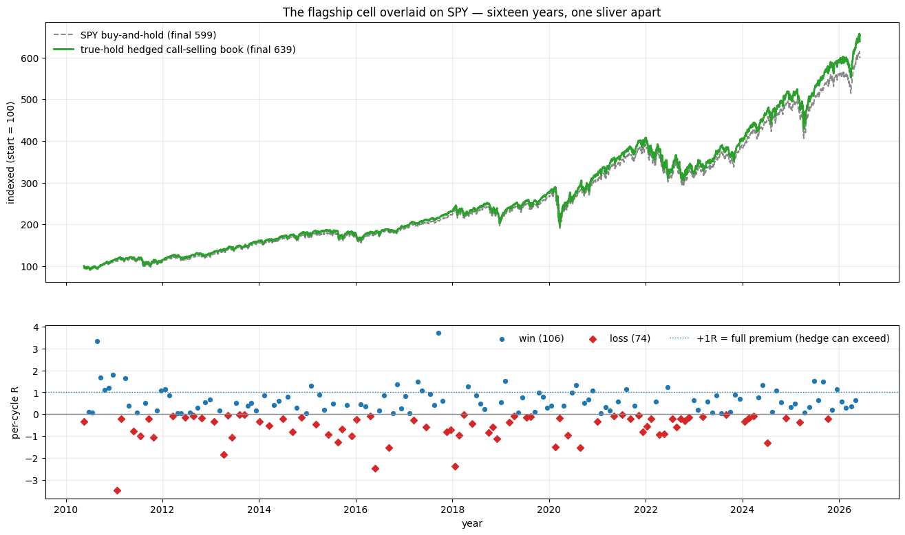
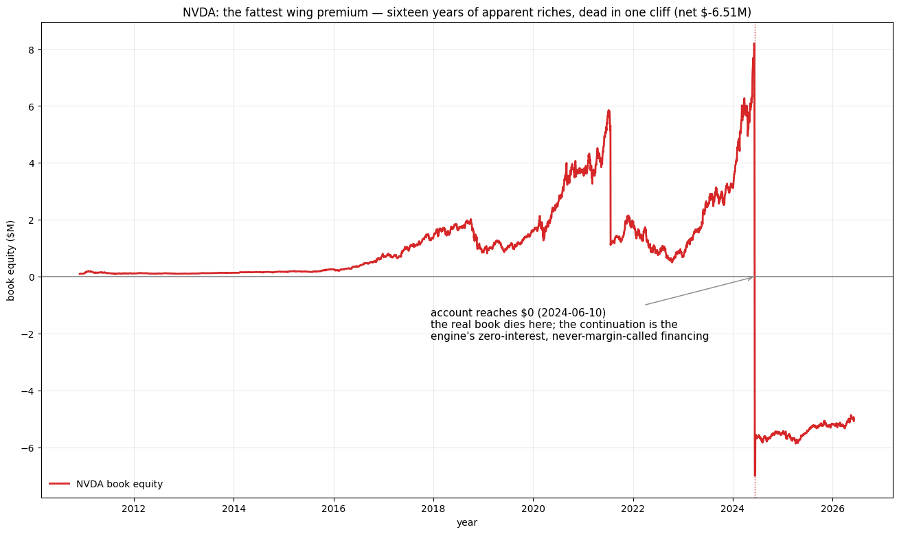
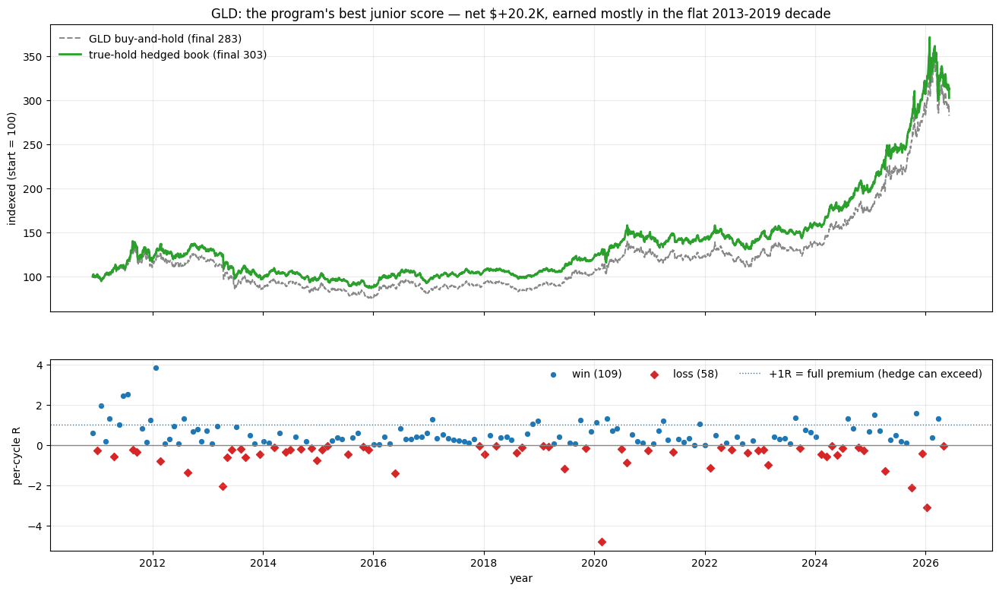

# Exploration log — ideas that didn't survive

This is the repo's record of **dead ends**: cheap kill-gate scouts on strategy
ideas that were measured and rejected, kept so they aren't re-explored from
scratch.

**Read this first — what these are and aren't.** Most entries are
*exploratory scouts*; one is a real-chain *robustness check* on a
published refinement. Neither is a registered experiment. Each runs on data
that has already been used, so it **spends the sample**: it can only *kill* an
idea or *justify* taking it to a pre-registration. It is never itself a
confirmatory verdict. The numbers are pinned (`tests/test_explorations.py`, or for
the real-chain check `tests/test_real_cc_backtest.py`) so a dead end stays settled
and so a future change can't silently revive a buried result — but pinning a
result does **not** promote it to a registered finding.
That line is the whole point of [the pre-registration discipline](prereg_trend_gate.md):
a result that conditions on outcome data it also generated cannot claim a
p-value. A scout that *passes* would earn a registration, not a headline.

The recurring lesson across the entry-conditioning scouts: **conditioning
call-selling entry on recent upward price action has the sign backwards on
these names.** The
damage a covered-call seller takes comes from the sharp *rebounds* out of
selloffs (2020-03, 2025-04) — moves the signal reacts to *after* they've
happened, not ones it anticipates. Every gate built on "the stock just went
up, so be cautious" therefore skips the wrong cycles.

---

## Post-rip cooldown — KILLED (2026-06-13)

**The idea.** After a "rip" that causes a deep-in-the-money buyback or a
loss-making assignment, suspend covered-call selling for N days, then resume.
The intuition: a rip means the stock is running, so sit out the continuation.

**How it was tested.** A two-part scout on the naked baseline runs
(`run_real_cc_overlay`, published params) pooled across MSFT / QQQ / SPY — 705
cycles, 243 rip triggers, on the clean canonical chains (`CHAIN_CLEAN_START`
era clip applied; SPY on the corrected 2010-05-17 boundary). Both parts pinned
in `TestCooldownScout`.

1. **Does the mechanism exist?** For each cooldown horizon N, tag every cycle
   as *post-rip* if it was entered within N days of a prior rip **on its own
   ticker** (per-ticker — a rip on one name can't cool down another), and
   compare the per-cycle P&L of post-rip cycles to the rest:
   `D_A = mean(post-rip) − mean(other)`. The hypothesis predicts `D_A < 0`
   (post-rip entries do worse). A seed-pinned trigger-placement permutation
   (1,000 draws) gives the null.

2. **Is there a length to set?** On the price series alone (no strategy P&L),
   measure the forward return after the actual rip dates versus the
   unconditional baseline, and the daily-return autocorrelation — the "memory"
   a cooldown would need to ride.

**The verdict — wrong-signed, and no memory to time it to.** `D_A` is
**positive at every horizon** — post-rip cycles *lose less*, the opposite of
the hypothesis — and the real arrangement sits in the high tail of the
permutation null, never the low tail a real effect needs:

| Cooldown N | D_A (per cycle) | permutation percentile |
| --- | --- | --- |
| 7d | +$57 | 0.56 |
| 30d | +$376 | 0.94 |
| 60d | +$623 | 0.95 |
| 90d | +$1,770 | 1.00 |

And there is no return memory to anchor a cooldown length to: forward returns
after a rip are **below** baseline at every horizon (−0.46pp at 21 trading
days widening to −1.06pp at 120), and the pooled daily-return lag-1
autocorrelation is **−0.126**. A rip is a weakly *mean-reverting* event, not a
momentum-igniting one — so the window after it is, if anything, a slightly
*safer* time to sell, and any nonzero N is pure abstinence.

**The trap this avoids.** Skipping post-rip cycles "improves" net P&L by
+$157K (N=7) rising to +$451K (N=180) — but only because the naked strategy
loses money, so skipping any growing slice of cycles helps regardless of
skill. Sweeping N against net P&L and picking the best would have "found" a
brilliant long cooldown that is nothing but *not trading*. The per-cycle
`D_A`, immune to that abstinence confound, is the honest statistic — and it
says no.

**How to determine the cooldown length** (the question that motivated the
scout): you don't search for it — you measure the memory of the rip in the
return series, and that measurement either hands you N or tells you none
exists. Here it told you none exists.

---

## IV-richness gate — KILLED (2026-06-11, pinned 2026-06-13)

**The idea.** Sell a call only when its implied volatility is *rich* relative
to recent realized volatility — the classic volatility-risk-premium play. If
options are systematically overpriced, gate entry to the rich days and harvest
the premium.

**How it was tested.** For each naked cycle, read the entry contract's vendor
implied volatility (the engine's loader discards the IV column as unreliable,
so the scout reads it directly, with a fail-closed IV < 0.05 floor for the
lattice/placeholder rows). Pooled across MSFT / QQQ / SPY — 694 cycles carry a
usable entry IV. Three measurements, all pinned in `TestIvRichnessScout`:

1. **Is there premium to harvest?** The ex-post VRP at the sold ~25-delta /
   30-day contract = entry IV minus the realized vol over the option's life.
2. **Does the signal predict P&L?** The rank-correlation (Spearman) of entry
   richness — entry IV minus trailing realized vol, the thing you'd gate on —
   against cycle P&L.
3. **Does a rich/not split separate outcomes?** A binary `D_A` on
   IV > trailing-RV, with a permutation null.

**The verdict — no premium to gate on.** The three measurements:

| Measurement | Value | Reading |
| --- | --- | --- |
| Ex-post VRP at the sold contract (median / mean) | −0.27% / −2.30% | ~0 — options not systematically overpriced |
| Spearman(entry richness, cycle P&L) | +0.03 | richness doesn't predict P&L |
| Binary IV>RV split, `D_A` | +$646/cycle (95th pct) | looks like signal — but see below |

The one positive-looking number is a **confound, not a premium.** "Rich"
entries (IV above trailing realized vol) cluster where trailing vol is *low* —
mean trailing RV 0.15 for rich entries vs 0.23 for the rest — i.e. in calm
markets, where covered calls do better regardless of any volatility premium.
With the ex-post VRP at \~0 and the rank-correlation at \~0, the binary split
is gating on the *vol level*, not harvesting a premium. There is no
volatility-risk-premium edge to condition on at these strikes on these names.

---

## Delta-hedged covered call on real chains — KILLED (2026-06-14)

**A different kind of dead end.** The scouts above kill *entry-timing* ideas.
This one kills a *P&L-reconstruction* refinement, and it's the only entry here
whose victim was a **published** number rather than a prospective hypothesis.
Blog post 6 had already flagged that the proxy's delta-hedged t-stats (MSFT
1.63, QQQ 1.58) "need re-measuring against real quotes before they mean
anything"; this entry is that measurement. It is pinned in
`tests/test_real_cc_backtest.py` (`TestMsftRealRiskManagedRegression`,
`TestQqqRealRiskManagedRegression`), not `tests/test_explorations.py`.

**The idea.** Delta-hedge the covered call (Israelov & Nielsen, 2015): each day
hold extra long stock equal to the short call's delta × base shares, pinning
the portfolio's net delta at the buy-and-hold level. This strips the
equity-*timing* swing the short call injects — variance that adds no return —
and should leave the pure volatility-risk premium the call sale harvests. On
the **synthetic** IV-proxy engine it was the strongest refinement the proxy
produced: it lifted the overlay's Newey-West t-stat from 0.46 → 1.63 on MSFT
and 0.10 → 1.58 on QQQ (MSFT's lift quoted in blog post 4, QQQ's in post 5;
pinned in `TestMsftRiskManagedRegression` / `TestQqqRiskManagedRegression`).

**How it was tested.** Re-run the identical hedge on **real option premiums** —
`run_real_cc_overlay(..., delta_hedge=1.0)` over each name's clean canonical
chain (2016-06 → 2026-06, bid/ask fills) — and re-measure the excess-return
Newey-West t-stat. A proxy twin runs on the same unadjusted price series, so
the real-vs-proxy gap isolates the only thing that changed: where the option
price came from.

**The verdict — the edge was a proxy artifact.** On real premiums the hedged
excess falls to noise of zero on both names; the proxy's t-stat does not
survive:

| Ticker | Proxy twin NW t (same series) | Real NW t — bid/ask | Real NW t — mid | Hedged net overlay (real) |
| --- | --- | --- | --- | --- |
| MSFT | +1.76 | −0.23 | +0.73 | −$82.4K |
| QQQ | +1.52 | +0.18 | +0.30 | −$14.9K |

The proxy was minting premiums richer than the market paid (\~1.6× on MSFT), so
the premium the hedge "isolated" lived only in simulation. The hedge still does
its mechanical job on real chains — identical trades, excess vol cut
(MSFT 6.64% → 4.80%, QQQ 5.30% → 3.06%), and it removes the naive run's
near-significant directional *harm* (MSFT −1.73 → −0.23, QQQ −1.78 → +0.18).
What it cannot do is conjure a premium that isn't there. The price is paid in
tail risk: max drawdown *rises* under the hedge (MSFT 41.00% → 44.34%,
QQQ 38.22% → 40.92%), because the extra stock sits on negative cash — a levered
long in selloffs.

**Same conclusion as the IV-richness scout, from the other side.** That scout
measured the *statistical* premium — ex-post IV minus realized vol at the sold
contract — and found ≈0. This builds the strategy that would *capture* that
premium and earns nothing significant. The statistical premium is absent and
the capturable premium is absent: no harvestable volatility-risk premium at
these strikes on these names, at real quotes.

---

## Exit variants on the SPY short vol — MEASURED, no sign flip (2026-07-14)

**The idea.** Experiment 4 of the Van Tharp test plan
([van_tharp_gap_e.md](van_tharp_gap_e.md)): hold the pinned 0.25Δ/30-DTE SPY
short-vol entry fixed and vary only the exit — profit target, premium-multiple
stop, time exit — over the six-variant grid pre-committed in the design doc.
Does the exit change per-cycle expectancy, and does a stop truncate the
negative-skew MAE tail?

**How it was tested.** Six engine re-runs on the registered-span SPY chains
(`REGISTERED_CLEAN_START`), one exit knob at a time, measured through the Gap A
R-multiple ledger and the Gaps C+B intratrade ruin replay at f = 2%. The prior
was pre-stated from the pinned covered-call stop verdict
(`TestMsftStopLossRegression`: whipsaw machinery — worse at every level).
All seven runs (baseline + six variants) pinned in
`TestSpyExitVariantExploration` (tests/test_vol_premium.py).

**The verdict — the prior held in half.** No variant flips the sign: baseline
−0.54R per cycle, every variant still negative — exit choice moves risk shape,
not sign, so nothing here is an edge. But on the *delta-hedged* short call the
2× stop is **not** the CC's whipsaw machinery: expectancy improves to −0.18R,
the worst intratrade excursion truncates from −11.41R to −3.12R, and intratrade
P(ruin) at f = 2% falls from 0.992 to 0.835. The mechanism difference: the CC's
stop fired into an unhedged trending stock and re-sold into the same rally; here
the daily delta hedge has already absorbed the trend, so the stop's whipsaw cost
is smaller than its tail protection. The profit targets recycle faster and
improve expectancy but *deepen* the worst MAE-R (early-banked winners leave the
tail landing on smaller open premiums — −23.6R at the 50% target).

**The trap for the future.** A better-shaped negative game is still a negative
game: the improved stop numbers are exploratory, convention-flattered (daily-close
stop-market, all-legs-quoted triggers under-fire), and sit on a sample the
baseline already spent. Any promotion runs through the design's E3 gate — a
human-signed grammar widening and a registered cell — never from this entry.

---

## Random entry-day jitter on the SPY short vol — MEASURED, no exclusion (2026-07-14)

**The idea.** Experiment 2 of the Van Tharp test plan
([van_tharp_gap_f.md](van_tharp_gap_f.md)): Tharp's random-entry thesis, mapped to the timing axis this
engine actually has. Replace the deterministic enter-immediately-when-flat cadence with a random wait
(`J ~ uniform{0..10}` chain-days per flat stretch), keep the strike rule, hedge, exits, and sizing
fixed, and locate the pinned delta-targeted baseline inside its own 20-career random band.

**How it was tested.** `random_entry_scout` — 20 pre-committed seeded careers
(`RANDOM_ENTRY_SEED = 20260714 + i`) plus a baseline re-run through the same harness, each career the
short_vol spec verbatim with only the selector swapped (zero engine changes: the jitter is a stateful
closure through the existing `select=` seam, delegating the pick to the baseline selector itself).
Measured through the Gap A ledger (per-trade `expectancy_r` primary) and `short_vol_statistics` (hedged
NW t, secondary — jittered careers hold more flat days, a mechanical dilution). All pinned in
`TestRandomEntryScout`; the selector mechanics, including the k=0 baseline-identity anchor and the
emission-keyed desync convention, in `TestRandomEntryMechanics`.

**The verdict — no envelope exclusion, two locates.** The prior said the baseline sits inside the band,
with the cooldown texture naming a possible upper-tail mechanism. Neither exclusion happened, and the
named mechanism is not supported: on raw per-cycle `expectancy_r` the baseline (−0.5407R) sits at the
**5th percentile** — worse than 19 of 20 jittered careers, the opposite tail — while the hedged NW t
(+2.54) sits inside at the **85th** (band 0.98–3.58). The informative fact is the band itself: the same
strategy at date-shifted entries spans −0.58R to −0.03R per cycle on the raw option-cycle basis
(placement-fragile), while the hedged premium measure stays in a band containing the baseline
(placement-robust). Career trade counts 141–147 vs the baseline's 174.

**The trap for the future.** Do not read the 5th-percentile locate as "jitter improves the strategy."
The raw option-cycle basis excludes the hedge (the covered-call lesson in reverse); on the hedged basis
the baseline is unremarkable inside its band; a 20-career locate carries no significance; and no
mechanism is on record — the one pre-stated mechanism predicted the opposite tail. Any
entry-timing idea built on this locate is a new exploratory scout under the usual rails, and the
placement-fragility of raw per-cycle expectancy is itself the reusable lesson: per-cycle raw numbers on
this overlay move materially with entry-calendar placement, so treat any single career's raw expectancy
as one draw from a wide band.

---

## Portfolio combos on the pinned overlays — MEASURED, neither claim survives (2026-07-14)

**The idea.** Experiment 6 of the Van Tharp test plan
([van_tharp_gap_g.md](van_tharp_gap_g.md)): Tharp's two portfolio claims on the pairs this repo owns.
Combo A — noncorrelated systems (the MSFT covered call's equity beta vs the SPY delta-hedged short
vol), 50/50: does variance reduction earn a negative-edge leg its place on the risk-adjusted metric?
Combo B — independent markets (the same short-vol system on SPY/QQQ/MSFT), one-third each: do more
markets improve the whole?

**How it was tested.** `portfolio_scout` — four leg re-runs at pinned coordinates with an internal
drift alarm asserting each leg's published headline pins first (the three short-vol NW t's; the CC
leg's overlay P&L and excess NW t), then the harness (`common/portfolio.py`): inner-join
alignment, per-capital daily P&L over zero-yield cash (structure legs rf-netted by the `rf_credit`
column switch), pairwise Pearson, pre-committed weights, one fixed-base drawdown definition. All
pinned in `TestPortfolioCombos`; the harness mechanics in `TestPortfolioMechanics`.

**The verdict — both expected verdicts held; neither claim survives on these legs.** Combo A's correlation is
genuinely low (0.1975 — beta vs vol premium, as constructed), but the dead leg earned nothing:
combined NW t 1.54 vs the better leg's 2.47, and the combined percent-of-peak DD (34.31%) sat ABOVE
the 50/50 weighted average (24.04%) — the dollar-space subadditivity guarantee did not survive the
percent transform, because the CC leg's compounding stock position dominates the book's later, larger
peaks. Combo B: SPY\~QQQ correlation 0.656 (the shared vol factor — these markets are not that
independent), and one pinned-negative leg plus that correlation left the combined NW t at 1.01 vs
SPY-alone's 2.56 — killed as pre-stated. The DD gap subadditivity IS visible in Combo B (19.53% vs
27.07%), where no leg compounds stock.

**The trap for the future.** Two, both mechanical. First: percent-of-peak drawdowns on mixed books are
treacherous — a compounding leg's grown peaks re-weight the whole comparison, so "diversification
lowers drawdown" can flip sign under the percent definition while holding in dollars; any future
portfolio claim must state its DD definition before running. Second: low correlation is necessary but
nowhere near sufficient — Combo A had the low correlation Tharp's lesson wants and still failed both
verdict metrics, because no amount of variance reduction rescues a leg whose drift is the wrong sign.
Diversification arithmetic multiplies whatever expectancy the legs supply — negative included (the
Loc 3791 lesson, portfolio edition).

---

## Exit variants + defined-risk sizing on the SPY call credit spread — MEASURED, three findings (2026-07-18)

**The idea.** Widening 5's sections 6–7
([call_spread_widening_plan.md](call_spread_widening_plan.md)): on the pinned
SPY call-credit-spread campaign cell (30 / 0.25Δ / 0.10Δ, campaign
coordinates), run the pre-committed exit grid — three stops, two targets, the
21-DTE time exit, both brackets — and the Gap C+B sizing sweep on the
`defined_max_loss` risk basis (R = width − credit, its first honest use). The
committed question the defined-risk structure makes new: does a stop add
anything **on top of the structural width cap**, or just pay whipsaw for
redundant protection?

**How it was tested.** Nine engine runs (hold + eight variants), each reduced
through the Gap A ledger and the intratrade ruin replay at f = 2%; the sweep at
the Tharp fractions with the Kelly reference; and a percent-volatility
comparison arm (position scaled by median-normalized trailing 30-day RV at
entry, matched average exposure). All pinned in
`TestCallSpreadExitSizingExploration` (tests/test_vol_premium.py).

**The verdict — three findings.** (1) **No sign flip, again**: every variant's
expectancy stays negative (hold −0.14R, best variant −0.05R) — the third
independent confirmation that exit choice moves risk shape, not sign. (2) **The
stop earns its keep even above a width cap — and charges the alpha stream for
it.** The cap bounds the *settlement* at \~1R, but the ride is unbounded below
it: hold-to-expiry careers touch −1.007R marks and 10.5% of f = 2% careers
breach 50% drawdown. The 1.5× stop truncates the worst excursion to −0.458R
and takes intratrade P(ruin) to **0.000** — while worsening the hedged excess
(NW t −0.64 → −1.89: more cycles, more friction). Protection, priced; never
edge. (3) **The practitioner brackets destroy the book by churn**: 562–598
round trips turn +$57K of raw P&L *negative* (−$3.0K / −$1.1K, t \~ −5.3).
`bracket75`, killed as a lattice choice in the registered experiment, is
killed a second way here. Sizing: the defined-risk sweep runs P(ruin)
0 / 0 / 0 / 0.105 / 0.692 across the Tharp fractions against the naked
short-vol book's pinned 0 / 0.121 / 0.849 / 0.991 / 0.998 (cross-basis,
qualitative) — **the width cap is worth roughly an order of magnitude of ruin
at practitioner fractions**. Kelly = 0 on the negative bag, terminal medians
monotone-declining — every positive fraction still loses long-run. And
**Tharp's percent-volatility model is redundant on defined risk** (0.144 vs
0.105 at f = 2%): the R unit already normalizes the risk; vol-scaling the
size just adds dispersion.

**The trap for the future.** The stop numbers are convention-flattered
(daily-close stop-markets, all-legs-quoted triggers under-fire) and sit on a
cell the campaign already spent; the ruin collapse is a property of *defined
risk*, not of this strategy having merit — the bag is still negative. Any
promotion runs through a registration, never from this entry.

## The Tharp/Basso random-entry replication — SENTENCE FAILS, MORAL FAILS (2026-07-18)

**The idea.** Replicate Van Tharp's flagship experiment
([tharp_random_entry_plan.md](tharp_random_entry_plan.md)) at his own
coordinates — coin-flip direction, 3×ATR(20) trailing stop, 1% percent-risk
sizing, always-in — on the repo's nine-ticker basket over 2000–2026 (a span
with two real bear markets), then subject it to the four nulls his era never
ran. Phase 1 tests his *sentence* ("it made money consistently"); Phase 2
tests his *moral* ("exits and sizing carry the system").

**How it was tested.** 100 seeded careers (`20260719+i`) through
`engine/tharp_random_entry.py` (16 hand-derived mechanics tests green before
any ensemble ran), measured in his own R units; then the drift twin, a
1,000-career structure-matched placebo-exit family, the fixed-hold no-stop
control, and the Gap C+B sizing replay at the median career length. All
pinned in `TestTharpReplicationEnsemble`.

**Phase 1 — the sentence fails, the shape survives.** Only **54% of careers
have positive expectancy and 40% end above starting capital**; the median
career *loses* (final $89,410 on $100K over \~26 years; worst $33,609). Yet
the trend-follower signature is exactly as he describes — 36.4% win rate,
1.75 payoff ratio — riding a **zero-expectancy bag** (+0.0011R pooled over
195,900 trades). The mechanism produces his shape without his profits: what
made money in his era was the era, not the machinery.

**Phase 2 — every null wins.** The trailing stop manufactures a
**+25%-of-capital average long tilt out of coin flips** (the endogenous-tilt
prediction, confirmed), and the drift twin holding just that average
exposure **beats the live system in 98% of careers** (twin median +$80,654
vs system −$10,590 — the system's trading destroys \~$91K of the drift it
captures). The real trailing stop sits at the **44th percentile of
skill-free placebo exits** (P = 0.44 — no mechanism), and the no-stop
control is indistinguishable. Sizing: at **his own 1% risk** on the
zero-edge bag, P(ruin) = 0.32 and P(25% drawdown) = 0.70 with median
terminal 0.853; the Kelly fraction is **0.0006 — seventeen times smaller
than the fraction he taught**. Exits and sizing did not carry the system;
drift did, and the exits threw most of it away.

**The trap for the future.** This does not prove Tharp wrong *in his era* —
diversified futures in the 1970s–90s were a different regime, and the
replication is scoped to this basket, span, and cost model (ETF borrow,
EOD stop-markets, effective breadth \~5–6). What it kills is the *portable*
version of the claim — that random entries plus trailing stops plus
percent-risk sizing constitute a system on liquid modern assets. They
constitute a costly way to hold a drifting basket. Any follow-up (his era's
futures, other stop multiples) is a new design, never an edit of this one.

## The SPY covered call in R-multiples — THE LOSS IS THE DIRECTION BILL (2026-07-19)

**The idea.** The frozen design in
[spy_cc_r_experiment_plan.md](spy_cc_r_experiment_plan.md): re-measure the
SPY covered call in one consistent R-multiple frame — Book U (the plain CC,
0.25Δ / 30 DTE / 0.75 close) and Book H (the same run delta-hedged, the
engine's Israelov-Nielsen path — the missing third ticker of the
risk-managed re-measurement after MSFT −0.23 and QQQ +0.18) — on identical
cycles, with the hedge's share P&L attributed *into* each cycle's R (fixing
Gap E's raw-option-cycle seam), plus the 3×3 exit grid, the sizing battery,
and Tharp's six-market-type read. Seven priors were committed in the plan;
contradictions are findings.

**How it was tested.** Twenty engine passes (`realchains/cc_r_experiment.py`):
the 3×3 exit grid × both books on the live span (2010-05-17 → 2026-06-05,
4,039 days), baseline cells on the frozen registered span for comparability
with the +2.54 short-vol pin. Every cycle's P&L re-derived from the daily
overlay-excess path (`attribute_cycles`) under two asserted invariants —
excess flat outside cycle windows, and Book U's attribution reproducing the
engine's own per-trade P&L — so Book H's hedge-inclusive R stands on a
helper validated against the engine, not on trust. (On the real books the
cycles tile the span back-to-back, so the flatness rail is exercised by the
synthetic tests; the Book-U per-cycle identity is the rail that bites on
real data, and it holds on all nine unhedged cells.) All pinned in
`TestSpyCcRExperiment` (tests/test_cc_r_experiment.py).

**The verdict — the decomposition closes to the dollar.** Book U loses
**−$124,197** (−0.30R per cycle, 65% wins, trade-order t −3.49, daily NW t
−1.78). Book H ends at **−$1,401** — statistically and economically zero
(−0.0001R, daily NW t +0.41). The hedge's share P&L is **+$122,796**, and
U = H − hedge to the dollar: the SPY covered call's entire sixteen-year loss
is the direction bill, and the insurance book underneath is breakeven.

**How a buy-high/sell-low rebalancer *gains* $122,796.** The hedge buys
shares as the market rises (delta climbing) and sells as it falls — a
pattern that loses on every round trip, and the toll is real: the bill (the
plan's frozen `R_U − R_H`) is *positive* in 62% of cycles (median +0.58R) —
the chop cycles, where the hedge bled whipsaw and the plain book came out
ahead. But the pattern is also always **net long** — it holds the short
call's delta in shares, between 0 and 1, never short — and a long-on-average
position collects the market's drift regardless of its rebalancing tempo.
Over a span in which SPY multiplied \~6×, the drift ride dwarfs the toll:
buying high only hurts if the price comes back, and SPY's didn't. Net, the
bill runs **−0.30R per cycle**, many R deep in the rally cycles that decide
everything — the covered call is short exactly the lumps, the same
lumpy-drift texture as every other verdict in this log. And the +$122,796
is not a trading profit in any meaningful sense: the hedge mirrors the short
call's delta, so it gains almost exactly what the call's direction exposure
loses in each rally — it doesn't beat the market, it **un-bets the bet**,
which is why subtracting it from Book H reproduces Book U to the dollar.
The price of the bet was $122,796. SPY's risk-managed cell joins the family near zero (+0.41 live /
+0.42 frozen): the exploratory +2.54 does **not** carry into the CC frame.
The reconciliation, itemized — same option, same daily delta hedge, three
wrapper differences: (1) **the exit rule**, worth roughly half the gap
(+0.41 → +0.79 at hold): the CC frame takes profit at 75% and force-buys
deep-ITM calls back *into rallies at the ask*, where the short-vol overlay
rides every cycle to settlement; (2) **the yardstick**: `short_vol_statistics`
answers "did the option book beat cash, rf netted," `compute_statistics`
answers "did the hedged book beat the stock, zero-interest" — two
estimators, two questions, t-stats not interchangeable across them;
(3) **the cadence**: 325 round trips here vs the short-vol book's 174, each
paying the bid/ask toll. Two smaller items pull opposite ways. Uncredited
hedge-share dividends bias the CC frame *down*: the missing dividends on
*base* shares cancel against a benchmark holding the same shares, but hedge
shares are extras the benchmark never holds, so their lost dividends
(an unpinned \~$12K-order estimate on the comparable MSFT span) understate
a book whose entire P&L is −$1,401. And the +2.54 pays a **0.5 bp hedge
fee** — $5 of friction per $100K of hedge shares traded, the half-spread
toll — which the CC frame charges at zero, so the +2.54's honest form is
**+2.25** (that is a row of [vol_premium.md](vol_premium.md)'s pinned cost
curve, not a new measurement: +2.25 @0.5 bp, −0.35 @5 bp). Both
corrections *narrow* the gap: one small premium, two convention stacks. The
proportion lesson, next to the entry-jitter band already on record
(0.98–3.58): **a robust edge does not halve when the profit-take convention
changes — this premium does, so it is convention-sized**, smaller than the
measurement choices around it. That fragility is a finding, now also
recorded as limitation 5 of [vol_premium.md](vol_premium.md).

**Priors, scored.** (1) Book U negative everywhere — confirmed, all nine
cells (−0.13R to −0.30R). (2) The MSFT stop-whipsaw verdict **does not
replicate per-cycle on SPY**: stops *improve* Book U's expectancy (−0.30R →
−0.16R at 1.5×) and truncate the worst cycle (−6.58R → −2.48R) — but cycle
count balloons 325 → 573, the dollar total barely moves (−$124K → −$118K),
and the trade-order t **worsens** (−3.49 → −4.75): smaller, more frequent,
more *consistent* losses. Expectancy-per-cycle and dollars disagree because
stops manufacture cycles; read the dollars. (3) Gap E's hedged-stop
improvement does not replicate in the CC frame: on Book H the stops shave
expectancy at every target. (5) "No variant flips a sign" held for U and
failed trivially for H — H's baseline sits at zero, so the hold cells tip
positive. (6) Kelly = 0 on both baseline books. (7) **Hedging flattens the
regime structure** — floor-cell spread 0.68R → 0.24R — and Book U's death
cell is `bull_quiet` (−0.617R over 169 cycles, 52% of the book: the QQQ
pattern replicated on SPY), which the hedge *flips positive* (+0.150R): the
calm bull grind stops being the loss engine the moment direction is removed.
Sizing: the unhedged R-stream is catastrophically un-sizable (P(ruin) 0.91
at f = 1%, 0.997 at 2%; kelly 0), the hedged stream is merely pointless
(ruin ≈ 0, terminal median < 1); the overwrite dial on Book U walks
monotonically up toward buy-and-hold ($474.7K → $567.8K at 25% overwrite vs
$598.9K for none) — every step less covered call is a step richer — while
Book H's dial sits a whisker under buy-and-hold at every ratio (there is
nothing to dial on a breakeven overlay).

**The §8 escalation, recorded loudly.** Two hedged hold cells clear the
pre-committed bar — `close1.0` at +0.1186R (trade-order t +2.26) and with
the 2× stop +0.0961R (+2.57). The flag is a **doorbell, not a verdict**:
the bar exists so a promising cell can neither be quietly believed nor
quietly buried — it must surface, on the record, for a human decision. Per
the plan they **escalate to a human-signed registration proposal, and
nothing else**: the daily NW t — the
repo's sole significance authority — reads +0.79 and +1.08 there, and these
cells are the known SPY call-wing exploratory premium (the +2.54 family)
wearing covered-call clothes, measured on a trade-order statistic the
ledger's own docstring bars from gating. (Why the two scores can disagree on
the same P&L: the trade-order t grades each cycle's single endpoint,
equal-weighted per premium dollar, on a trade-index clock; the daily t
grades every day's actual dollar path — the swings inside cycles, the true
position sizes, the real calendar. Tidy endpoints, noisy journey. The full
two-judge rationale, and why the hierarchy is frozen rather than argued
per-result, lives in [van_tharp_gap_a.md](van_tharp_gap_a.md).) Two further deflators: these are the
**best two of eighteen** recipes — a pre-committed bar disciplines *conduct*
(the flag can't be dodged or invented after the fact), but it does not
un-flatter the winners of a grid, which is precisely the selection bias a
fresh registration exists to test through; and they are re-observations of
a premium whose entry-date jitter alone spans 0.98–3.58. One honest arrow
the other way: the hedge-dividend omission biases these cells *down*, not
up. If pursued, the proposal is a registration of the delta-hedged
hold-to-expiry call program on SPY, judged by the daily authority — not a
promotion of this entry.

**The trap for the future.** The stop cells' conventions still flatter stops
(daily-close stop-markets, all-legs-quoted triggers), the deep-ITM close
(delta > 0.70) was an engine invariant in the original grid — the addendum
below made it the `manage_deep_itm` knob, so only cells without `_noitm` in
their key carry it, and `close1.0_noitm` is a literal hold-to-expiry — and
the per-cycle R improvements under stops
are a denominator effect, not recovered dollars. Two hedged-book accounting
notes travel with the pins: hedge-share dividends are uncredited (biasing
Book H and the hedge P&L *down*), and the span includes the pre-2015
Saturday-expiry era, where the hedge unwinds Monday against a Friday-settled
option — one weekend of hedge exposure per such cycle (these are the first
pinned hedged runs to span that era; the engine's convention note says so).
The registered-span arm matches the live arm to two decimals everywhere, so
none of this is a boundary artifact. Any follow-up runs through a
registration.

**Addendum (2026-07-19, owner-directed): the deep-ITM close becomes a knob.**
The forced buyback at quoted delta > 0.70 was hardcoded in the real CC
engine; the owner asked to see the experiment with and without it, so it is
now the `manage_deep_itm` param (the structure engine's existing name;
default True), added as a one-line, line-count-neutral engine edit —
**proven byte-identical on the default path: all 22 previously-pinned cells
reproduced with zero diffs.** The grid is now 3×3×2 per book (36 live
cells; managed keys and pins untouched, `_noitm` cells new), and the frozen
arm adds the true-hold `_noitm` pair. Four findings:

1. **The cross-engine identity.** With both exits off, the frozen-span
   unhedged book reads **n = 174 cycles at −0.5407R** — *exactly* the
   Gap E short-vol baseline (`TestSpyExitVariantExploration`). Two
   independent engines converge to the same book once conventions match,
   which upgrades the +2.54-vs-CC-frame reconciliation from itemized
   argument to proof: the gap is wrapper, not measurement.
2. **The exit-convention ladder completes.** Hedged daily NW t: +0.41
   (baseline) → +0.79 (hold, managed) → **+1.19 live / +1.25 frozen** (true
   hold). The residual gap to +2.54/+2.25 is now attributable to the
   yardstick (rf netting), the 0.5 bp hedge fee, and the uncredited hedge
   dividends — the exit share is fully measured.
3. **Book U: the forced buyback was a directional stop, and its value is
   regime-dependent.** At hold its removal is catastrophic (−$78K →
   −$168K: threatened cycles ride the full rally to expiry) while at the
   75% target its removal *nets +$37K* (some threatened cycles recover to
   the target; win rate 65% → 75%) — but the tail always fattens without
   it (worst R −6.58 managed → −10.98 / −17.25 / **−23.62** across the
   no-stop `_noitm` cells), and all 18 U cells stay negative. Same law as
   every exit finding: the knob moves risk shape and loss timing, never
   sign.
4. **Book H prefers no deep-ITM close at hold** (+$39.8K vs +$21.4K; the
   hedge already absorbs direction, so the forced buyback only paid spread
   and timing). Its trade-order t (+2.31 live / +2.08 frozen) joins the §8
   above-bar family — now four cells, all variants of the one strategy
   (delta-hedged hold-to-expiry call selling on SPY), covered by the same
   single registration proposal, and still junior-judge only: the daily
   authority tops out at +1.19/+1.25, below 2 everywhere.

*The flagship cell (true hold, no deep-ITM) overlaid on SPY buy-and-hold —
the two lines are one line for sixteen years, ending ×6.39 vs ×5.99: the
+$39.8K sliver. Below, its 180 cycles: a cloud hugging zero with a slight
upward lean and no cap on either side (the hedge can push wins past +1R).
Tidy endpoints, noisy journey — trade-order t +2.31, daily authority +1.19.
Regenerate via `python -m search.make_exploration_figures`.*

## The wing-premium existence diagnostic — H-FLAT, the conditioning family closes (2026-07-20)

**The idea, in plain terms first.** Selling a covered call is selling
melt-up insurance. The question here: does the *overpricing* of that
insurance grow or shrink with the state of the market — predictably enough
to time your selling? Three gate proposals all assumed yes, in different
directions: sell when the insurance looks *rich* (betting spikes are
overreactions), sell when it looks *cheap* (betting cheap means safe), or
sell into *vol spikes*. The frozen design of
[wing_premium_diagnostic_plan.md](wing_premium_diagnostic_plan.md) (#143)
measures the one claim all three share — that the wing risk premium is
**state-dependent** — before any of them can spend strategy sample.
Per non-overlapping \~30-DTE cycle: what the 0.25Δ wing charged (IV backed
out of quote midpoints, vendor deltas selecting strikes only) minus the
realized upside semivolatility that followed, conditioned on the wing
spread's own point-in-time percentile, judged by Spearman ρ against 1,000
seeded circular shifts. Verdict rule, frozen: LIVE iff **both** QQQ and SPY
reach placebo-p ≤ 0.05 with the same sign.

**How it was tested.** `search/wing_premium.py`, \~150–170 cycles per ticker
over \~15 years (QQQ 153, SPY 168; MSFT 159 and NVDA 154 as exploratory
contrast), all §9 rails green (ATM-vs-vendor cross-checks 0.986–0.998,
coverage ≥ 0.97, median delta-miss ≤ 0.02, zero demotions; truncated tail
cycles dropped, never measured). The module survived an adversarial review
before pinning (ten findings fixed, including a truncated-final-cycle trap,
trading-day percentile windows, and a decoupling of the §9 reliability
rails from the §5 verdict rule). Pinned in `TestWingPremiumDiagnostic`
(tests/test_wing_premium.py).

**The verdict — H-flat, with three findings inside the null.** (Two terms,
glossed once: ρ is the Spearman rank correlation — a *trend score* between
−1 and +1 asking "as the wing gets richer, does the subsequent premium
rise or fall?" — and placebo-p is how often 1,000 shuffled arrangements of
the same data produce a trend that strong by pure luck.)

1. **On SPY, expensive insurance turned out to be expensive *for a reason*
   — but only on SPY.** ρ = **−0.265**, placebo-p 0.001: the pricier the
   wing looked on the day you would sell it, the *less* extra markup you
   collected afterward — a pattern luck produces about once per thousand
   shuffles, and robust across the §8 variants (0.20Δ/0.30Δ wings, the
   504-day window; weaker on full realized vol). Translation: when the
   market bids up melt-up insurance, it partly *knows something* — the fat
   premium is fair payment for elevated risk, not an overreaction to sell
   into. That refutes the rich-wing gate on its own terms. Why it is not a
   verdict: the identical test on QQQ — a near-twin index — found nothing
   (−0.105, p 0.389, no variant close), and the frozen two-ticker rule
   exists because of a scar: the +2.54 was one ticker's impressive number
   that wobbled 0.98–3.58 under entry-date jitter. A real law of markets
   should not vanish when you cross the street from SPY to QQQ. This one
   did.
2. **Cheap insurance is not cheap — and you can see it by counting, no
   statistics required.** On days when the wing sat in its cheapest fifth,
   its own price implied \~24% odds of finishing above the strike. It
   actually finished above **54% (QQQ) / 56% (SPY)** of the time — *double
   the advertised rate*, on both verdict tickers. Selling the cheap wing is
   selling hurricane coverage at sunny-day rates in hurricane season: the
   low premium is the market underestimating how often a calm market
   drifts through a nearby strike. That buries the cheap-wing gate by
   itself — and it is the covered call's calm-bull death cell
   (`bull_quiet`, the CC R-experiment entry above) seen from the
   price-tag side.
3. **The markup itself is real everywhere — but existence was never the
   question.** On average the wing charges more than reality delivers:
   QQQ +3.0 / SPY +1.8 vol points (MSFT +4.5; NVDA +10.5) — the +2.54
   family re-observed from the calibration side, and the CC R-experiment
   already measured what harvesting it nets after real frictions (a
   sliver). The gates did not need the markup to exist; they needed it to
   swell and shrink *predictably by state*, and that failed to replicate
   across the index pair. The NVDA footnote runs **backwards** (+0.217,
   p 0.001: richer wings meant *fatter* markups — the overreaction
   signature, consistent with single-name speculative call-buying) — which
   is precisely why an index verdict must never be carried over to single
   stocks, and why NVDA stays labeled exploratory.

**The decision-table row that fires** (plan §6): sell-when-rich is refuted
where the data speaks clearly, sell-when-cheap is punished at double the
advertised rate, and nothing holds across both index tickers — so the
rich-wing, cheap-wing, and vol-spike gates are all **declined without
spending strategy sample**, and the family closes. This is the fifth conditioning null in the covered-call
program (trend gate, cooldown, IV-richness, the CC R-experiment's splits,
and now the wing) and the cheapest: no overlay ever ran.

**The trap for the future.** SPY's −0.265 will tempt: it is one ticker, on
spent data, with its own +2.54-style jitter unsampled — a SPY-only wing
gate proposal must arrive as a *new registration*, never as a revival of
this entry. And the premium-exists finding is
vol-calibration on the 0.25Δ wing at \~30 DTE — not a tradeable-edge claim
(the CC R-experiment already measured what harvesting it nets after real
frictions: a sliver).

**Addendum (2026-07-20, owner-directed): the NVDA follow-up ladder — run,
and it says stop.** The plain plan: before anyone gets excited about NVDA's
backwards sign, (1) check its raw data, (2) see whether the pattern is a
category or a freak. Both steps executed:

1. **The NVDA store validated CLEAN** (`pipeline/validate_dailies.py`,
   2026-07-20): 100% usable days, zero defective in-band rows, put-call-
   parity delta cross-check 0.15% disagreement, price-vs-chain scale OK.
   The earlier "unvalidated store" caveat is retired — the number is not a
   data artifact.
2. **The contrast sweep** (every remaining ETF store; **TLT deliberately
   excluded** — the structure campaign's sealed vault stays sealed, the
   same call the call-premium-holdout design made) answers the category
   question with a twist. GLD joins NVDA as significantly *positive*
   (ρ +0.261, placebo-p 0.001) — and GLD is a **gold ETF**, not a
   speculative single name, so the "single-name speculative flow" story
   dies in the same breath as the "lone freak" story. The rest are flat
   like QQQ and MSFT: XLE −0.088 (p .31), EEM −0.084 (p .35), IWM −0.107
   (p .37). The cheap-wing breach miscalibration is also milder off the
   big index pair (Q1 realized 28–43% vs \~23% implied, against SPY/QQQ's
   \~2×).

   The honest synthesis: across eight tickers the state-dependence has an
   **unstable sign** — one strong negative (SPY), two strong positives
   (NVDA, GLD), five flat. With eight looks and three post-hoc narratives
   available ("informed here, overreacting there, nothing elsewhere"),
   this is what *no usable law* looks like, told per-ticker. The ladder's
   own pre-stated terms — a coherent category or nothing — return
   **nothing**: no registration is licensed, the H-flat verdict stands,
   and the family stays closed. Pinned in `TestWingPremiumContrast`.

## The backwards-sign tickers, actually sold — ONE BANKRUPTCY, ONE SLIVER (2026-07-20)

**The idea.** The coda to the wing story, owner-directed. The wing
diagnostic's table invites a bet: NVDA and GLD carry the *fattest* average
wing premiums (+10.5 and +5.1 vol points) — so selling their wings should
build the best books. Run the exact flagship configuration (delta-hedged,
hold-to-expiry, no deep-ITM management — the SPY book that made +$39.8K)
on both and find out. Pinned in `TestNvdaGldTrueHoldExploration`
(tests/test_cc_r_experiment.py); exploratory, kill-or-justify, no
idea-ledger rows.

**The verdict — the prediction is demolished in opposite directions.**

| | NVDA | GLD | SPY flagship |
| --- | --- | --- | --- |
| Wing premium (diagnostic) | +10.5 vol pts | +5.1 | +1.8 |
| Net overlay, 16y on $100K | **−$6.5M** | **+$20.2K** | +$39.8K |
| Final equity | **−$5.1M (dead)** | $302.8K | $638.7K |
| Worst cycle | **−43.5R** | −4.8R | −3.5R |
| Junior judge (trade-order t) | −1.02 | **+3.10** | +2.31 |
| Senior judge (daily t) | −1.28 | +0.43 | +1.19 |

**NVDA: the fattest premium bankrupted the seller.** Honesty first: the
−$6.5M is a fantasy continuation — the engine's hedge financing charges no
interest and never margin-calls, so the simulation sails through the point
(max drawdown 185%) where the real account simply *dies*, years before the
span ends. Why the diagnostic and the book don't contradict each other is
the unit trap in the flesh: the diagnostic prices the wing against
**upside-only** movement at one strike, while the hedged seller pays for
**total** movement — down-wiggles and, above all, the overnight earnings
gaps a once-a-day hedge cannot touch, on the gappiest large stock alive.
Both true at once: NVDA melt-up insurance is overpriced *as insurance*,
and selling it *hedged* is ruinous, because the hedge converts the seller
into a short-total-variance position on the most variant stock in the
market. (A fixed-share convention on a \~100× stock also balloons the
overlay's dollar notional against the static $100K base — the R-multiples
carry the honest per-premium story: −0.29R expectancy.)

*NVDA's book equity: sixteen years of apparent riches, dead in one cliff.
The book RIDES UP to \~+$8M on the base shares, then the −43.5R cycle
(June 2024's AI melt-up) takes it through zero on 2024-06-10 — everything
after the crossing is the engine's zero-interest, never-margin-called
financing; the real book ends there. Regenerate via
`python -m search.make_exploration_figures`.*

**GLD: the best per-cycle book in the program — and the same old verdict
shape.** +0.188R at 65.3% wins, trade-order t **+3.10** — the highest
junior-judge score yet measured, above SPY's escalated cells — and the
daily authority reads **+0.43**: nothing. Third member of the
tidy-endpoints/noisy-journey family, arriving with every usual asterisk
(one ticker, spent data, outside any pre-committed grid — so no escalation
machinery applies; this is a formalized chat run, not a §8 cell).

*GLD's book vs buy-and-hold — the +$20.2K sliver, earned mostly in gold's
flat 2013–2019 decade (a flat underlying is the insurance stand's paradise)
and bleeding in the 2025–26 melt-up. Below, its 167 cycles: the steadiest
upward lean in the program (trade-order t +3.10) that the daily authority
still reads as nothing (+0.43).*

**The trap for the future — and the moral of the whole arc.** This run is
the empirical answer to "I don't care if it's a law as long as it
generates alpha": we took the two most exciting backwards-sign tickers and
sold their wings — one bankruptcy, one sliver. A calibration premium is
not a harvest; a junior-judge t is not a verdict; and GLD's +3.10 is the
same shape as the +2.54 was. Any GLD follow-up arrives as a *new
registration* with a committed sign, never as a revival of this entry.

## The owner's 1-DTE QQQ wheel — EVERY CELL TRAILS HOLDING; THE LOSSES BECOME TIME (2026-07-20)

**The idea (owner-specified; design frozen in
[qqq_wheel_1dte_plan.md](qqq_wheel_1dte_plan.md), PR #149).** The **wheel**:
sell an overnight put roughly 1% below the price (nearest −0.20 delta,
expiring the next session); if QQQ finishes below the strike you're
**assigned** — you buy 100 shares at the strike — and you switch to selling
overnight calls above your **cost basis** until the shares are called away.
The owner's three rules, tested verbatim: never sell a call struck below
what the shares cost; only sell puts on an up day (the 3:55pm signal,
measured strictly before the fill); and if nothing sellable sits within
±0.05 of the 0.20-delta target, sell nothing that night. The verdict is
apples to apples: the same $100K against a book holding exactly the 100
shares one contract controls, idle cash at the same yield (0% primary —
the owner's brokerage sweep). Pinned in `TestQqqWheel1dteExploration`
(tests/test_wheel_1dte.py); exploratory, kill-or-justify, no idea-ledger
rows.

**The verdict — every configuration loses to just holding the shares.**

| cell (2023 → 2026-06 unless noted) | daily NW t | gap vs holding | rotations | raw win rate |
| --- | --- | --- | --- | --- |
| **primary (the owner's spec)** | **−1.04** | **−$9.8K** | 37 | **100%** |
| gate off | −1.33 | −$9.4K | 42 | 100% |
| basis rule off | −1.84 | −$23.8K | 57 | 64.9% |
| worst stop cell (−5%, ungated) | −2.86 | −$30.1K | 69 | 79.7% |
| full span 2016 → 2026 (three selloffs) | −1.27 | −$14.1K | 48 | 100% |

All **48 grid cells** are negative (best −0.74, worst −2.86); nothing
approaches the pre-committed +2 escalation bar. The wheel made real money
— +$34.3K on the primary cell — while the 100 shares it periodically
declined to hold made +$44.1K.

**The 100% win rate is the rule's arithmetic, not evidence.** The plan
predicted this before the run: with the basis rule on, a *closed* rotation
almost cannot end red — call-away at-or-above basis plus premiums is green
by construction. All 37 primary rotations closed green ("assigned, held
until called away at a profit, premium retained" — exactly the
practitioner's experience). The losses didn't vanish; they changed shape
into **time**. The worst primary rotation sat 77 trading days underwater.
On the full span the wheel survived 2018, 2020, and 2022 with its 100%
intact — by sitting through a **372-day** underwater stretch (485 days in
the gate-off twin), selling nothing, a full QQQ position waiting to get
back to even. The ablation shows the alternative: rule off realizes stock
losses via call-away (win rate 64.9%) and loses *more* (−$23.8K), because
at 1-DTE the unconstrained 0.20-delta call sits so close to the price
that a drawdown's recovery keeps getting sold away near the bottom.

**The junior/senior split, fourth appearance.** The per-overnight-trade
ledger *likes* this strategy: 423 sales, 84.2% winners, expectancy +0.22R,
trade-order t **+2.13**. The daily authority reads **−1.04**. Same
tidy-endpoints/noisy-journey shape as the covered-call, GLD, and
put-spread stories: counting trades equal-weights premium dollars;
counting days prices what the money actually did — including all the
nights the collateral sat out of the market.

**The gate did almost nothing — and the state machine explains why.** It
blocked 141 nights but cost only 28 put sales (304 → 276): a blocked
night usually just delays the same sale to the next up day. Its t
(−1.04) is marginally better than the ablation's (−1.33) — trading a
losing proposition less often, not timing skill — and the naive
close-over-close variant lands identically (−1.05), with the 3:55-vs-close
disagreement rate at 3.0% (26 of 859 days) and zero fallback days. Prior
8 held; the "\~42% fewer sales" arithmetic in prior 3 did not survive
contact with the state machine.

**Where the money actually went.** Premiums collected $23.3K; fees $275;
assignment losses $7.9K on the way in, more than recovered by +$19.2K of
holding-period share gains on the way out. Every bucket is positive-sum —
and the book still trails, because on the \~580 nights the wheel sat in
cash or carried only a 0.20-delta put, QQQ compounded for the comparator.
The 4.5% money-market twin narrows the gap by only $2.8K (−$9.8K →
−$6.9K): the comparator's own idle $73K earns the same rate, so the
symmetric accounting nets most of the interest question out of the
verdict, as designed.

**One right-signed number, labeled carefully.** The §7 decomposition
companion — the same legs replayed with a static overnight delta-hedge —
splits the +$34.3K into **+$27.2K of hedged option P&L** (daily NW t
**+2.40**) plus a $7.1K direction bill. Read plainly: the overnight
premiums themselves measured positive after hedging out the market. Every
asterisk applies: this is a friction-light diagnostic replay (the hedge
trades \~20–80 shares nightly at no cost), it is not a grid cell and
clears no pre-committed bar, and it is the same *shape* as the +2.54
call-wing number whose registered confirmations have failed on every
attempt (hedged CC −0.23/+0.18; put-spread −2.26/−2.51). It records here
as an echo, not an edge.

**Sizing had nothing to size.** The marble-bag resamples an all-green
rotation bag: ruin probability 0, Kelly literally *unbounded* — the §9
anticipation confirmed. When a sizing battery reports that betting more
is always better, it is telling you the bag left the risk out: the risk
lives in the underwater stretches and the open rotation, which the
closed-rotation bag cannot contain.

**The trade profile — what running this live should look like.** Tharp's
monitoring discipline: know your system's R distribution *before* trading
it, so live results can be checked against the profile instead of judged
by feel. In the table, **expectancy** is the average trade in R and
**σ(R)** is the standard deviation of the R-multiples — the typical
scatter of a single trade around that average, the volatility half of
Tharp's system-quality math. Here almost all of the σ comes from the loss
tail, so the histogram below carries what σ alone understates. The
wheel's profile, per side:

| side | trades | win rate | expectancy | σ(R) | worst |
| --- | --- | --- | --- | --- | --- |
| puts | 276 | 88.0% | **+0.45R** | 1.90 | −11.5R |
| calls | 147 | 76.9% | **−0.20R** | 2.87 | −15.8R |

Two structural facts a live trader should expect, not fear. First, **the
put side carries all the per-trade expectancy** — a wall of kept premiums
at \~+1R, interrupted about once a month by a multi-R assignment print
(33 losses in 41 months, never more than two in a month on this tape,
worst −11.5R on a single overnight gap). Second, **the call side loses
per trade by construction**: all 34 call "losses" land on called-away
nights — the very nights a rotation delivers its profit. The ledger
charges the shares' upside surrender to the call while the rotation books
the win; a live wheel-runner seeing red call trades is watching the
strategy *work*, and seeing none would mean the shares never leave.

*The wheel's R distribution, puts (top) and calls (bottom), log counts.
The shape to monitor against: a tall +1R wall (88% / 77% of trades) and a
thin many-R loss tail. Live execution drifting from this — losses more
often than \~monthly on the put side, or call losses that are NOT
called-away nights — is off-profile. Regenerate via
`python -m search.make_exploration_figures`.*

*When each side made money. Puts earn steadily whenever the wheel is in
cash (the unshaded stretches) and lose on the nights that open a shaded
stretch — assignments. Calls trade only inside the shaded stretches and
their losses cluster at the stretch endings — called-away nights, the
rotation's payday. The 2024–2025 tape spends long spans shaded: assigned
into dips, waiting at the basis floor. Regenerate via
`python -m search.make_exploration_figures`.*

**The trap for the future.** The wheel, measured, is a slower and
premium-decorated way to hold QQQ: its income is real, its win rate is a
bookkeeping identity, and its cost is compounding time out of the market
— none of which any dial (gate, stop, sizing, basis definition, fill,
cash yield) flipped. The one live thread — the hedged 1-DTE premium echo
at +2.40 — follows the standing rule: it arrives, if ever, as a *new
registration* with a committed sign and a friction model, never as a
revival of this entry.

## Tharp's support/resistance catalog, replicated — THE QUOTE MISSES BY 30 POINTS; NOTHING BEATS RANDOM (2026-07-20)

**The idea (design frozen in
[tharp_sr_replication_plan.md](tharp_sr_replication_plan.md), PR #151).**
The book's support/resistance catalog carries a handful of *checkable*
claims, quoted from the committed book notes by Kindle location. We
counted them on our own price data — two phases, no fills, no fees, just
"did the market do what the book says," with every conditional rate
judged against a matched-count resampled null (never the unconditional
coin) and, in Phase 2, against random entry (never against zero — the
drift wall). Pinned in `TestSrReplicationPins`
(tests/test_tharp_sr_replication.py, running in CI); exploratory,
kill-or-justify, no idea-ledger rows. Five of six committed priors
confirmed; the contradictions are the interesting part.

**Phase 1 — the "70–80% reliability" claim misses by 30+ points under
every reading, and splits AMBIGUOUS.** The book says a close in the top
part of the day's range gives "70 to 80 percent reliability for a more
extreme opening in the same direction." Measured on QQQ and SPY
(2,286/2,352 top-quartile days):

| reading | QQQ | SPY | base rate | verdict |
| --- | --- | --- | --- | --- |
| strict (next open beyond the day's HIGH — the quote's words) | 40.4% | 39.2% | 21–22% | beats its base, but mechanically |
| loose (next open merely higher) | 53.1% | 51.3% | 54–55% | **wrong-signed** (below base) |

Neither reading approaches 70–80%. The strict reading's big edge over
its base rate is **proximity geometry, not prediction**: a close parked
near the high makes "open beyond the high" a short mechanical hop, the
same way standing near a door raises the odds of walking through it.
The loose reading — the one a trader would actually cash — runs slightly
*below* its base rate on both tickers: after strong closes, the next
open is marginally less likely up than average, the same mean-reversion
sign the cooldown scout measured. Strict survives the frozen bar, loose
fails it → **C1 records AMBIGUOUS**, and the quoted number is simply
wrong on these instruments.

**The book's "safe" companion claim fails too (prior 2 contradicted).**
The book says the odds the market *closes* in the direction are "much
less" than the odds it opens there. Measured: the close-up rate after a
strong close is \~53.8% and the open-up rate \~53.1% — the same number.
There is no "much less"; C2 CLOSED. The trending-day reversal claim
(C3) is flat everywhere (gaps +0.002 to +0.004, p 0.77–0.84): CLOSED.

**Phase 2 — zero beating cells; the book's cited study replicates
wholesale.** Six signals (three Donchian breakouts at the Turtles' own
lookbacks, the 200-day cross, the golden cross, the Wilder RSI(14)
oversold recross) × four time-exit horizons × both sides × eight
tickers: **not one cell beats matched-count random entry** — not on any
ticker, any horizon, either side. Every signal closes at 0-of-8 on the
pre-committed survival bar, and not even the \~5 expected false
positives showed up. The exemplar: QQQ 20-day breakouts, 377 trades,
59.2% winners — against a random-entry null that wins 57.3%
(p 0.23). Entering on a breakout of resistance earns you the drift you
would have earned entering on a random Tuesday. LeBeau & Lucas's
conclusion — quoted in the book as "most of the indicators failed to
perform any better than random" — needed no adjustment for 2026 ETFs.

**Turtle Soup — half right, for the wrong reason.** The book says most
20-day breakouts *now* fail (implying they used to work). The modern
panel confirms the failure rates: 52.7% (QQQ) and 54.7% (SPY) of
breakouts fall back below the level within five sessions. But the
earliest panel (1999–2009) already failed at 55.0% and 65.2% — the
decay test reads p 0.72/0.99, nowhere near significance. On index ETFs
breakouts didn't *stop* working; they mostly *never* worked, which is
the cooldown scout's rips-mean-revert sign wearing a chart pattern.

**The trap for the future.** This closes the catalog's checkable half
with pins: the one quantified setup claim misses by 30+ points and
splits on a geometry artifact; the entry menu is indistinguishable from
random entry on every instrument we trade; and the era-decay story is a
universe mismatch (futures lore applied to mean-reverting index ETFs).
The band-trading family remains unbuilt — it has no book-pinned number
to check and the widest free-dial space in the catalog — and any
revival of a specific signal here arrives as a *new* frozen design,
never as a re-read of these cells. §6's escalation path fires for
nothing: no claim survived.

## The intraday breakout on the minute archive — NO CONTINUATION, AND THE TAPE IS DOING IT (2026-07-22)

**The idea.** This one came from a chart rather than a backtest. On a
5-minute candle chart a large cap sits in a two-hour range, then rips on
heavy volume — RSI in the seventies, price extended well above the 50-,
100- and 200-bar moving averages. Every discretionary trader has been
asked to judge that bar. Does the rest of *that session* keep going?

**How it was tested.** The five things the chart shows, written as a
screen and applied at every 5-minute bar close using only information
available at that close: a fresh two-hour high (`brk2h`), a 30-minute
impulse of +1.5% or better (`mom6`) that is also at least 3 sigma for
that name (`z6`), twice the usual volume for that clock window (`rvol`),
more than 1% above the 50-bar EMA (`ext50`), and Wilder RSI at 70 or
above. Run across 501 S&P 500 names from the minute archive, 2010
onward, reporting 2016 onward: **2,508,712 permissive triggers, of which
28,951 match the full screen, over 2,431 sessions and 499 names.** It
fires on most sessions — this is a common bar, not a rare one.

Three things carry the result, and each is a place the obvious version of
this study goes wrong:

- The **estimator** is a two-way demean, not a raw win rate. The same
  tape that lifted this name lifted everything else, so the excess
  subtracts the name's own average at that clock, the same session's move
  at that clock across every other name, and the clock's own drift, each
  leave-one-out.
- **Inference resamples calendar sessions**, never events. A market-wide
  rip fires hundreds of names on the same bar, so the event count is not
  the sample size; the session count is.
- A **placebo** keeps each event's name and clock but moves it to a
  random session. It returns `+0.28 bp` (sd 0.70), so the machinery is
  not manufacturing the effect. Unbiasedness at the intermediate horizons
  is pinned separately by synthetic recovery tests, which inject a known
  effect and check it comes back.

Pinned in `TestContinuationResults` and the always-run detector and
estimator batteries (tests/test_intraday_continuation.py); the panel
itself is dataset-gated because the archive is personal and gitignored,
so the published run is committed as
[data/intraday_continuation_results.json](../data/intraday_continuation_results.json).
Exploratory, kill-or-justify, no idea-ledger rows.

**The verdict — the breakout does worse than the names that did not
break out.** The raw win rate is the trap: half the time it closes
higher, which reads like a coin flip until you ask what everything else
did over the identical window.

| measure | chart-like breakout | its own session's peers |
| --- | --- | --- |
| closes higher | 49.3% | 52.2% |
| excess to the close | −8.15 bp, 95% CI [−14.8, −2.0] | — |
| touches +0.5% before −0.5% | 46.5% | — |
| touches −0.5% first | 53.2% | — |

The interval excludes zero on the *negative* side. Entering at the next
bar's open instead of the signal close does not rescue it — measured
slippage is `−0.10 bp`, so this is not an artifact of an unfillable
entry price.

**Breadth is the whole story.** Splitting on how much of the eligible
universe fired the same screen on the same bar separates "this name broke
out" from "the tape went up", and they are opposite populations:

| how much of the tape | events | sessions | closes higher | peers | excess |
| --- | --- | --- | --- | --- | --- |
| lone mover (<0.5%) | 16,252 | 2,417 | 46.8% | 50.6% | −6.11 bp |
| thin (0.5–2%) | 7,416 | 793 | 47.3% | 51.1% | −17.61 bp |
| moderate (2–5%) | 2,229 | 92 | 55.7% | 56.9% | −8.73 bp |
| broad (5–15%) | 1,355 | 23 | 51.1% | 47.8% | +1.52 bp |
| tape-wide (>15%) | 1,699 | 5 | 71.9% | 69.7% | +6.69 bp |

When the name is the only one breaking out, the rest of the session
closes higher **46.8%** of the time. The impressive 71.9% row is five
sessions in eleven years on which the whole market ripped, and its peers
did 69.7% — the excess there is +6.69 bp with an interval spanning
[−77.9, +24.2], which is to say nothing at all.

**There is no continuation phase.** Recording the forward path bar by bar
rather than only at the close shows the excess is already negative on the
very next bar and deteriorates for about an hour before flattening:

| held for | raw | excess |
| --- | --- | --- |
| 5 min | −1.3 bp | −2.90 bp |
| 20 min | −4.4 bp | −5.28 bp |
| 60 min | −3.8 bp | −8.68 bp |
| 2 hours | +0.9 bp | −7.16 bp |
| 5 hours | −9.3 bp | −9.38 bp |

The best relative price is the signal bar itself. The median time from
the signal to the session's forward high is **14 bars (70 minutes)** — the
move puts its best price in early and drifts off it.

This also settles the time-of-day pattern, which looks like a real effect
and is not. Late-day breakouts hold up far better in raw terms simply
because less session remains for them to give back; split by entry clock
on a balanced panel the decay curves have the same shape and the same
50-to-80-minute trough, and the late-day cells' peers rise just as much.
The clock is truncating a common curve, not changing it.

**What the signal does predict is size.** Realized volatility after the
signal, against the same name's own normal at that clock:

| window | realized | own normal | ratio |
| --- | --- | --- | --- |
| 0–30m | 106 bp | 45 bp | 2.68× |
| 30–60m | 81 bp | 40 bp | 2.18× |
| 60–90m | 69 bp | 37 bp | 2.00× |
| 2–3h | 78 bp | 47 bp | 1.73× |
| 4–5h | 67 bp | 45 bp | 1.52× |

So the bar roughly triples the size of what follows and says nothing
about its direction. The volatility excess decays far more slowly than
the direction does — still 1.5× four hours later — which means the two
signals have genuinely different tenors.

That is a volatility statement, and turning it into a trade needs a
second number this repo cannot currently measure: whether the option
market had already marked implied volatility up by more than the \~2.4×
realized expansion. The chain stores are end-of-day snapshots, and the
quote that matters is the one at the signal bar. A first pass on the four
names with both a minute archive and a chain store returned 63 usable
event-days on NVDA alone at `t = −0.59` — no information, not evidence of
mispricing. **The option question is UNVERIFIED, not answered**, and
settling it needs intraday option quotes, which is a data acquisition
rather than an analysis.

**What this does not establish.** The universe is the 2026-07 S&P 500
snapshot, so both arms are drawn from a survivor-biased population; the
bias largely cancels in a difference but inflates the level of each side.
There is no earnings or news calendar, so "idiosyncratic" is proxied by
breadth and gap, never identified. There are no quotes, so the only
friction measured is the close-to-next-open slip and every cost beyond it
is an assumption. And the subject that prompted the question trades far
above the liquidity of anything in the archive, so the pooled figure is a
large-cap answer, not a single-name one.

The wrong-signed direction is the fourth time this repo has conditioned
on a recent up-move and found the sign backwards — after the post-rip
cooldown, the trend gate, and the IV-richness gate. The fade is bigger
and more consistent than the null, but at −8 bp against a realistic
large-cap round trip of 8–15 bp it is not a trade in either direction;
it is a reason not to initiate into one.

## Related, recorded elsewhere

- **Trend gate** (suspend selling during a 200-day uptrend) — a *registered*
  experiment, killed at Stage 1 with the same wrong sign (`D_A = +$439`). Full
  results in [trend_gate_results.md](trend_gate_results.md); it is not a scout,
  so it lives there with its own pins, not here.
- **Delta-neutral / put-side VRP experiment** — the follow-up the delta-hedge
  entry above pointed to, now run (an unpinned scaffold). The clean delta-neutral
  isolator (net delta → 0, not buy-and-hold) confirms the covered-call \~0 was a
  *structure* artifact: at the same strike and span the signal flips positive
  (MSFT −0.23 → +0.87, QQQ +0.18 → +0.90; SPY 0.25Δ NW t +2.54). On SPY the premium
  is real and marginally significant and **survives that name's realistic
  transaction costs** (\~+2.0 at 1bp); the risk-free *financing* nets out and is
  not a drag — an earlier "+0.93 / doesn't beat T-bills" reading was a base
  mismatch (the helper subtracted rf on capital, not on the smaller cash base the
  engine credited), now corrected. It stays thin and single-wing: QQQ/MSFT are
  sub-t=2, the daily-close backtest hides the short-gamma tail, and it is the weak
  call wing — promising, not a confirmed edge. Corrected numbers and the rf-base
  fix are in [vol_premium.md](vol_premium.md); the put side — where the premium
  actually lives — is blocked on a put-inclusive data fetch.
