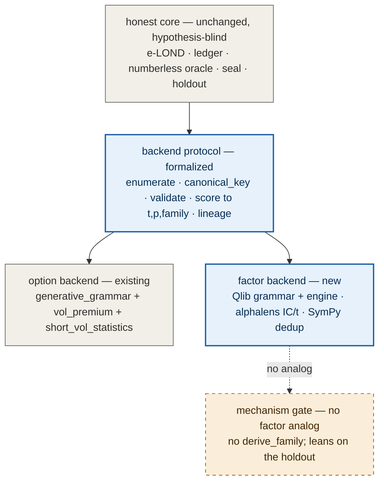
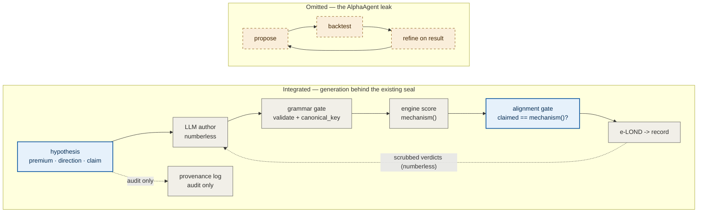

# Integration plan — extending the honest-search apparatus

> **Status: DESIGN, not yet built.** Two extensions on one shared foundation, neither implemented. Nothing
> here changes promotion: a survivor stays EXPLORATORY until the Phase-C time-axis holdout exists
> ([docs/read_gate.md](read_gate.md), [docs/generative_grammar_plan.md](generative_grammar_plan.md)).

This plan covers two related extensions to the apparatus:

- **Part 1 — a factor backend** behind a formalized backend protocol (a *new domain*: alpha-factor
  formulas, scored by a real backtest engine).
- **Part 2 — a hypothesis-first proposer upgrade** lifted from AlphaAgent
  ([arXiv:2502.16789](https://arxiv.org/abs/2502.16789), KDD 2025) — a *cross-backend* generation
  improvement.

They share one foundation and one throughline. The foundation: the honest core is hypothesis-blind, so a
new domain is a new *backend*, not a core rewrite. The throughline: the backend protocol's `mechanism()`
method is exactly what AlphaAgent's alignment gate checks — the option backend implements it
(`derive_family`); the factor backend cannot. The mechanism gate is what the option domain has and the
factor domain lacks, and it recurs in both parts.

## The shared foundation: the honest core is hypothesis-blind

A repo map (three Explore agents over `edge_search.py` / `evalue_fdr.py` / `generative_grammar.py` /
`generative_engine.py` / `read_gate_wire.py` / `vol_premium.py`) confirmed the load-bearing fact:

> The honest core keys on `(data_lineage_hash, phase, template, ticker, params)` and reads result
> statistics (`p_value`, `t_stat_newey_west`, `sign_ok`, `measurement_invalid`, `elond_survivor`) — never
> engine output. e-LOND is the online FDR control of record over *any* backend's p-values. The seal
> (`assert_numberless` + `BANNED_RESULT_FIELDS`) is a static key-name guard, independent of backend shape.

So both extensions sit on an unchanged core. Extract — from what `run_composition_round` /
`score_composition` / `judge_compositions_against_published` / `gate_compositions` actually call — the
minimal contract any backend must satisfy:

```python
class Backend(Protocol):
    def enumerate(self) -> list[Candidate]: ...           # the bounded, pre-specified space
    def validate(self, c: Candidate) -> Candidate: ...    # production-rule gate; raises off-grammar
    def canonical_key(self, c: Candidate) -> str: ...     # content-addressed, order-invariant, sign-excluded
    def mechanism(self, c: Candidate, data) -> str | None # the mechanism gate; None == fail-closed
    def lineage(self, c: Candidate, data) -> str: ...     # SHA over (data, engine version)
    def score(self, c: Candidate, data) -> dict: ...      # -> {statistic, p_value, sign_ok,
                                                          #     measurement_invalid, family, n_days, ...}
```

The honest core consumes only the `score` row schema. Formalizing this protocol (today implicit in the
option backend) is the precondition for *both* extensions.

## Part 1 — a factor backend behind the protocol

Integrating an alpha-factor grammar + backtest engine is: (1) formalize the protocol above, then (2) add a
second backend that implements it. The option backend is unchanged; the honest core is unchanged.

| Protocol method | Option backend (exists) | Factor backend (new) |
| --- | --- | --- |
| `enumerate` | `enumerate_compositions` / `enumerate_grammar_templates` | bounded formula grammar (Qlib ops + depth/window caps), or the LLM author |
| `validate` | `validate_composition` | bounded production rules (cap depth + operator/operand/window alphabets) |
| `canonical_key` | `canonical_key` (sha256 of sorted leg tokens) | SymPy-normalize → sha256 (partial — see caveats) |
| `mechanism` | `derive_family` (greek signature → family) | **no analog** — the gap |
| `lineage` | `_data_lineage_hash` | sha over the equity panel checksum + engine version |
| `score` | `run_real_structure_overlay` + `short_vol_statistics` | Qlib `D.features` (eval formula → signal) + alphalens `calc_ic` → IC-t |

**What the factor backend reuses:**

- **Grammar + engine: Microsoft Qlib** (MIT). Its expression engine (`qlib.data.ops` — `ElemOperator` /
  `PairOperator`: `Ref/Mean/Std/Corr/Cov/Rank/Add/...`) *is* the alpha grammar; string formulas over
  `$close/$volume/...`; `D.features(instruments, fields, start, end)` evaluates a formula to a
  per-name-per-day signal. The engine + eval are usable **standalone** (decoupled from Qlib's ML pipeline).
  The data layer (`.bin`/CSV/Parquet, `dump_bin.py`, US + CN universes) is the panel.
- **Scoring: alphalens-reloaded** (the actively-maintained Quantopian fork). `compute_ic` (Spearman / rank
  IC), quantile / long-short returns, the IC t-stat — the factor analog of `short_vol_statistics`. The
  `score` row emits `{statistic: IC-t, p_value, sign_ok, measurement_invalid, family}` so the honest core
  is untouched.
- **Canonicalization: SymPy** (normalize commutative/associative/idempotent forms) → sha256 — the
  `canonical_key` analog. Partial (see caveats); `egg` (e-graph equality saturation) is the
  better-but-heavier option (Rust + hand-written rewrite rules) if dedup quality bites.



## Part 2 — the hypothesis-first proposer upgrade (from AlphaAgent)

AlphaAgent is the closest public cousin to this repo — it targets "overfitting, selection bias through
p-hacking, and multiple testing." But its **Eval Agent is a feedback loop** (propose → backtest → *refine
on the result* → repeat), exactly the in-loop p-hacking the numberless oracle forbids. So we don't
integrate its loop; we lift its two good ideas and run them behind the seal — across *either* backend.

- **Hypothesis-first generation.** Before the candidate, the author states a falsifiable economic claim
  (`{premium_family|hypothesis, direction, conditioning, claim}`), generated numberless and recorded
  audit-only (like today's `reasoning`). Add `HYPOTHESIS_FIELDS` to `read_gate_wire.py`.
- **Hypothesis-factor alignment, made rigorous.** An oracle-side gate where the backend's `mechanism()`
  must match the author's *claimed* family, or the cell is killed — the direct cure for the foil-paper
  failure mode (a persuasive rationale on a candidate that does something else).



**The connection between the two parts:** the alignment gate (Part 2) calls the backend's `mechanism()`
(Part 1's protocol). For the **option** backend, `mechanism()` is `derive_family` — so the alignment gate
*works*, and a persuasive story that doesn't match the greeks is killed. For the **factor** backend,
`mechanism()` has no analog — so the alignment gate degrades to a no-op, and the hypothesis is unchecked
insight only. The proposer upgrade is therefore an *option-backend strength that highlights the factor
backend's gap*.

## Reuse vs replace — the verdicts

| Component | Verdict | Why |
| --- | --- | --- |
| honest core (`evalue_fdr` e-LOND, `edge_search` ledger/oracle, `read_gate_wire` seal, the holdout) | **keep / reuse as-is** | audited, the repo's contribution, hypothesis-blind |
| option backend (`generative_grammar`, `generative_engine`, `vol_premium`, `short_vol_statistics`) | **keep** | audited + pinned (`TestSpyShortVolRegression` t=2.54); the rf-netted vol-P&L is load-bearing |
| `_data_lineage_hash`, `canonical_key`, `judge_against_lifetime_stream`, `assert_numberless` | **keep** | primitives / design choices, audited; no faster-or-better swap |
| Benjamini-Yekutieli, the Newey-West lag rule | **keep** for options | pinned to the published ledger; the factor backend uses libraries from the start |
| data loading (`load_chain_store` / `select_entry`, CSV→tuple parsing) | **replace** for factors | Qlib data layer / Parquet + polars — faster, standard, the bottleneck once you score thousands of factors daily (the option path stays; a Parquet swap there is perf-only) |
| Qlib | **reuse (external, MIT)** | the factor grammar + engine + IC eval |
| alphalens-reloaded | **reuse (external)** | the factor scorer (IC / rank-IC / t / quantile) |
| SymPy | **reuse (external)** | factor canonicalization (partial) |
| `anthropic` (optional) | **reuse** | the LLM author (Part 2); or none, via `ClaudeCodeProposer` |
| `egg` (e-graphs) | **optional** | better canonicalization; defer until SymPy's incompleteness bites |
| gplearn, AlphaCFG, AlphaGen | **skip / reference** | gplearn has no dedup; AlphaCFG/AlphaGen are *search* strategies — our menu-walker + LLM author already cover proposal |

The honest answer to "replace existing components": the repo's audited core and option engine are the
*quality* pieces — keep them. The real replace is the hand-rolled **data layer** for the factor path;
everything else new is *added* (Qlib/alphalens), not swapped.

## The honest caveats (where quality is at risk)

1. **The mechanism gate has no factor analog — the throughline of both parts.** Qlib confirms no economic
   typing. `derive_family` (and the alignment gate that checks it) is the option domain's foil-paper
   defense; it does not transfer. A data-mined formula with a high IC has nothing to disqualify it but the
   statistics, so the factor backend leans *entirely* on e-LOND + the holdout. Either build an economic
   typing (map a formula to value/momentum/carry/quality and verify the loading — hard, aspirational) or
   accept the weaker defense and let the holdout carry it.
2. **Exact canonicalization is unsolved at scale.** SymPy is heuristic and incomplete; `egg` needs a
   rewrite-rule set; AlphaGen/AlphaAgent only *approximate* (RPN / AST similarity). Leaked duplicates are
   conservative for e-LOND validity (over-counting raises the bar) but weaken the pre-specification
   precondition and the BY-diagnostic denominator. Plan for partial dedup.
3. **A new data dependency** — a broad equity panel (Qlib's US/CN data or a fetch); the repo has option
   chains, not equities.
4. **e-LOND power, again.** An open factor space saturates the FDR budget fast (we saw t≥6.6 by cell 145);
   the harness will mostly *kill*. A tiny, mechanism-prioritized menu retains power, which a formula space
   resists by nature.
5. **Audit-trail constraint.** `short_vol_statistics`, the Newey-West lag, and BY are pinned to the
   published ledger — do not swap them for the option path; the factor path uses libraries from the start.
6. **Qlib is a real dependency to vet** — MIT, ~45k stars, but v0.9.7 (Aug 2024), uneven cadence, and the
   standalone-expression-eval path is under-documented.

## Phasing

- **F1 — formalize the backend protocol.** Extract the `Backend` Protocol from the option backend; refactor
  the option path to implement it explicitly. No behavior change; the precondition for everything else.
- **F2 — the factor scorer.** Wrap Qlib `D.features` + alphalens `calc_ic` into a `score`-shaped row on a
  small fixed equity panel; verify it feeds `judge_against_lifetime_stream` unchanged.
- **F3 — the factor grammar + canonicalization.** A bounded formula grammar (`validate` + SymPy
  `canonical_key`), enumerable and pre-specified.
- **H1 — the hypothesis schema + the alignment gate** (deterministic, stub-testable behind the seal). On
  the option backend it is a real strengthening even with no LLM; on the factor backend it degrades to a
  no-op until a `mechanism()` exists.
- **F4 / H2 — the proposer.** The menu-walker / LLM author over each grammar, emitting hypotheses
  (env-gated OFF). Resolve the factor mechanism decision (economic typing vs holdout-only).
- **Promotion stays gated on Phase C** for both domains.

## Bottom line

The repo was already factored for this: the honest core is the asset, and it does not know or care whether
a hypothesis is an option structure or an alpha formula. Both extensions reduce to **one new abstraction**
(the backend protocol) plus **public libraries** (Qlib + alphalens + SymPy for the factor backend;
`anthropic` for the proposer) — with the data layer replaced for scale. The single thing that does *not*
port is the mechanism gate, and that — not the grammar, the engine, or the proposer — is what decides
whether the factor domain is worth doing before the holdout exists.

_Last updated: 2026-06-27._
