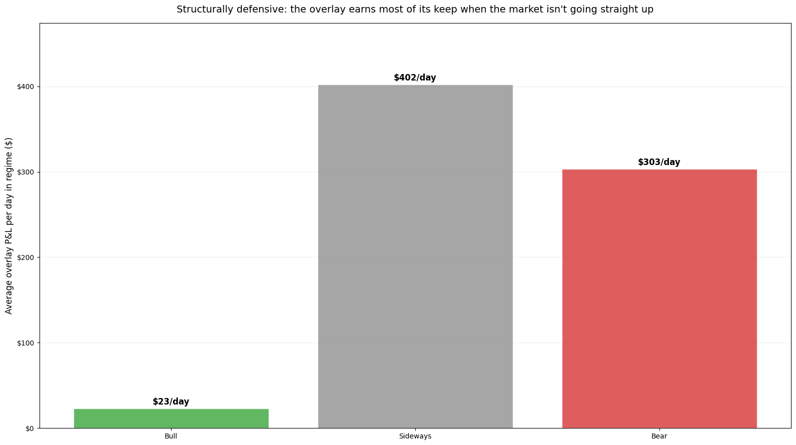
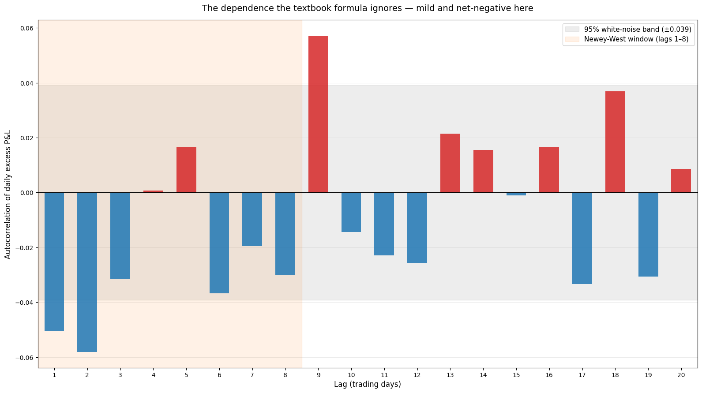

# Building a Covered Call Backtester From Scratch

## Theory, Code, and Lessons

**For:** Bao, actively learning options trading  
**Goal:** Understand both the WHY and the HOW of backtesting covered calls  
**Time to read:** 60 minutes (code walkthrough: another 60)  
**Last updated:** June 2026

---

## How to Read This Tutorial

This is a long document. You almost certainly don't need every word of it. Pick the path that matches where you're starting from:

- **Total beginner (new to options, new to backtesting):** Read straight through. Each part builds on the last, and the [glossary](#appendix-c-glossary-of-key-terms) at the back has every term you'll need.
- **Coder, no finance background:** Skim the [Glossary](#appendix-c-glossary-of-key-terms) and [Part 1](#part-1-foundations--what-are-we-actually-doing) for vocabulary, then spend your time in [Part 2](#part-2-option-pricing-with-black-scholes) (Black-Scholes) and [Part 3](#part-3-the-covered-call-overlay-engine) (the overlay engine). That's where the finance becomes mechanical.
- **Quant learning Python options:** Jump to [Part 4](#part-4-walk-forward-optimization) (walk-forward) and [Part 5](#part-5-robustness-checks--proving-its-not-luck) (Newey-West, bootstraps, regime splits), then browse the rest as reference.

---

## Table of Contents

1. [Part 1: Foundations — What Are We Actually Doing?](#part-1-foundations--what-are-we-actually-doing)
2. [Part 2: Option Pricing with Black-Scholes](#part-2-option-pricing-with-black-scholes)
3. [Part 3: The Covered Call Overlay Engine](#part-3-the-covered-call-overlay-engine)
4. [Part 4: Walk-Forward Optimization](#part-4-walk-forward-optimization)
5. [Part 5: Robustness Checks — Proving It's Not Luck](#part-5-robustness-checks--proving-its-not-luck)
6. [Part 6: Putting It All Together](#part-6-putting-it-all-together)
7. [Part 7: Key Takeaways & Cheat Sheet](#part-7-key-takeaways--cheat-sheet)
8. [Appendix A: The Code](#appendix-a-the-code)
9. [Appendix B: Common Pitfalls and How to Avoid Them](#appendix-b-common-pitfalls-and-how-to-avoid-them)
10. [Appendix C: Glossary of Key Terms](#appendix-c-glossary-of-key-terms)
11. [References](#references)
12. [Provenance & Disclaimer](#provenance--disclaimer)

---

## Part 1: Foundations — What Are We Actually Doing?

### The Core Idea: Own Shares + Sell Insurance = Extra Income

Imagine you own a house worth $300,000. You could:

1. **Do nothing** — hope it appreciates, sit and wait
2. **Rent it out** — get monthly income while keeping the house
3. **Sell homeowner's insurance to your neighbors** — collect premiums if nothing bad happens

A covered call is like option #2 and #3 combined. You own the stock (like owning a house). You sell call options (like selling insurance: "I'll let you buy my stock at $50 anytime in the next 30 days, and you pay me $2 for that right"). If the stock goes up, sometimes your buyer exercises the option and buys your shares (you "lose" them, but at a fixed price). If it stays flat or goes down, the buyer doesn't exercise, and you keep both the stock AND the premium ($2).

> You're collecting small, frequent premiums while the stock does its normal thing.

**Predict first.** You own shares bought at $50. You sell a 30-day call struck at $55 and collect a $2 premium. Over the next month the stock rockets to $65. Did the covered call make money or lose money — and how does your result compare to someone who just held the shares and sold nothing?

<details>
<summary>Reveal</summary>

**You made $7 a share — and left $8 on the table.** You keep the $2 premium plus the $5 of appreciation from $50 up to the $55 strike: $7 total. But the buyer exercises and takes the shares at $55, so the entire run from $55 to $65 is theirs — $10 of rally you forfeit, only partly cushioned by the $2 premium. Buy-and-hold captured the full $15 move ($50 → $65). Both outcomes are positive; the covered call is simply the *smaller* one in a strong rally. That $8 gap is **capped upside**, the price you pay for the premium income, and it's exactly why every later Part measures the overlay against buy-and-hold rather than against cash.

</details>

### Why Backtesting Matters (And Why Most Backtests Lie)

Before you risk real money, you want to ask: "Does this actually work? How much could I make? What could go wrong?"

A backtest is a time machine. You rewind to the past, follow your rules perfectly, and measure what would have happened. It's not perfect, but it's way better than guessing.

**Why most backtests are misleading.** Start with the problem no code can engineer away: people run — and believe — a backtest only when recent conditions were rosy (lucky timing). Guarding against that is the job of the whole methodology, not a single trick. The engine uses one fixed 10-year window spanning bull, bear, and sideways markets, so the headline isn't a cherry-picked slice; the regime, Monte Carlo, and holdout checks in Part 5 and the conclusion probe it further.

Underneath that timing problem sit three *mechanical* biases any single run can hide:

- They peek at future prices while building today's decision (look-ahead bias).
- They only count the survivors — the stocks that didn't go bankrupt (survivorship bias).
- They tweak parameters so much that they overfit to random noise (overfitting).

We engineer the first of these out of the code, sidestep the second, and attack the third head-on.

### The Three Enemies of Backtesting

| Enemy | What It Means | Example in CC Trading | How We Handle It |
| --- | --- | --- | --- |
| **Look-ahead bias** | You use tomorrow's price to make today's decision | "I'll sell a call because I know the price will drop tomorrow" | Only use data available on the decision date; never peek forward |
| **Survivorship bias** | You only test stocks that survived (ignoring the ones that died) | Only test Apple, Google, Microsoft (tech survived 2000s); ignore Blockbuster | Sidestep on one stock by measuring the overlay's *excess over the same stock* (see note below) |
| **Overfitting** | You tune your strategy so it's perfect for 2010-2020, then it fails 2021-2026 | Tweak the delta, expiration, and volatility multiplier until you get 1000% returns | Use walk-forward validation: train on one period, test on a different period |

**A note on survivorship.** This backtest deliberately tests a single survivor (Microsoft), so survivorship bias can't be eliminated here — only sidestepped. The trick is to measure the overlay's *excess over the same stock*: the winner's upward drift inflates the covered-call overlay and the buy-and-hold benchmark alike, so it cancels in the difference. Single-stock remains a genuine limitation; the real fix — a diverse universe that includes delisted names — is named but not run here (Part 5 and the conclusion).

### Mental Model: Think of Backtesting Like a Time Machine With Rules

Here's how we'll build it:

1. **Rewind** to April 2016
2. **Load** 10 years of daily price data for a stock
3. **Each day**, check: Should I open a covered call? Should I close it? What's my profit?
4. **Simulate** the entire history
5. **Measure** the results (return, drawdown, Sharpe ratio, etc.)

The output? A graph showing: "If you'd done this from 2016–2026, you'd have made $X" — and how much of that was luck vs. skill.

### Check Your Understanding

Answer from memory before revealing — if one doesn't come, that section is worth a reread before Part 2 builds on it.

1. A backtest that only ever traded Apple, Microsoft, and Google from 2000–2026 reports a 4,000% return. Name the enemy and explain why the number is suspect even if the code is bug-free.
2. "I'll sell the call only on days I can see the stock drops tomorrow." Which enemy is that, and what single structural rule prevents it?
3. A strategy is tuned until it returns 1000% on 2010–2020, then loses money on 2021–2026. Name the third enemy, and state the one-line structural fix Part 1 gives for it.

<details>
<summary>Reveal</summary>

1. **Survivorship bias.** Those three are the *survivors*; the test silently excludes the firms that went to zero, so the figure is the return *conditional on having picked winners in advance* — which you can't actually do. The fix is testing a diverse universe, not just the names you already know made it.
2. **Look-ahead bias** — using tomorrow's price for today's decision. The structural prevention: only ever use data available on the decision date (half-open windows, never peek forward). That's the same no-peeking discipline walk-forward enforces in Part 4.
3. **Overfitting** — the strategy was tuned to the noise in one period, so it fails on a different one. The fix Part 1 names: **walk-forward validation** — train on one period, test on a different period (developed fully in Part 4). That completes the three enemies: survivorship, look-ahead, overfitting.

</details>

---

## Part 2: Option Pricing with Black-Scholes

### The Analogy: Black-Scholes Is Like a Recipe

If I asked you, "How much should I charge for car insurance for a 25-year-old?" you'd need to know:

- How wild a driver are we talking about? (volatility)
- What's the coverage limit? (strike)
- How long is the policy? (time)
- How much will I earn from interest on the premiums? (interest rate)
- What's the current car value? (stock price)

The **Black-Scholes model** ([Black & Scholes, 1973](https://www.jstor.org/stable/1831029)) is exactly that recipe. It takes five ingredients and spits out a fair premium.

For covered calls, we'll use Black-Scholes to *estimate* what an option should cost when we can't buy real option data.

### The Five Ingredients

| Ingredient | Symbol | Meaning in CC Context | Example |
| --- | --- | --- | --- |
| **Stock price** | S | Current price of the stock we own | $50 |
| **Strike price** | K | The price at which we'll sell shares | $52 |
| **Time to expiration** | T | Trading days until the contract ends, as a fraction of a year | 30 days = 30/252 |
| **Risk-free rate** | r | What we'd earn if we put money in Treasury bonds | 4% per year |
| **Volatility** | σ (sigma) | How much the stock bounces around | 25% per year |

For a stock at $50:

- If **T = 30 days** and **σ = 25%**, the stock might swing $1–2
- If **T = 365 days** and **σ = 25%**, it might swing $8–12
- Higher volatility = bigger swings = more valuable insurance = higher premium

### Step-by-Step Intuition (Not the Math)

Written out, the formula is:

```text
C = S₀·N(d₁) - K·e^(-rT)·N(d₂)
```

But here's what's *actually* happening:

#### Step 1: Calculate "d₁" — the distance the stock needs to move

```text
d₁ = [ln(S/K) + (r + σ²/2)·T] / (σ·√T)
```

Translation: "If the stock is at $50 and the strike is $52, how many standard deviations away is that? And how much time do we have?"

A high σ (volatility) makes the denominator huge, so d₁ stays closer to zero. This means the market expects big moves, so the option is worth more.

#### Step 2: Run d₁ and d₂ through the normal distribution

```text
N(d₂) = (risk-neutral) probability the stock finishes in-the-money
N(d₁) = delta — how much the option's value moves per $1 of stock
```

Both run through the **cumulative normal distribution function (CDF)** — the function that converts a z-score into a probability (see [Glossary](#appendix-c-glossary-of-key-terms)). We'll use the [Abramowitz & Stegun approximation](https://en.wikipedia.org/wiki/Abramowitz_and_Stegun). (d₂ is just d₁ nudged down by σ√T.) Traders often read delta itself as the ITM probability — that's N(d₁) standing in for N(d₂), close for short-dated options but not exact; we come back to it at the delta dial.

#### Step 3: Calculate the call option price

```text
C = S·N(d₁) - K·e^(-rT)·N(d₂)
```

Think of it this way:

- **S·N(d₁)** = "the share I'd receive if the call is exercised, valued today"
- **K·e^(-rT)·N(d₂)** = "the strike I'd pay if exercised — discounted for interest and scaled by N(d₂), the chance I actually pay it"
- The **difference** is what the option is worth.

### Why We Need It: No Historical Option Data

**We don't have historical option prices.**

If I want to test, "Would I have profited selling SPY calls on January 15, 2015?", I can't just look up what SPY calls cost that day—at least not easily or reliably. The data is expensive or incomplete.

So we *estimate* option prices using Black-Scholes, feeding it an assumed volatility. That's a simplification. Real options don't trade at one flat number — the market bakes a different volatility into each strike, a pattern traders call the **volatility smile** — and a rigorous backtest would use historical option chains. But Black-Scholes is the canonical pricing model and a practical stand-in when that data isn't available.

### The Normal CDF (Cumulative Distribution Function) Approximation

The Black-Scholes formula requires the cumulative normal distribution function N(x) — the function that tells us "given a bell curve, what fraction of the area falls to the left of x?"

**The problem:** There's no simple equation you can write down that directly computes this. Unlike, say, the area of a circle (πr²), the area under a bell curve can't be expressed as a neat formula using basic math operations — addition, multiplication, exponents, etc. Mathematicians call this "no closed-form solution." The exact answer is defined by an integral with no closed-form shortcut — so every computer, from a pocket calculator to Python's `math` library, reaches it through an approximation rather than the integral itself.

**The workaround:** Mathematicians found that a **polynomial** — a simple expression like `a·t + b·t² + c·t³ + d·t⁴ + e·t⁵` — can mimic the real CDF closely enough. Polynomials use only multiplication and addition, so you can read the formula and see exactly why it works. The trick is picking the right coefficients (a, b, c, d, e) so the polynomial matches the true answer to many decimal places.

The **Abramowitz & Stegun approximation** (from their 1964 math reference handbook) does exactly this — it's accurate to 7 decimal places, which is far more precision than we need for option pricing.

But first, we need one helper — the **PDF (probability density function)**, which gives the *height* of the bell curve at any point. The CDF approximation uses the PDF as a building block:

```python
import math

def normal_pdf(x):
    """
    The height of the bell curve at point x.
    
    CDF = area under the curve (cumulative probability).
    PDF = height of the curve (how likely this exact value is).
    
    The CDF approximation below multiplies the PDF by a polynomial
    to estimate the area.
    """
    # Step by step:
    #   x**2        → always positive (squaring kills the sign)
    #   -x**2       → always negative (flip it)
    #   -x**2 / 2.0 → still negative, just smaller
    #   math.exp(-x**2 / 2.0) → e^(negative) → always between 0 and 1
    #     At x=0: e^0 = 1 (peak of bell curve)
    #     At x=3: e^(-4.5) ≈ 0.011 (curve nearly flat)
    #   / math.sqrt(2 * math.pi) → scale so total area under curve = 1
    return math.exp(-x**2 / 2.0) / math.sqrt(2 * math.pi)

def normal_cdf(x):
    """
    Approximates the cumulative standard normal distribution.
    Accurate to ~7 decimal places (max absolute error ~7.5e-8).
    Uses Abramowitz & Stegun (1964) Formula 26.2.17.
    
    NOTE: These are the same coefficients used in black_scholes.py.
    """
    # Polynomial coefficients (Abramowitz & Stegun, 1964, Formula 26.2.17)
    b1, b2, b3, b4, b5 = 0.319381530, -0.356563782, 1.781477937, -1.821255978, 1.330274429
    p = 0.2316419
    
    # For negative x, use symmetry: Φ(-x) = 1 - Φ(x)
    sign = 1 if x >= 0 else -1
    x_abs = abs(x)
    
    t = 1.0 / (1.0 + p * x_abs)
    # Multiply the bell curve height (PDF) by the polynomial to estimate the area (CDF)
    # PDF is symmetric, so pdf(x_abs) == pdf(-x_abs) — the x² kills the sign
    y = 1.0 - normal_pdf(x_abs) * (b1*t + b2*t**2 + b3*t**3 + b4*t**4 + b5*t**5)
    
    return y if sign == 1 else 1.0 - y
```

**Why this works:** The CDF is the area under the bell curve. The approximation says: "take the height of the curve at this point (PDF), multiply by a polynomial correction, and you get a good estimate of the area." It's like estimating the area of a hill by measuring its height and applying a shape factor.

> **Production note:** The A&S polynomial above is shown here because you can read it and *understand* how a CDF approximation works. In actual production code (and in the runnable scripts later in this tutorial) we use Python's built-in `math.erf` instead, via the identity:
>
> ```python
> def normal_cdf(x):
>     return 0.5 * (1.0 + math.erf(x / math.sqrt(2)))
> ```
>
> The C standard library's `erf` is good to \~15 decimals (vs A&S's \~7), which matters when you stack hundreds of thousands of CDF calls in a backtest — the accumulated rounding error in A&S can shift final equity by a few cents. Same algorithm, more precise pipes. We keep the polynomial here for teaching purposes only.

### Delta: The Probability Dial — What 0.20 Δ Actually Means

**Simple definition:** Delta is *approximately* the probability that your option ends in-the-money at expiration — close enough that traders use it as the everyday proxy.

- **Δ = 0.20** → ~20% chance the stock rises past the strike → sell a call with ~20% ITM risk
- **Δ = 0.50** → ~50% chance the stock rises past the strike → sell a call with ~50% ITM risk
- **Δ = 0.80** → ~80% chance the stock rises past the strike → ~80% ITM risk: near-certain assignment, almost no upside kept

The shorthand is a proxy, not an identity: call delta is N(d₁), while the exact (risk-neutral) chance of finishing ITM is N(d₂) = N(d₁ − σ√T), which runs a little lower. The gap shrinks the shorter-dated and lower-vol the option, so for the 21-day calls this engine sells, delta and the true probability sit within a couple of points — fine for picking a strike, as long as you don't mistake the dial for the thing it measures.

**In covered call terms:**

- Sell **0.30Δ** = "I'm okay with a ~30% chance the stock gets called away"
- Sell **0.50Δ** = "50/50 shot the shares get called away"
- Sell **0.70Δ** = "high chance of assignment — and I've sold away most of my upside, collecting mostly intrinsic value" (the premium's in-the-money portion, `stock − strike` — handed back at assignment, so the real income is just the smaller time-value slice)

Income sellers conventionally target the **0.20–0.40 delta** range, low enough that assignment is the exception rather than the rule. The ~0.30 center of that band is institutional convention, not theory: CBOE's [30-Delta BuyWrite Index (BXMD)](https://www.cboe.com/us/indices/dashboard/BXMD/) writes one-month 0.30-delta S&P 500 calls by published methodology. The width around that center is a practitioner rule of thumb, not a derived threshold. This engine sits at the conservative, low-delta end: the walk-forward `call_delta` grid is `[0.15, 0.20, 0.25]`, defaulting to 0.25.


*Delta is monotone-decreasing in strike, so "pick a target delta" and "pick a strike distance" are the same decision viewed from two ends. The 0.20–0.40 band is wide in delta but narrow in strike distance — a few percent of moneyness covers the whole income-seller range, which is why small volatility errors move the effective delta more than you'd expect.*

### Finding a Strike for a Target Delta: The Brute-Force Search Approach

Now the practical question: "I want to sell a 0.25Δ call. Which strike should I pick?"

We work **backwards** from delta:

1. Start with a guess strike (e.g., stock price + 5%)
2. Calculate delta at that strike using Black-Scholes
3. Compare to our target (0.25)
4. If delta is too high, move the strike up (safer)
5. If delta is too low, move the strike down (more aggressive)
6. Repeat until delta ≈ target delta

This is called a **grid search**. It checks every whole-dollar strike in a range and picks the one whose delta is closest to the target. With only \~30–50 candidates to check, it runs instantly — and it naturally returns whole-dollar strikes that match real option chains.

The production implementation is [`cc_backtest.py::find_strike_for_delta`](https://github.com/l3a0/covered-call-backtesting/blob/main/cc_backtest.py#L83). It scans whole-dollar strikes in `[0.80·S, 1.02·S]` for puts and `[0.98·S, 1.25·S]` for calls — the asymmetric ranges cover the relevant out-of-the-money zone for each option type while keeping the candidate count small. For each candidate it calls `bs_delta(...)` and tracks the strike whose computed delta is closest to `target_delta`.

**Example run:**

- Stock at $100, want 0.25Δ, 30 days out, σ=20%
- Grid search checks every whole-dollar strike from $98 to $125
- $105 has delta ≈ 0.28, **$106** has delta ≈ 0.23 — $106 is closest to 0.25
- Returns strike = $106, delta = 0.23

### Code Walkthrough: bs_price(), bs_delta(), find_strike_for_delta()

The full Black-Scholes toolkit — `normal_pdf`, `normal_cdf`, `bs_price`, `bs_delta`, and `find_strike_for_delta` — lives in [`cc_backtest.py`'s section 1](https://github.com/l3a0/covered-call-backtesting/blob/main/cc_backtest.py#L11). What each one does:

| Function | What it computes |
| --- | --- |
| `normal_pdf(x)` | Height of the standard-normal bell curve at `x`. Used inside the A&S polynomial CDF approximation shown earlier. |
| `normal_cdf(x)` | Area under the bell curve from `-∞` to `x` — converts a z-score into a probability. Production uses `math.erf` (\~15 decimals) rather than the polynomial (\~7 decimals); the educational section above shows the polynomial so you can see *how* a CDF approximation works, and the production docstring explains why the switch matters at scale (A&S's 8th-decimal error compounds into a few cents of equity drift across hundreds of thousands of CDF calls). |
| `bs_price(S, K, T, r, sigma, option_type='put')` | The Black-Scholes formula itself — returns the option premium given stock, strike, time, rate, vol, and option type. |
| `bs_delta(S, K, T, r, sigma, option_type='put')` | Just `N(d1)` for calls or `N(d1) − 1` for puts — the option's first-derivative sensitivity to stock price, and a close proxy for the probability of finishing ITM (the exact risk-neutral figure is `N(d2)`). |
| `find_strike_for_delta(S, T, r, sigma, target_delta, option_type='put')` | Grid search across whole-dollar strikes; returns the one whose Black-Scholes delta is closest to `target_delta`. Whole-dollar because real option chains list whole-dollar strikes. |

**How to use it:**

```python
# Current stock price is $100
S = 100
# We want to sell a 0.25-delta call, 30 days out
target_delta = 0.25
T = 30 / 252  # 30 trading days as fraction of year (252 trading days/year)
r = 0.04  # 4% interest rate
sigma = 0.20  # 20% volatility

# Find the strike (note: arg order matches black_scholes.py)
strike = find_strike_for_delta(S, T, r, sigma, target_delta, option_type='call')
actual_delta = bs_delta(S, strike, T, r, sigma, option_type='call')
print(f"Strike: ${strike:.0f}, Delta: {actual_delta:.4f}")

# Calculate the premium for that strike
premium = bs_price(S, strike, T, r, sigma, option_type='call')
print(f"Premium: ${premium:.2f} per share (${premium*100:.0f} per contract)")

```

**Output:**

```text
Strike: $106, Delta: 0.2294
Premium: $0.89 per share ($89 per contract)
```

Note: The delta won't be exactly 0.25 after rounding to a whole dollar — that's normal. Real strikes come in fixed increments, so you pick the closest one to your target delta.

### Common Mistake: Confusing Historical Volatility with Implied Volatility

**Predict first.** You're *selling* covered calls. You price each one by feeding Black-Scholes the stock's trailing 30-day historical volatility — say 16%. In reality the market trades those same options at an implied volatility nearer 20%. Does your backtest *overstate* or *understate* the premium income the strategy would actually have collected?

<details>
<summary>Reveal</summary>

**It understates it — this bias runs conservative, the opposite of most backtest sins.** A higher volatility input means a fatter Black-Scholes premium, and you are the one *receiving* that premium. Real options trade at IV, which sits structurally above HV most of the time (the volatility risk premium). Feed the model raw HV and every simulated premium comes out too small, so the backtest under-counts the income the live strategy would earn. Direction is everything: assume HV *above* IV instead and you'd overstate income, and the real strategy would quietly disappoint. That asymmetry — and the fact that the gap isn't constant — is exactly why the engine never prices off raw HV; it scales HV up toward IV, regime by regime, in the next section.

</details>

**Historical volatility (HV)** = How much the stock bounced around in the past

- Example: "SPY moved ±1% per day on average over the last 30 days"
- That's a daily standard deviation of 0.01 (1%)
- Annualize it: 0.01 × √252 = 0.01 × 15.87 = **0.159 ≈ 16%**
- (Why √252? Standard deviations scale with the square root of time, not linearly. 252 = trading days per year.)

**Implied volatility (IV)** = What the market *expects* will happen

- Example: "Call buyers are willing to pay premiums that assume 18% volatility" → IV ≈ 18%

In our backtest, we **don't have historical option prices**, so we can't extract IV. Instead, we use HV as a proxy, then adjust it.

**The relationship:** IV usually sits **above** HV — sellers are paid a premium for bearing volatility risk (the VRP from the reveal above), so a proxy built from HV has to scale *up*, not down. How far up depends on the market regime — that's the next section.

### The IV Proxy: Why a Regime-Based Multiplier Works

In practice, we calculate **rolling historical volatility** and multiply by a **regime-dependent** factor — higher when vol is low (markets underpricing risk), lower when vol is already elevated (IV converges toward HV).

The three helpers — [`calc_rolling_volatility`](https://github.com/l3a0/covered-call-backtesting/blob/main/cc_backtest.py#L126), [`detect_regime`](https://github.com/l3a0/covered-call-backtesting/blob/main/cc_backtest.py#L161), and [`estimate_iv`](https://github.com/l3a0/covered-call-backtesting/blob/main/cc_backtest.py#L170) — are implemented in `cc_backtest.py`. Part 3 walks through both in detail (see *Rolling Historical Volatility* for the log-returns identity, Bessel's correction, and the √252 annualization derivation; see *The Dynamic IV Multiplier* for the regime → multiplier table). The skeleton in plain English:

- For each day, `rolling_vol = std_dev(last 30 log returns) × √252` (annualized).
- Classify the regime: `"high"` if `rolling_vol > 25%`, `"low"` if `< 15%`, else `"normal"`.
- Apply the multiplier: `iv_estimate = rolling_vol × {high: 1.1, normal: 1.3, low: 1.5}[regime]`.

In the production engine `estimate_iv(rolling_vol)` does steps 2 and 3 together — pass it a vol, get back an IV estimate.

**Why these multipliers?**

- As a rough practitioner rule of thumb, implied volatility tends to run on the order of 20–40% above realized volatility — the **volatility risk premium** (Bakshi & Kapadia 2003; Coval & Shumway 2001 establish the premium's existence and sign; the specific band is lore, not a figure from those papers).
- But the gap **varies by regime**: when vol is already high, IV doesn't spike as much above HV; when vol is low, IV tends to stay well above HV (mean-reversion pricing).
- The regime-based approach (1.1×/1.3×/1.5×) captures this dynamic better than a flat constant.

**When this still breaks down:**

- **Before earnings:** IV spikes way above HV (the market expects a big move).
- **After a crash:** HV explodes but IV might normalize faster (panic recedes).
- **In persistent trends:** HV might be high (the stock is moving a lot) but IV might be low (it's moving in one direction, so options are more predictable).

We implement this regime-based approach in Part 3's `run_cc_overlay()` engine.


*Four of the five Black-Scholes inputs are observable to the penny; this chart is the fifth. The shaded band is the assumed HV→IV markup, and it is not constant: it is widest in the low-vol regime (1.5×) and pinches shut in the 2020 panic (1.1×), exactly the regime-dependent behavior the multiplier table encodes. Every option price in the backtest inherits whatever error lives in that gap.*

### Check Your Understanding

Answer from memory before revealing — if one doesn't come, that section is worth a reread before Part 3 builds on it.

1. The backtest needs an *IV proxy* instead of just reading implied volatility off the data. What's missing, and what observable do we substitute?
2. Daily volatility is annualized by ×√252, not ×252. Why the square root?
3. You sell a 0.25Δ call. In one sentence, what does that 0.25 actually tell you about the trade?
4. The regime multiplier is **1.5× in the low-vol regime but only 1.1× in the high-vol regime** — larger when realized vol is *lower*. Why that inverse direction, and what would a single flat multiplier miss?

<details>
<summary>Reveal</summary>

1. There is **no historical option-price data**, so implied volatility can't be extracted from the dataset. The only observable is the stock's price history, so we compute rolling **historical** volatility and scale it up to approximate IV.
2. Variance grows linearly with time; volatility is its square root, so it scales with **√time**. With 252 trading days per year, daily σ × √252 = annual σ. (Scaling by 252 instead would overstate annual vol roughly 16×.)
3. Roughly a **25% probability the call finishes in-the-money** — i.e., about a 25% chance the shares get called away — which is also the option's first-derivative sensitivity to the stock price.
4. The HV→IV gap (the volatility risk premium) is **widest when realized vol is low** — the market still prices in elevated future vol (mean reversion) — and **compresses when vol is already high**, as HV catches up to IV. A single flat multiplier would over-mark options in calm markets and under-mark them in panics; the regime ladder tracks the gap instead of assuming it's constant.

</details>

---

## Part 3: The Covered Call Overlay Engine

### The Core Rule: "Never Sell Your Shares"

This is the invariant the rest of the engine is built around. It's what makes this an income *overlay* — premium collected on top of a share position you would hold anyway — rather than a directional bet on the stock: [`run_cc_overlay`](https://github.com/l3a0/covered-call-backtesting/blob/main/cc_backtest.py#L201) never liquidates the underlying; only the short call cycles (sell → bought back, expires, or assigns → sell again). Why it earns its place rather than just sounding sensible: holding through every regime instead of timing exits is exactly what produces the defensive return profile measured in [Part 5's regime analysis](#regime-analysis-does-it-work-in-bulls-bears-and-sideways) — the overlay's per-day edge there is roughly 10× larger in bear and sideways markets (\~$23/day bull vs. \~$303 / \~$402) precisely *because* it keeps selling against the same shares no matter the trend. Abandon the rule and you forfeit that profile.

**Mistake:** Selling a 0.60Δ call, hoping the stock goes down, so you keep the premium AND the shares. If it rises above the strike, the shares get called away at a loss.

**Right approach:** Sell a 0.25Δ call. You *expect* the shares to get called away 25% of the time. That's fine — it's built into the premium you collect. You own the upside up to the strike, then the shares leave. You're okay with this.

> **Analogy:** You own a rental property worth $300k. You lease it for $2k/month, expecting a 10% chance per year the lease breaks early. The early-break risk is built into your rental decision. You don't twist the terms hoping the tenant never leaves — that's not the business you're in.

In a covered call overlay, you're in the **income business**, not the **capital appreciation business**.

### How the Overlay Works Day by Day: Walk Through a Week

Let's simulate a realistic week:

**Monday, Jan 6, 2025:**

- Own 100 shares of ABC at $50
- ABC is up 5% over the last month → HV ≈ 18%
- IV estimate = 18% × 1.3 = 23.4%
- **Decision:** Sell a call
  - Target delta = 0.25 (25% chance of ITM)
  - Strike = $53 (found via grid search — closest whole-dollar strike to 0.25Δ)
  - Premium = $0.64
  - Net credit = $0.64 × 100 = $64, minus $0.65 commission = **$63.35**
- **State:** OPEN (call is active)

**Tuesday, Jan 7:**

- ABC closes at $51
- Call is still OTM ($51 < $53 strike), delta ≈ 0.30
- Option has decayed slightly — time decay is working in our favor
- Check profit target: not yet at 75% of premium captured
- **Decision:** Hold (not at target yet)

**Wednesday, Jan 8:**

- ABC rallies to $51.50
- The call is more expensive now — stock moved toward the strike
- **Decision:** Hold (waiting for time decay to work in our favor)

**How "close at 75% profit" works:**

When you sell a call:

- You receive the premium now: $64
- You *might* have to buy it back later at a higher price (loss)
- You *might* get assigned at expiration (shares sold at the strike)

If we want a "75% return on the premium," we close when the option has lost 75% of its value:

- Collected: $64
- Close when option worth: $64 × 0.25 = $16 (we keep 75%, buy back for 25%)
- If option is still worth $50, we haven't hit our target yet
- **Decision:** Hold, waiting for more decay

**Thursday, Jan 9:**

- ABC drops back to $50.50
- Check expiration: 23 days left (not close to expiration)
- Option still worth more than $16 target — not at 75% profit yet
- **Decision:** Hold, waiting for target or expiration

**Friday, Jan 10:**

- ABC stays at $50.50
- Check expiration: 22 days left
- Option still decaying but not at 75% profit target
- **Decision:** Hold

**Wednesday, Jan 15 (expiration week, 8 days out):**

- ABC is at $50
- Call is now OTM (delta ≈ 0.10) and worth \~$0.10
- We sold at $0.64; if we buy back now, we pay $0.10
- Profit: $0.64 - $0.10 = $0.54 = **84% return on the premium**
- That exceeds our 75% target — time to close
- **Decision:** Close the position, lock in 84% profit, reset for next month

**Friday, Jan 17 (expiration day):**

- Call expires worthless (ABC is still below $53)
- Shares are still ours
- **State:** RESET (ready to sell another call)

### The State Machine: OPEN → Check → Handle → Reset

Here's the logic:

```text
IDLE (no open call)
  ↓
[Sell call at 0.25Δ]
  ↓
OPEN (call is active)
  ├─ [Expiration reached: days_left ≤ 0?] → YES → settle (assigned if price ≥ strike, else expires worthless)
  ├─ [Check profit target: 75% of premium captured?] → YES → close and RESET
  ├─ [Check ITM assignment risk: delta > 0.70?] → YES → close and RESET
  └─ [Hold and check again tomorrow]
  ↓
RESET (sold and closed; ready for next call)
  └─ [Wait 1 day, then go back to IDLE]
```

The real engine has no separate per-day function — [`cc_backtest.py::run_cc_overlay`](https://github.com/l3a0/covered-call-backtesting/blob/main/cc_backtest.py#L201) inlines exactly this loop body, with the four transitions above as its `if`/`elif` branches. *The Run_cc_overlay() Function: Full Walkthrough*, later in this part, traces it line by line.

**Then how does any call reach the expiration branch at all?** The two early-close gates only run while time remains. They sit in the `else` of the `days_left ≤ 0` check, so on the day a call expires the engine handles it and never re-checks profit or delta. A call reaches expiration only when both gates stayed false on every day it still had time: it never decayed to 25% of the premium, and its delta never crossed 0.70.

That's the call that drifts near its strike for its whole life. Hovering close to the money, it keeps too much value to hit the 75% target, yet never moves far enough in-the-money to trip the 0.70-delta gate. The last day it gets checked is the one with a single day left. The next morning `days_left` reaches 0 and the position settles one of two ways: it finishes a hair out-of-the-money and expires worthless with the premium kept, or it finishes just in-the-money and the shares are assigned at the strike. Both outcomes log as `expiration`, and together they're a small minority — most calls are closed early by one of the two gates well before expiry.

### Transaction Costs: Commission ($0.65/contract) + Slippage (3% of Premium)

Leave transaction costs out of a backtest and every trade looks more profitable than it would in a real account.

**Reality:**

- You pay $0.65 per contract to open (a contract covers 100 shares, so $0.65 per contract = $0.0065 per share)
- You pay $0.65 per contract to close
- You have slippage: the bid-ask spread might mean you sell the call for 95¢ but it's worth $1.00

The engine doesn't wrap this in a helper — it's one line inside [`cc_backtest.py::run_cc_overlay`](https://github.com/l3a0/covered-call-backtesting/blob/main/cc_backtest.py#L335): `net_premium = premium * (1 - 0.03) - 0.0065` on the sell side (3% slippage; $0.65/contract commission = $0.0065/share), with a matching `- 0.65 * num_contracts` charged when the call is bought back to close. If costs would exceed the credit — a near-worthless deep-OTM call — it skips the trade rather than open at a loss.

**Example:**

- Black-Scholes says the call is worth $1.00
- Slippage (3%): lose $0.03
- Commission on open (0.65 per contract = $0.0065 per share): lose $0.0065
- **Net credit:** $1.00 - $0.03 - $0.0065 = **$0.9635**

Over a year with ~12 calls sold, slippage and commission consume roughly 3–5% of the premium collected. The slippage alone is a flat 3% by construction; the $0.65/contract commission adds the rest.

### The Dynamic IV Multiplier: Context Matters

We use a simple regime-based IV multiplier. `detect_regime(rolling_vol)` classifies the current 30-day annualized HV into one of three buckets, and `estimate_iv(rolling_vol, regime)` applies the appropriate multiplier:

| Regime | HV range | Multiplier | Why |
| --- | --- | --- | --- |
| **High** | > 25% | 1.1× | IV is already elevated; further expansion is limited. |
| **Normal** | 15–25% | 1.3× | Typical HV-to-IV adjustment in calm markets. |
| **Low** | < 15% | 1.5× | IV is suppressed; expect mean reversion to higher values. |

Implementations: [`cc_backtest.py::detect_regime`](https://github.com/l3a0/covered-call-backtesting/blob/main/cc_backtest.py#L161) and [`::estimate_iv`](https://github.com/l3a0/covered-call-backtesting/blob/main/cc_backtest.py#L170).

### Rolling Historical Volatility: 30-Day Window, Log Returns, Annualize

The implementation is [`cc_backtest.py::calc_rolling_volatility`](https://github.com/l3a0/covered-call-backtesting/blob/main/cc_backtest.py#L126) — for each price index, it computes the standard deviation of the last `window` log returns and annualizes by `√252`.

Four pedagogical notes worth pulling out, because they show up in every volatility-related calculation in this codebase:

1. **Log returns vs. simple returns.** `np.diff(np.log(prices))` computes `ln(price_t / price_{t-1})` for each day. The identity `log(a) − log(b) = log(a/b)` is what makes this work. Log returns are *additive across days* (you can sum them to get multi-day returns) and *symmetric* (a +5% followed by a −5% nets to zero in log space). Note that `log(diff(prices))` is *not* the same thing and will break on any negative price change.

2. **NaN padding for alignment.** The first `window - 1` indices of the output get `NaN` because there aren't enough prior return observations to fill the window yet (with a 30-day window, you need at least 30 returns before the first valid volatility). NaN-padding keeps the output array index-aligned with the input price series, so downstream lookups stay correct.

3. **Bessel's correction (`ddof=1`).** The window's return values are a *sample* from the stock's theoretical distribution, not the population. Dividing by `N-1` instead of `N` corrects for the bias introduced when the sample mean is computed from the same data you're measuring deviation from. For `N = 30` the correction is small (about 3% larger std dev), but it's the statistically correct choice.

4. **Annualize by `√252`, not `252`.** Variance (`σ²`) is additive over independent time periods, so `σ²_annual = σ²_daily × 252`. Taking square roots: `σ_annual = σ_daily × √252`. Standard deviations scale with the *square root* of time, not linearly.

**Example:**

- Last 30 daily log returns have a standard deviation of 1.2%
- Annualized: 1.2% × √252 ≈ 1.2% × 15.87 ≈ **19%**
- IV estimate: 19% × 1.3 = **24.7%**

### The Run_cc_overlay() Function: Full Walkthrough

The core backtesting engine lives in [`cc_backtest.py::run_cc_overlay`](https://github.com/l3a0/covered-call-backtesting/blob/main/cc_backtest.py#L201). It's heavily commented and small enough to read end-to-end. Function signature:

```python
def run_cc_overlay(
    dates: list[str] | NDArray[Any],
    prices: NDArray[np.floating[Any]],
    params: dict[str, float],
) -> tuple[dict[str, Any], list[dict[str, Any]], pd.DataFrame]:
```

The function takes the price series and the strategy parameters and returns `(summary, trades, daily_equity)` — a summary dict with the headline metrics, a list of every trade with its action/price/P&L, and the day-by-day equity curve.

**What the function does on each trading day** (the inner loop):

1. **Compute today's rolling volatility** from a 30-day window of log returns. During the first three days fall back to 20% annualized as a warm-up baseline.
2. **Pick an IV estimate** by multiplying the rolling HV by a regime-based factor (1.1× in high vol, 1.3× normal, 1.5× low) — see `detect_regime()` and `estimate_iv()`.
3. **If no position is open:** find the strike whose Black-Scholes delta matches `params['call_delta']` via grid search, price the call, apply transaction costs (3% slippage + $0.65 commission), and open the position. Skip opening if the net premium would be negative.
4. **If a position is open:** check three close conditions, in this order:
    - **Expiration reached** (`days_left ≤ 0`): settle as assigned (if ITM, the buyer exercises and we rebuy shares at market) or expired worthless (we keep the premium and the shares).
    - **Profit target hit** (call has lost `close_at_pct` of its value, default 75%): buy back the call and book the gain.
    - **Deep ITM** (`delta > 0.70`): assignment is now likely; close early to free up capital and limit gamma damage.
5. **Mark-to-market** today's equity = stock value + idle cash + cumulative overlay P&L (plus any unrealized P&L on an open position), and append to the day-by-day equity curve.

That's the whole loop. The state-machine diagram earlier in this section is the visual counterpart; the source code is the executable one.

At the end of the loop, the function tallies summary statistics — total return, buy-and-hold benchmark, gross premium collected, buybacks and assignment costs, premium retention %, calls sold, win rate, max drawdown — and returns the three result objects.

### Common Mistake: Letting Shares Get Called Away vs. Buying Back ITM Calls

**Predict first.** You sold a 0.25Δ call. Three weeks later the stock has rallied, the call is now \~0.65Δ and in-the-money with 10 days left, and your gut says *buy it back now before I lose the shares*. Is that the right move — and if the shares do get called away at expiration, did the strategy fail?

<details>
<summary>Reveal</summary>

**No on both counts.** Buying back a 0.65Δ call with 10 days left is Mistake B — panic-closing while time decay is still working *for* you (you're short the option). The engine closes early only on its two rules: 75% of the premium captured, or delta past 0.70 (deep-ITM, where gamma starts compounding the damage). 0.65Δ with time left is neither. And if the shares *are* assigned, nothing failed: you sold a 0.25Δ call, so you priced in roughly a 25% chance of exactly this, and the premium paid you for it. Both reflexes — the panic buy-back and reading assignment as a loss — are the market-timing mindset. A covered-call overlay is an income strategy; you let the contract you sold play out.

</details>

**Mistake A:** Sell a 0.50Δ call, hoping to keep the shares. The stock rockets up. You're now forced to sell at the strike, feeling like you "missed out" on the upside.

**Reality:** You were running a 50/50 bet on assignment. It happened. That's not a mistake; it's the business you signed up for. The premium you collected compensated for the upside risk.

**Mistake B:** The call goes ITM (delta > 0.60), and you panic-buy it back even though you have 10 days to expiration.

**Reality:** Let it ride. The closer to expiration, the faster the call loses value. If you wait 5 more days and nothing happens, the call might be worth 50% less.

**Principle:** Treat covered calls like an **income strategy**, not a market-timing strategy. You sold insurance at a price you thought was fair. Let the contract play out unless:

1. You hit your profit target (75% of premium captured), or
2. The call has gone deep ITM (delta > 0.70) and assignment is now very likely — close to free up capital before gamma compounds the damage

### Check Your Understanding

Answer from memory before revealing — if one doesn't come, that section is worth a reread before Part 4 builds on it.

1. "Never sell your shares" is *the* rule. When a short call goes deep in-the-money, what does the overlay actually do — and why does that make it an *overlay* rather than market timing?
2. Before expiration the state machine has exactly two early-close triggers. Name both and give the one-line reason for each.
3. The engine charges 3% slippage + $0.65/contract on every trade. Roughly what share of the premium do these costs consume, and what does the engine do when costs would exceed the credit?

<details>
<summary>Reveal</summary>

1. The share position is **permanent** — the engine never liquidates the underlying. When a short call goes deep ITM it **buys the call back** at delta > 0.70 (the `close_itm` rule) specifically to avoid assignment. Assignment happens only as a fallback, when a call reaches expiration still ITM without the 0.70 or profit-target gate having closed it first — and even then the shares are modeled as held (the overlay books `premium − (price − strike)` while the stock's appreciation up to the strike stays in equity). Either path cycles only the *short call*, never the shares. Liquidating shares to dodge assignment would make it a market-timing bet on the stock, the opposite of running an income overlay on a position you hold anyway.
2. **(a) 75% of the premium captured** → lock in most of the decay without riding through the gamma-heavy final stretch; **(b) delta > 0.70 (deep ITM)** → close to cap assignment damage before gamma compounds it. Anything short of those two: hold and recheck tomorrow.
3. Roughly **3–5% of the premium** — the slippage is a flat 3% by construction, plus a small per-contract commission. If costs would exceed the credit (a near-worthless deep-OTM call), the engine **skips the trade** rather than open at a guaranteed loss.

</details>

---

## Part 4: Walk-Forward Optimization

### The Analogy: It's Like Studying for a Test, Then Taking a Different Test

**Bad approach (in-sample optimization):**

1. Get a practice test (2010–2020)
2. Memorize all the answers (tweak your strategy on this exact data)
3. Take the real test (2010–2020)
4. Pat yourself on the back: "I got 100%!"
5. Take another test (2021–2026) — suddenly you fail

**Right approach (walk-forward validation):**

1. **Split your data into a training window and a test window** (e.g., train on 2010–2017, test on 2018–2019)
2. **Optimize your strategy on the training window** — build intuition, tune parameters, develop rules
3. **Lock those rules and score yourself on the test window** — no peeking, no re-tuning
4. **Roll both windows forward by the same step** (e.g., train on 2012–2019, test on 2020–2021)
5. **Repeat**: optimize on the new training window, then score on the new test window
6. **Keep rolling** until you've exhausted your data (e.g., train on 2014–2021, test on 2022–2023)
7. **Average all the out-of-sample test scores** — that average is your realistic estimate of future performance

Walk-forward is the primary guard against *parameter* overfitting — choosing settings that fit one period's noise — but it is one layer, not the whole defense (Part 5 makes the layered case explicitly, including where walk-forward alone is blind). It has real limitations:

- **You can overfit the walk-forward itself.** The choice of training window length, test window length, step size, and optimization metric are all meta-parameters. If you try 10 different walk-forward configurations and pick the best one, you've just moved the overfitting up one level.
- **Regime changes break the assumption.** Walk-forward assumes the near future resembles the near past. But markets undergo structural shifts (COVID crash, 2008 crisis, interest rate pivots from 0% to 5%). A strategy optimized on 2016–2018 calm markets has no way to prepare for March 2020.
- **Limited data gets sliced too thin.** With 10 years of daily data, each training window might be too short to capture a full bull/bear cycle, and each test window might be too short for results to be statistically meaningful — you could "pass" a 6-month test by luck.
- **It validates parameters, not strategy design.** Walk-forward tells you "delta 0.25 is better than delta 0.30." But you *chose* to run covered calls with delta-based strike selection — that architectural decision was made with hindsight knowledge about what kinds of strategies tend to work.

That's why Part 5 layers additional robustness checks on top: Monte Carlo, sensitivity analysis, regime testing, and more.

### Why In-Sample Optimization Lies: The "Peeking at the Answer Sheet" Problem

Imagine you're optimizing a covered call strategy. You have 10 years of data (2016–2026). You ask:

"What delta (0.20, 0.25, 0.30) gave the best returns?"

If you test all three on the same 2016–2026 data and pick the winner, you're peeking at the answer sheet. The delta that worked best is partly because of *luck* during those specific 10 years. It might not work as well forward.

**The problem gets worse** with more parameters:

- Delta: 5 choices (0.15, 0.20, 0.25, 0.30, 0.35)
- DTE target: 4 choices (14, 21, 28, 35 days)
- Profit target: 3 choices (10%, 20%, 30%)
- Trend filter: 2 choices (yes/no)
- **Total combinations:** 5 × 4 × 3 × 2 = **120 parameter sets**

Test all 120 on 2016–2026 data, pick the top performer, and you've almost certainly overfit. By random chance alone, some strategies will look great.

Walk-forward prevents this by using *different* data for training and testing.

### The Walk-Forward Structure: 3-Year Train → 6-Month Test → Roll Forward

Here's the idea:

```text
Training window        Testing window
[Apr 2016 - Mar 2019] [Apr 2019 - Sep 2019] (6 months)
                                               ↓ roll forward
                      [Oct 2016 - Sep 2019] [Oct 2019 - Mar 2020]
                                               ↓ roll forward
                                    [Apr 2017 - Mar 2020] [Apr 2020 - Sep 2020]
                                    ... etc ...
```

For each **training window:**

1. Test all parameter combinations
2. Pick the one with best Sharpe ratio
3. Use that parameter set on the **testing window**
4. Record the result

Finally, stitch all testing results together into one equity curve.

**Why a 6-month test window?** In walk-forward the out-of-sample window is both the slice you score honestly *and* how often you re-optimize. A 6-month test means re-tuning twice a year. The guidance is to keep it a modest fraction of the training window, so each honest test still rests on parameters fit to plenty of data (Pardo 2008). The specific figure is practitioner lore that is commonly cited around 10–20% of the optimization window, with real-world setups ranging up to about a third.

Our 3-year train / 6-month test is a \~17% ratio, squarely inside that band. As the [degrees-of-freedom section](#degrees-of-freedom-was-the-window-big-enough-to-optimize) below shows, the 3-year window is chosen so every walk-forward fit clears Pardo's 30-trade sample-size floor. Keeping the 6-month test lands the window ratio in the recommended range too. A 2-year train would be a 25% ratio, at the band's upper edge. That would leave the trade count short of the floor, which is why we don't use it.

### The Parameter Grid: What We Search Over and Why

The walk-forward optimizer searches a small grid of three parameters:

- **`call_delta`** — `[0.15, 0.20, 0.25]`. Lower is conservative (rarely called away); higher collects more premium but assigns more often.
- **`dte`** — `[21, 30, 45]`. Shorter means faster, more frequent sales; longer means richer premiums per trade.
- **`close_at_pct`** — `[0.50, 0.75, 1.00]`. Close once this fraction of the premium has been captured; `1.00` holds to expiry.

That's 3 × 3 × 3 = **27 parameter sets**.

Expanding the grid into all 27 combinations is one Cartesian product — [`cc_backtest.py::_param_combinations`](https://github.com/l3a0/covered-call-backtesting/blob/main/cc_backtest.py#L873) — which `walk_forward_optimization` loops over on each training window.

### How to Stitch Out-of-Sample Results into a Single Equity Curve

The implementation is [`cc_backtest.py::walk_forward_optimization`](https://github.com/l3a0/covered-call-backtesting/blob/main/cc_backtest.py#L887). Signature:

```python
def walk_forward_optimization(
    dates: list[str],
    prices: NDArray[np.floating[Any]] | list[float],
    param_grid: dict[str, list[float]],
    fixed_params: dict[str, float] | None = None,
    train_years: int = 3,
    test_months: int = 6,
    roll_months: int = 6,
) -> tuple[pd.DataFrame, list[dict[str, Any]]]:
```

The function takes the price series, a parameter grid (dict mapping parameter name to candidate values), and the window-sizing knobs. It returns `(oos_equity, period_records)` — the stitched out-of-sample daily equity curve, and a list of dicts describing each iteration's train/test bounds (ISO date strings), the chosen `best_params`, and the in-sample training Sharpe that won.

What it does per iteration:

1. Slice `[train_start, train_end)` and `[test_start, test_end)` from the date series. The half-open intervals guarantee the boundary date `current_date` belongs to exactly one window — `test_start == train_end`, never both. This is the central guard against in-sample overfitting: the parameters evaluated on a test window are chosen *without ever seeing* that test window's data.
2. Loop over every combination from `param_grid`. For each combo, run the overlay on the training window and compute the annualized Sharpe of daily returns (`mean / std × √252`). Keep the highest-Sharpe combo.
3. Run those locked params on the out-of-sample test window. Append the resulting daily equity to the stitched curve.
4. Advance `current_date` by `roll_months` and repeat until the next test window would run past `end_date`.

The production implementation in [`cc_backtest.py::walk_forward_optimization`](https://github.com/l3a0/covered-call-backtesting/blob/main/cc_backtest.py#L887) is heavily commented. It carries the teaching content (window arithmetic diagram, boolean-indexing explainer, Sharpe-built-inside-out walkthrough, Bessel's correction, √252 annualization derivation, "rules are LOCKED — no re-tuning" emphasis) right next to the code that does the work. The fixing test [`test_cc_backtest.py::TestMsftTenYearRegression::test_walk_forward_optimization`](https://github.com/l3a0/covered-call-backtesting/blob/main/test_cc_backtest.py#L1394) pins the 13 walk-forward periods, the most chosen parameters, and the cumulative OOS compound return on the bundled MSFT data.

### What the Optimizer Chose

Running walk-forward on the bundled MSFT data with the 3×3×3 grid produces 13 OOS test periods. The optimizer's choices per period (pinned by `test_walk_forward_optimization`):

| Parameter | Most-chosen value | Counts across 13 periods |
| --- | --- | --- |
| **call_delta** | **0.25** | 0.25 × 13, 0.20 × 0, 0.15 × 0 |
| **dte** | **21** | 21 × 9, 30 × 4, 45 × 0 |
| **close_at_pct** | **0.75** | 0.75 × 7, 0.50 × 6, 1.00 × 0 |

The strike dial is unanimous — `call_delta` is 0.25 in all 13 periods. `dte` favors the monthly 21 (9 of 13, the rest 30). `close_at_pct` is the one genuinely split axis: 0.75 wins 7 periods and the earlier-profit 0.50 wins the other 6. The longer window makes early profit-taking competitive where the 2-year window had mostly favored 0.75. The hold-to-expiry 1.00 and the slow 45 DTE never win. The exact triple `0.25Δ / 21 / 0.75` wins outright in a minority of periods. What's robust is the *neighborhood* — a tight cluster around aggressive-but-not-maximal strikes, monthly expiries, and early-to-mid profit-taking. That an honest, no-peeking search keeps returning to the same region across very different market windows is a small piece of evidence the defaults reflect something structural.


*Blue is in-sample (free to optimize); orange is the locked, never-tuned six months that actually counts. The labels make the per-axis story concrete: delta pins to 0.25 in every cycle, while DTE and close-pct drift between adjacent grid values — convergence to a region, not a point.*

**Why these defaults make sense:**

1. **0.25Δ** is the top of the conservative grid:
   - The walk-forward search only ranges over `[0.15, 0.20, 0.25]` — 0.25 is the most aggressive setting it can pick.
   - Lower (0.15Δ) leaves too much premium uncollected; pushing past the grid (0.30–0.35Δ) collects more but gets assigned too often.
   - 0.25 takes the most income the conservative range allows while still keeping the shares most of the time.

2. **21 DTE** is the monthly rhythm:
   - Matches typical options expiration cycles.
   - Gives enough time for the trade to work out.
   - Runs roughly monthly — about 12 cycles a year for reinvesting premiums.

3. **75% profit target** is the default, with early-to-mid closing the robust region:
   - Captures most of the premium decay without holding through the gamma-heavy final stretch.
   - Holding to expiry (100%) means riding through the period where assignment risk is highest and time decay slows — the optimizer never picks it.
   - Walk-forward splits between 0.75 (7 of 13 periods) and the earlier 0.50 (6 of 13) — both early-to-mid profit-taking. The 3-year window makes 0.50 competitive, but 0.75 still edges it and stays the `__main__` default.

4. **Deep-ITM close at delta > 0.70** caps assignment damage:
   - When the call goes deep ITM, gamma is steep and a small adverse move can wipe out months of premium income.
   - Closing early at the 0.70-delta threshold gives up the last sliver of time value to escape before assignment crystallizes the full upside loss.

### The Key Finding: Walk-Forward Tells the Honest Story

**Predict first.** Walk-forward re-tunes the parameters every period using only the data available *before* each test window. The "fixed-params" run instead uses the single best triple for the whole 6.5-year span. Before you read on, commit to an answer: does walk-forward come out **higher or lower** than fixed-params — and which of the two is the number you should actually trust?

<details>
<summary>Reveal</summary>

**Lower — and the lower number is the honest one.** Walk-forward underperforms fixed-params here by roughly 54 percentage points. That feels like the more rigorous method losing, but it's the reverse: fixed-params only "wins" because it was handed the answer key — the winning triple, chosen with full hindsight over the very data it's then scored on. Walk-forward is the return you'd have actually earned trading in real time. The numbers are below.

</details>

**Result on the bundled MSFT data, over the walk-forward span (2019-04 → 2025-10):**

- **Walk-forward** (params optimized per period, 6-month OOS windows chained): **\~324%** cumulative compound return.
- **Fixed params** (`0.25Δ`, `21 DTE`, `0.75 close`) over the same span: **\~378%** total return.
- **Buy-and-hold** over the same span: **\~317%** total return — *not* the README's \~646%, which is the full 10-year sample. This is the baseline the overlay numbers above should be compared against.

Walk-forward **underperformed** fixed-params by about 54 percentage points (\~14% relative). That sounds bad until you notice what the fixed-params number actually represents: the return *given that you somehow knew, before seeing any of this data, that those exact three parameters would be the winners on this 6.5-year window*.

The walk-forward number is the return you'd have actually achieved running this strategy in real time, with no peeking. The gap is the cost of not having hindsight — which is to say, the realistic expected return.

The point: **fixed-params backtests systematically overestimate the strategy's return; walk-forward gives you the number you'd actually have achieved.** If you see a strategy that "outperforms" in a single full-period backtest, walk-forward will often pull the headline number lower.

This also clarifies the right reading of the headline 915% number reported elsewhere in this tutorial. That number is the fixed-params total return over the *full* 10-year MSFT sample (2016-04 → 2026-04). It extends \~3 years *before* the walk-forward span and \~6 months *after* it. The 324% / 378% comparison above is the apples-to-apples one inside the walk-forward window.

The same span trap applies to the buy-and-hold baseline. The README's \~646% buy-and-hold is the full 10-year sample; over the walk-forward window buy-and-hold returned \~317%. Compared correctly, fixed-params (\~378%) beats same-span buy-and-hold by \~61 pp, but the honest walk-forward number (\~324%) clears it by only \~7 pp over 6.5 years — an even thinner margin than the 2-year window's \~16 pp. Part 5 doesn't test that walk-forward edge. Its significance test is a separate measurement, run on the full 10-year fixed-params backtest. It reaches the same verdict: the Newey-West t-stat on the overlay's *excess* over buy-and-hold lands well below 2. By either route, the overlay barely clears buy-and-hold, if at all.

### Degrees of Freedom: Was the Window Big Enough to Optimize?

We optimize on a **3-year** window, and Pardo's degrees-of-freedom checks are the reason. Robert Pardo's *The Evaluation and Optimization of Trading Strategies* (2008) gives two checks, and they disagree at a window length of two years. That disagreement is what drives the choice.

The first is **degrees of freedom** in the literal sense. Each free parameter you optimize consumes one degree of freedom. Each indicator consumes data equal to its lookback — the 30-day rolling-volatility window "uses up" its first 30 bars. A 2-year (504-day) window spends `3 + 30 = 33` and keeps **93.5%** free; the 3-year (756-day) window keeps **95.6%**. Pardo's rule of thumb wants that above ~90% (the [quantstrat](https://rdrr.io/github/braverock/quantstrat/man/degrees.of.freedom.html) port of his method tightens it to 95%), so *both* windows pass. [`degrees_of_freedom`](https://github.com/l3a0/covered-call-backtesting/blob/main/cc_backtest.py#L1097) computes it, and `TestDegreesOfFreedom` pins the arithmetic.

The second check is the one that decides. Pardo argues — in separate chapters on sample size and "How Many Trades?" — that the unit of statistical evidence is the **trade**, not the time bar. The time bar count flatters a covered call: one short option drives P&L for weeks, so consecutive daily bars are not independent observations. The real sample size is the number of option cycles. At a **2-year** window the median across the grid is just **24 trades** (range 12–50), and the *winning* fit clears the conventional 30-trade floor in only 8 of the 15 walk-forward periods — 7 fall short. Lengthen the window to **3 years** and every one of the 13 periods clears it (median **54 trades**). That is precisely why the engine optimizes on three years rather than two.


*Why the optimization window is three years. Pardo's bar-level degrees-of-freedom check passes at both window lengths (93.5% at 2 years, 95.6% at 3), so the binding check is the trade count. At a 2-year window the winning fit falls below the conventional 30-trade floor in 7 of 15 walk-forward periods (median 30); at 3 years every one of the 13 periods clears it (median 54). The longer window is sized to satisfy the sample-size floor.*

So the degrees-of-freedom check is **why the window is three years, not two**: the time bar-level percentage passes either way, but the trade count — the unit that actually carries evidence for a held-position strategy — only clears Pardo's floor at the longer window. Two caveats keep this honest. First, the longer window costs out-of-sample granularity: 13 periods instead of 15. Second, and more important, clearing a sample-size floor buys a more *stable* parameter fit, not a real edge. It means there was enough data to look, not that the strategy found an edge. Only the Newey-West significance test in Part 5 speaks to whether the excess return is distinguishable from zero.

**Why not just trade more often to clear the floor?** Because that's a fake fix. Selling 14-day or weekly calls instead of monthly multiplies the trade count, but only by chopping the *same* price path into finer, still-overlapping slices: more trades, barely more independent information, and a transaction-cost bill that grows with every round-trip. The levers that add genuine evidence are the ones Pardo names: lengthening the window (the one we took), **adding symbols**, or **cutting parameters**. Of those three, pooling the overlay across a basket — AAPL, SPY, QQQ — turns one window's few dozen trades into a couple hundred and is the only one that *also* tightens the Part 5 significance test, since it adds genuinely independent excess-return observations rather than re-slicing one path. Running the same name for more years would tighten it too, but Part 5 shows that route needs centuries of data to clear the bar. Pooling names gets you there without the wait. The catch: names share market-wide volatility, so the gain is real but below a clean 10×. Trimming the grid from three free parameters to one works the other side of Pardo's ratio: needing less evidence rather than manufacturing more.

### Common Mistake: Optimizing on Too Many Parameters (Overfitting the Grid)

If you optimize on 500 parameter combinations, some will look amazing by pure luck.

**Predict first.** Two analysts each search a 500-set grid. Analyst A's top three sets return 250%, 120%, 45%. Analyst B's top three return 1,050%, 1,030%, 1,010%. Whose result would you trust to hold up out of sample — the one with the highest peak, or something else? Decide before revealing.

<details>
<summary>Reveal</summary>

**Trust Analyst B, even though A's headline-vs-nothing gap looks tamer.** What matters is the *shape of the leaderboard*, not the top number. A's results fall off a cliff (250 → 120 → 45): the winner is an isolated spike, almost certainly luck, and the parameter next to it on the grid behaves nothing like it — that's the signature of overfitting. B's top three are clustered tight (1,050 / 1,030 / 1,010): the strategy works across a *neighborhood* of parameters, so the specific winner isn't a fluke. A flat plateau is robust; a lone peak is a trap. (This is the same "convergence to a region, not a point" idea you saw in *What the Optimizer Chose*.)

</details>

**Red flag:**

- "I tested 500 parameter sets and the best one has 250% returns"
- "The second-best is 120% and the third-best is 45%"
- **There's a huge drop-off between best and second-best → overfitting**

**Healthy pattern:**

- Best: \~1,050% return
- Second-best: \~1,030% return
- Third-best: \~1,010% return
- **Close together → robust, not overfit**

**To avoid overfitting:**

1. Use walk-forward (tested on different data than training)
2. Look for stability across parameter values
3. Test fewer parameters (coarse grid first, then fine-tune)
4. Use cross-validation (train on A, test on B, train on B, test on A, average)

### Check Your Understanding

Answer these from memory before peeking — if any answer doesn't come, that section is worth a re-read before Part 5 builds on it.

1. The half-open intervals guarantee `test_start == train_end` but never put the boundary date in *both* windows. Why is that one-line detail the load-bearing part of the whole method?
2. Fixed-params returned \~378% and walk-forward \~324% over the same span. Which number would you quote to someone deciding whether to trade this, and why is the *bigger* one misleading?
3. `call_delta` locked to 0.25 in all 13 periods, but DTE and close-pct wandered between adjacent grid values. Is that wandering a problem? What would actually be the worrying pattern?

<details>
<summary>Reveal</summary>

1. It's the no-peeking guarantee made mechanical. If the boundary date leaked into both windows, the parameters scored on a test window would have been chosen partly *from* that window — exactly the in-sample contamination walk-forward exists to prevent. The interval arithmetic is what makes "no peeking" a property of the code rather than a promise.
2. Quote \~324% (walk-forward). The \~378% fixed-params number assumes you knew the winning triple before seeing any data — it's the return *with* hindsight, which you'll never have live. Walk-forward is the no-hindsight number, i.e. the realistic expectation.
3. Not a problem — it's the healthy "convergence to a neighborhood" pattern. The worrying signature is the opposite: a single parameter triple winning by a wide margin while its grid neighbors collapse (the cliff-shaped leaderboard from the overfitting Common Mistake). A robust strategy works across a region; a fragile one works at a point.

</details>

---

## Part 5: Robustness Checks — Proving It's Not Luck

A backtested strategy is only as good as your confidence that it will work forward. These tests check if the returns are **real** or just **lucky**.

### Monte Carlo Simulation: Shuffle Daily Returns, Rebuild Price Paths

**Idea:** If you randomly shuffle the daily price returns and rebuild synthetic price paths, does the strategy still make money?

If yes → the strategy exploits the return *distribution* (robust, real skill)

If no → the strategy exploits a specific *sequence* of returns (could be luck)

**Why this works:** Real prices have a specific order — trends, mean-reversion, volatility clusters. Shuffling destroys that order while keeping the exact same set of daily returns (same mean, same volatility, same distribution). So if your strategy profits on both real and shuffled paths, it's capturing **statistical properties** of the returns (e.g., collecting premium in a volatile market) — those survive shuffling. But if it only works on the real path, it was exploiting the **specific sequence** — like selling calls right before drops and not selling before rallies. That pattern won't repeat, so it's likely overfitting or luck. Think of it like poker: if you win with many random deals, you have real skill. If you only win with the exact hand order you practiced on, you just memorized that deck.

The implementation is [`cc_backtest.py::monte_carlo_shuffle`](https://github.com/l3a0/covered-call-backtesting/blob/main/cc_backtest.py#L1184) — it computes daily returns from the real prices, shuffles their order with a fixed seed, rebuilds a synthetic price path from each shuffled sequence, runs the overlay backtest on each, then compares the real ordered path's total return against the distribution. The fixing test [`test_cc_backtest.py::TestMsftTenYearRegression::test_monte_carlo_shuffle`](https://github.com/l3a0/covered-call-backtesting/blob/main/test_cc_backtest.py#L1290) pins the resulting percentile, MC mean, and best-shuffled return on the bundled MSFT data (500 paths, `seed=42`, `__main__` params).

**Fixed parameters, by design.** Each shuffle reruns the overlay with the *same* fixed `__main__` parameters. It does not re-optimize or walk-forward on the synthetic path. Walk-forward and Monte Carlo vary *different* inputs: walk-forward holds the price path fixed and searches the parameters without hindsight, testing for parameter overfitting; Monte Carlo holds the parameters fixed and scrambles the path's order, testing for sequence-luck. Re-optimizing inside each shuffle would blur that separation. It would also be far slower — each of the 500 shuffles would run a full walk-forward search over the parameter grid instead of a single backtest, orders of magnitude more computation. Holding the strategy fixed is what lets the percentile carry one clean meaning: did the result need the real *sequence*, or only the real return *distribution*?

**Our result (`__main__` params on the bundled MSFT data, 500 shuffles, seed=42):**

- Real return: \~915%
- MC mean: \~657% (average across 500 shuffled paths)
- MC percentile: 100 (in this seed-42 sample the real return tops every one of the 500 shuffled paths — the best reached \~870%)
- What that 100 means: in *this* sample no scramble beat the real path. It does **not** mean the real ordering is unbeatable — at other seeds the percentile prints 98–99, with a handful of scrambles (\~0.5–1% of orderings) edging past. The real path sits around the **99th percentile** of orderings; seed 42 simply drew a sample with zero winners.

**Interpretation:** Landing in the far right tail of the shuffled distribution (\~99th percentile) rules out *sequence-luck* — the result survives destroying the trends and clusters. It does **not** establish skill or an edge over buy-and-hold: the shuffle mean (\~657%) is itself enormous because that's mostly the stock. Whether the overlay specifically adds value is the separate question the Newey-West test in *Statistical Significance* answers — in the negative.


*The shuffles keep the exact return set and destroy only the order, so the spread here is the return you'd get from MSFT's volatility with the trends and clusters removed. The real path sits in the far right tail — past every shuffle in this sample, around the 99th percentile of orderings: the overlay is harvesting a property of the return distribution, not a lucky sequence. But note the shuffle mean (\~657%) is itself enormous, the first hint that most of this return is the stock, not the overlay.*

### Sensitivity Analysis: Perturb Each Parameter, See If Results Collapse

**Idea:** Unlike a grid search (which tries many combinations to find the *best* params), sensitivity analysis starts from already-chosen params and nudges *one at a time* to check *stability*. Grid search answers "what's optimal?" — sensitivity analysis answers "how fragile is that optimum?" If returns change drastically from a small tweak, you're overfitting that parameter. A robust strategy should stay in a similar range across small perturbations.

The implementation is [`cc_backtest.py::sensitivity_analysis`](https://github.com/l3a0/covered-call-backtesting/blob/main/cc_backtest.py#L1265) — it sweeps `call_delta` and `close_at_pct` at ±0.05 / ±0.10 / ±0.20 offsets from base. The algorithm: hold all params fixed except one, vary that one by a small offset in both directions, measure each variant's total return, then compute the worst drop from base. The fixing test [`test_cc_backtest.py::TestMsftTenYearRegression::test_sensitivity_perturbations`](https://github.com/l3a0/covered-call-backtesting/blob/main/test_cc_backtest.py#L1248) pins each variant's return and asserts the worst drop from base stays under 10% (the "robust" verdict) on the bundled MSFT data — the notebook companion calls the same function, so the two can't drift.

**Example output** (`__main__` params on the bundled MSFT data, run against the current engine):

```text
call_delta sensitivity:
  -0.10: 837%   -0.05: 827%   base: 915%   +0.05: 900%   +0.10: 904%
  Swing: 87 pp (max−min) ≈ 9.6% of base; worst drop from base is 87 pp (9.6%).

close_at_pct sensitivity:
  -0.20: 946%   -0.10: 956%   base: 915%   +0.10: 857%   +0.20: 902%
  Swing: 100 pp (max−min) ≈ 11% of base; worst drop from base is 58 pp (6.3%).

Strategy is ROBUST: both params produce single-digit-percent drops under
realistic perturbations. Worth noting: the base config isn't always the
optimum — close_at_pct=0.65 outperforms the default 0.75 by ~42 pp here,
hinting at a small in-sample optimization opportunity. Hardcoding
close_at_pct=0.65 on that basis is the in-sample peeking Part 4
warns about; walk-forward is the honest test of whether such an
edge survives.

Math behind the call_delta sensitivity:
  base = 915%, worst variant = 827% (at -0.05 offset, i.e., 0.20Δ)
  Drop = 915 − 827 = 87 percentage points
  Relative drop = 87 / 915 = 9.6% of base return
  → Changing call_delta by 0.05 (from 0.25 to 0.20) costs ~9.6% of return (just under the 10% bar).

Math behind the close_at_pct sensitivity:
  base = 915%, worst variant = 857% (at +0.10 offset, i.e., 0.85)
  Drop = 915 − 857 = 58 percentage points
  Relative drop = 58 / 915 = 6.3% of base return
  → Changing close_at_pct by 0.10 (from 0.75 to 0.85) costs ~6.3% of return.
```

**Our result: "robust."** The verdict is one number per parameter — the *worst drop from base* under the perturbations — against a 10% bar (`sensitivity_analysis`; pinned by `test_sensitivity_perturbations`). The numbers:

- **call_delta:** worst drop **9.6%** (915% → 827% at −0.05)
- **close_at_pct:** worst drop **6.3%** (915% → 857%)
- Both are under the 10% bar ⇒ **robust**. A return that collapsed under a small parameter nudge — a worst drop ≥ 10% — would fail it; this backtest doesn't come close.

(The `close_at_pct` combos span \~100 points, 857–956% — a 10.9% spread around the midpoint. Spread is a plateau-vs-cliff lens: a tight cluster means nearby settings behave alike (robust), a wide one means performance is perched on a spike (the Part 4 overfitting signature). There's no principled cutoff — which is why the engine's overfit guard is the worst-drop-from-base < 10% rule above, not the spread.)

### Regime Analysis: Does It Work in Bulls, Bears, and Sideways?

**Idea:** Classify each day as bull, bear, or sideways, then bucket the overlay's trade P&L by regime. If most of the income comes from one regime, the strategy isn't actually market-neutral.

The implementations are [`cc_backtest.py::classify_regime`](https://github.com/l3a0/covered-call-backtesting/blob/main/cc_backtest.py#L724) and [`::regime_analysis`](https://github.com/l3a0/covered-call-backtesting/blob/main/cc_backtest.py#L771). `classify_regime` looks at where the last price sits relative to its trailing 200-day SMA — `bull` if it's >5% above, `bear` if >5% below, `sideways` if within the band, `unknown` for the first 199 days when there aren't enough observations yet. `regime_analysis` runs the classifier at each day (using only past prices — no future peeking) and sums each closed trade's P&L into the regime active on its close date.

**Our result** (`__main__` params on the bundled MSFT data, pinned by `test_regime_analysis`):

| Regime | Days | Total P&L | Avg P&L/day |
| --- | ---: | ---: | ---: |
| Bull | 1,690 | $38,917 | $23.03 |
| Bear | 279 | $84,616 | $303.28 |
| Sideways | 346 | $139,032 | $401.83 |
| Unknown (first 200 days) | 200 | $7,916 | $39.58 |

**Interpretation:** Bear and sideways regimes produce **roughly 10× the per-day premium** of bull regimes, even though bull days dominate the day count (1,690 out of 2,515). Two things drive this: (1) volatility is higher in non-bull regimes, so option premium per trade is richer; (2) when the stock isn't grinding steadily upward, calls more often expire worthless or hit the profit target, so the overlay keeps the premium. A steady bull grind does the reverse — it carries the stock through the strike, where the call is assigned or closed deep ITM, capping the gain and handing back the upside above it. That cap is why bull days earn the least per day despite dominating the count, and why the strategy is structurally defensive: it earns most of its keep when the market is anything other than a one-way bull. That's the point of selling vol.



*A bull-market strategy in disguise would put its tall bar on the left. This does the inverse: it barely registers while MSFT grinds up and earns \~13–17× as much per day once volatility returns. The day-count asymmetry (1,690 bull days vs. 625 bear+sideways) is exactly why the headline P&L still looks bull-driven in dollar terms even though the per-day edge is not.*

### Common Mistake: Only Testing in Bull Markets

**Predict first.** You backtest the overlay only on 2016–2021, a strong bull run. It badly trails buy-and-hold over that window. Is that evidence the overlay is a weak strategy?

<details>
<summary>Reveal</summary>

**No — that's precisely the window where a call-selling overlay is *supposed* to look worst.** A one-way bull is exactly when capped upside hurts most, so testing only there both flatters buy-and-hold and hides the overlay's real job. Look back at the regime table: the per-day edge is roughly 10× larger in bear and sideways markets (\~$23/day in bull vs. \~$303 bear / \~$402 sideways). The defect isn't the strategy, it's the *sample* — judging a defensive overlay on bull-only data answers a question you didn't mean to ask.

</details>

If you only backtest on 2016–2021 (a strong bull run), you'll overestimate buy-and-hold returns and underestimate the CC overlay's relative value.

**Solution:** Test on multiple regimes. MSFT data from 2016–2026 includes:

- Bull: 2016–2017, 2019–2021 (tech boom)
- Bear: 2018 (correction), 2022 (rate hike sell-off)
- Sideways: 2023–2024 (consolidation)

### Statistical Significance: Is the Excess Return Real?

You can have a backtest with massive dollar P&L *and* zero statistical edge. These aren't contradictory — they're often the same result viewed two ways.

Run the MSFT backtest with `capital=$100,000`. The "Net Overlay P&L" line shows roughly **+$268,000** of excess profit over buy-and-hold. That looks great. It is also, statistically, indistinguishable from zero.

The t-statistic is how we settle the question.

#### Why a Headline Number Can Lie

Picture two coin-flippers trying to prove they have an edge. Player A flips 10 coins and gets 7 heads. Player B flips 10,000 coins and gets 5,200 heads. Player A's *rate* (70%) looks more impressive than Player B's (52%), but Player B's *evidence* is much stronger. With 10 flips, 7 heads is well within what luck produces; with 10,000 flips, 5,200 is improbable under fair-coin luck.

The t-statistic formalizes this. It asks: **how many standard errors above zero is my estimate?** The bigger the t-stat, the harder it is to dismiss the result as luck.

Two thresholds to remember:

- **|t| > 2** — Fisher's traditional bar. \~5% chance of occurring under the null. The textbook line for "statistically significant."
- **|t| > 3** — [Harvey, Liu & Zhu's stricter bar from their 2016 paper](https://academic.oup.com/rfs/article-abstract/29/1/5/1843824). They argue that because finance has tested hundreds of factors, many "significant" |t| ≈ 2 results are just the lucky ones from a wide search. Three is the honest bar once you account for multiple testing.

Those thresholds are easier to feel as **p-values** — the probability that pure chance, under H₀, produces a t at least this extreme. At n ≈ 2,500 daily observations the reference distribution is effectively standard normal (what Newey–West and Harvey–Liu–Zhu both assume asymptotically), so the mapping is just the normal tail:

| t-stat | Two-sided p | One-sided p | ≈ false-positive odds (two-sided) |
| ---: | ---: | ---: | --- |
| 1.96 (exact 5%) | 0.050 | 0.025 | 1 in 20 |
| **2.0** — conventional bar | **0.046** | 0.023 | \~1 in 22 |
| 2.576 (exact 1%) | 0.010 | 0.005 | 1 in 100 |
| **3.0** — Harvey–Liu–Zhu bar | **0.0027** | 0.0013 | \~1 in 370 |
| naive **0.40** (this backtest) | 0.69 | 0.34 | \~1 in 1.4 |
| Newey–West **0.46** (this backtest) | 0.65 | 0.32 | \~1 in 1.5 |
| risk-managed **1.63** | 0.10 | 0.052 | \~1 in 10 |

`compute_statistics` tests `|t|`, so the two-sided column is the one the pass/fail flags use; the one-sided column applies if you only care about a *positive* edge. Two caveats keep these honest: (1) the single-test p **understates** the true false-positive rate after a parameter search — search 27 combos, report the luckiest, and your real error rate is far worse than its nominal p; that gap is precisely why HLZ push the bar to t = 3 (p ≈ 0.0027), and why you should never read the t = 2 column as your error rate when you optimized. (2) The p inherits the Newey–West SE and the normal-tail approximation; with fat tails or residual autocorrelation it is itself an estimate — argue from the t-magnitude and the HLZ bar, not a bright-line p = 0.05. On this backtest the Newey–West 0.46 is a p ≈ 0.65: chance beats the overlay's excess about two times in three. That is the quantitative content of "indistinguishable from zero."

#### What We're Actually Testing

For a covered call overlay, the relevant null hypothesis is:

> **H₀: The overlay adds zero value compared to simply holding the stock.**

We are *not* testing "does the strategy make money?" That's almost guaranteed because the strategy holds shares of MSFT, which compounded \~27% annualized over our sample. We need to isolate the overlay's contribution.

The clean way to do that is **excess returns**: each day's overlay return minus that day's buy-and-hold return on the same shares. The stock's drift cancels in the subtraction; what's left is the part attributable to selling calls. We then ask whether the *mean* of that excess-return series is reliably different from zero.

#### The IID Trap

The standard t-stat formula is:

```text
t = mean / (std_dev / sqrt(n))
```

This assumes daily observations are IID — Independent and Identically Distributed. They almost never are for an overlay.

**Independent fails.** When you sell a 21-DTE call, that *same option position* drives daily P&L for up to 21 days. Today's overlay return and tomorrow's overlay return share a common driver. They aren't independent draws — they're samples from one position lifecycle.

**Identically distributed fails.** Your own `detect_regime()` function explicitly classifies returns into low-vol, normal-vol, and high-vol regimes — acknowledging that returns come from *different* distributions depending on which regime we're in.

When IID is violated, the naive formula misstates the standard error; the direction depends on the sign of short-lag autocorrelation (treated later in this section). You can be led to believe in an edge that isn't there, or miss one that is — both are possible failure modes.

#### Autocorrelation and Heteroskedasticity: What They Actually Mean

The two IID failures we just named have proper names in the statistics literature, and those names are baked right into "Newey-West **HAC**" (often abbreviated **NW**) — **Heteroskedasticity and Autocorrelation Consistent**. Worth understanding each one before applying the fix, because both are everywhere in financial data and both bias the naive formula in slightly different ways.

**Autocorrelation: when today depends on yesterday.**

A series is *autocorrelated* when one observation gives you information about the next. The data has *memory*. Picture the difference between a coin flip and a thermostat-controlled room: the coin has zero memory (yesterday's result tells you nothing about today's), while the room temperature has lots of memory (if it was 72°F a minute ago, it's almost certainly 71–73°F now). Financial returns aren't quite the thermostat, but they're definitely not the coin flip either.

Why this breaks naive t-stats: every t-statistic is `t = estimate / SE`, where SE is the **standard error** — how much your estimate would wobble across different samples. The textbook formula `SE = σ/√n` quietly assumes each observation contributes one full unit of *independent* information. When observations are correlated, that's a lie — your effective sample size is smaller than `n`. The naive formula produces a too-small SE, which produces a too-large t-stat, which makes you believe in edges that aren't there.

In our backtest, autocorrelation enters in three reinforcing ways:

1. **Position lifecycle.** When we sell a 21-DTE call, that *same* option position drives the overlay's P&L for up to 21 days. Day 5 and day 6 aren't two independent draws — they're samples from one shared position.
2. **Profit-target clustering.** The 75% close threshold tends to fire after stretches of stock-friendly days, which clusters close events and introduces serial correlation in the overlay's daily P&L.
3. **Underlying market memory.** Returns themselves have mild *momentum* (the tendency of returns to keep moving in the same direction) at short lags. Even before the overlay adds its own correlation, the price series isn't IID.

**Heteroskedasticity: when the variance moves.**

A series is *heteroskedastic* when its variance changes over time. Some periods are calmer; some are wilder. Variance isn't a constant property of the series — it's a moving target. Think of the ocean: waves are a different size on a windy day vs. a calm day. Try to summarize "the ocean's wave height" with one number and you'll be roughly right on average but dramatically wrong about both individual days.

Why this also breaks naive t-stats: a standard error that assumes constant variance is doing exactly the ocean thing — averaging over periods that have genuinely different volatility. The composite SE is biased: too small in calm periods, too big in volatile ones. Across the full sample you can over- or under-state significance depending on how the high-vol periods coincide with your signal.

In our backtest, heteroskedasticity is everywhere. Volatility clusters in equities — documented for at least 50 years ([Engle's 1982 ARCH paper](https://www.jstor.org/stable/1912773), [Mandelbrot's 1963 cotton-prices paper](https://www.jstor.org/stable/2350970)). The MSFT data spans calm 2017, the COVID volatility spike of 2020, the 2022 rate-hike sell-off, and 2024's renewed mega-cap bull run, each with materially different return variance. Our own `detect_regime()` function literally encodes this: it classifies each day as low / normal / high vol, explicitly acknowledging that returns come from different distributions. That classification *is* heteroskedasticity in code form.

**Why it matters that HAC handles both.**

Newey-West is built around *sample autocovariances at each lag* rather than a single global variance assumption. The lag-0 autocovariance — i.e., the variance itself — is estimated directly from the data, so heteroskedasticity in the level of variance is handled by simply not assuming the variance is constant. The lag-1, lag-2, ..., lag-L autocovariances handle the autocorrelation. Two violations, one estimator.

That's the promise of the "C" (consistent) in HAC: **as your sample grows, the HAC standard error gets closer and closer to the truth**. The naive standard error doesn't have this property under autocorrelated data — give it a million more observations and it just becomes more confidently wrong. Picture a pollster using a broken sampling method: with 100 voters their estimate is off, with 10 million voters it's still off by the same amount, just with tighter "confidence" around the wrong answer. That's the naive estimator. HAC is the pollster who fixes the method, so each additional observation actually pulls the estimate toward the right number. At any finite sample (like our 2,500 days) HAC has a small wobble that shrinks as you collect more data; the naive formula has a structural bug that more data can't fix.

This is why HAC is the default standard-error tool for time-series data in modern empirical finance. Financial returns are almost never IID, so a regression that assumes they are makes both these mistakes silently. HAC is what you reach for when you want the t-stat to mean what it claims to mean.

#### The Newey-West Fix

The Newey-West correction widens the standard error to account for autocorrelation:

```text
Var(mean) = (1/n) · [γ₀ + 2 · Σₖ wₖ · γₖ]
```

where γₖ is the autocovariance of excess returns at **lag k** (k days apart — lag 0 is just the variance, lag 1 is today vs. yesterday), and wₖ = 1 − k/(L+1) are **Bartlett weights** — a smoothing **kernel** (the math word for a weighting scheme over the lags) that gives lag 0 full weight, then tapers linearly to zero at lag L, ensuring distant noisy lags don't blow up the variance estimate. Intuitively: Newey-West asks "how much *effectively independent* information do I have, given that consecutive observations are correlated?" — then sizes the standard error accordingly.

The lag cutoff follows [Andrews (1991)](https://www.jstor.org/stable/2938229): `L = floor(4 · (n/100)^(2/9))`. For our 10-year MSFT sample (\~2,500 days), that's 8 lags.

The constants and exponent in that formula solve a real bias-variance tradeoff in choosing how far back to look for autocorrelation:

- **Bias side.** Set L too small and you cut off lags that still have real autocorrelation. Newey-West then *still* underestimates the variance of the mean — you've fixed the IID assumption only partially.
- **Variance side.** Set L too large and you start including lags where the *true* autocorrelation is essentially zero, but the *sample estimate* is just noise. Each near-zero noisy autocovariance you add jitters the variance estimator from sample to sample, so your standard error becomes unreliable in a different way.

The optimum sits where the marginal reduction in bias equals the marginal increase in variance — equivalently, where the estimator's **mean squared error** (`MSE = bias² + variance`) is minimized. For the Bartlett kernel weights `w_k = 1 − k/(L+1)`, that optimum scales as `n^(2/9)`. Andrews (1991) provided the theoretical framework; [Newey & West (1994)](https://ideas.repec.org/p/att/wimass/9220.html) made it operational with the specific constants `4 · (n/100)^(2/9)`, calibrated to give sensible lag counts across the sample sizes typical in econometrics. The `n/100` term is just a scaling anchor — at n = 100 the formula returns exactly 4, so think of "4 lags at 100 observations" as the calibration point and everything else as a slow extrapolation from there.


*Bias-variance decomposition of the Newey-West variance-of-the-mean estimator. Simulated from 2,000 AR(1) paths — a "today depends on yesterday plus noise" time series with `φ = 0.3` autocorrelation (see [Glossary](#appendix-c-glossary-of-key-terms)) — each of length n=2,500. Small L misses real autocorrelation (high bias, dashed blue); large L pulls in noisy near-zero autocovariances (high variance, dotted orange). The black MSE curve's U-shape is shallow but real, and the Andrews/Newey-West choice of L=8 lands essentially at the bottom — exactly the sweet spot the formula was designed to find.*

The 2/9 exponent is small, so L grows slowly with sample size:

| Sample size n | L = floor(4 · (n/100)^(2/9)) |
| --- | --- |
| 100 | 4 |
| 500 | 5 |
| 1,000 | 6 |
| 2,500 | 8 |
| 10,000 | 11 |

Doubling your sample only buys you \~17% more lags (`2^(2/9) ≈ 1.17`). The formula is telling you that with more data, most of the extra information goes into *refining the autocovariances you're already estimating* — not chasing deeper lags whose estimates would be too noisy to trust. The behavior is also self-floored: at n = 2 (the minimum to have any variance at all) the formula returns 1, so you never need a separate `max(1, ...)` guard.

The intuition transfers nicely. If your data has long memory (momentum factors, volatility clusters, slowly mean-reverting overlay P&L), the formula picks up enough lags to handle it. If the data is nearly IID, the few-lag NW correction barely changes the standard error from the naive version. Either way, it auto-adapts — you don't have to tune the bandwidth by hand for each dataset.

**Bottom line: report the Newey-West t-stat, not the naive one.** On near-IID data NW reduces to nearly the naive value at no cost; on the autocorrelated data you actually have, the naive SE is biased (in either direction depending on the sign of short-lag autocorrelation — see the subsection below).

#### The Code

The full implementation is [`cc_backtest.py::compute_statistics`](https://github.com/l3a0/covered-call-backtesting/blob/main/cc_backtest.py#L599). Signature:

```python
def compute_statistics(
    daily_equity: pd.DataFrame,
    num_contracts: int,
    cash: float,
    periods_per_year: int = 252,
) -> dict[str, Any]:
```

Internally it reconstructs the buy-and-hold equity curve from `shares × price + cash`, computes daily excess returns by differencing both curves, then runs both the naive `mean / (std/√n)` t-stat *and* the Newey-West-corrected version (with `L = floor(4·(n/100)^(2/9))` Bartlett-weighted lags via Andrews / Newey-West). Returns the two t-stats, annualized excess return/vol, Sharpe of excess, the chosen lag cutoff, and pass/fail flags for the t=2 and t=3 thresholds.

#### What MSFT Actually Says

Running this on the bundled 10-year MSFT data:

```text
Annualized Excess Return:          +1.249%
Annualized Excess Vol:               9.90%
Sharpe of Excess Return:           +0.126
t-stat (naive, IID):                +0.40
t-stat (Newey-West, L=8 ):          +0.46
Clears t=2 bar?                     False
Clears t=3 bar (HLZ 2016)?          False
```

The +$268K headline P&L is real money in dollar terms, but **it's not statistically distinguishable from buy-and-hold noise**. With a Sharpe of 0.126 and 10 years of data, we'd need \~250 years of comparable data to clear the t = 2 bar at this effect size.


*Daily excess returns from the bundled MSFT backtest. The mean (red line) is +0.5 bps/day, annualizing to +1.25%. The daily standard deviation around that mean is 62 bps — well over 100× larger. That noise-to-signal ratio is why the t-statistic is small.*

**Two standard deviations, not one.** The formula `t = mean / (std / √n)` quietly does more work than it looks like. It's the bridge between **two different standard deviations**, and conflating them is how people misread their own backtests.

**σ — the standard deviation of the data itself.** How much do individual daily returns vary day-to-day? In our case, **62 bps/day**. Some days are +200 bps, some are −150 bps, most are within ±60 bps. That's the volatility of the underlying observations.

**SE — the standard deviation of the *estimate* of the mean.** Imagine running this same 10-year backtest in a parallel universe with the same underlying market dynamics but different specific outcomes. The sample mean from each universe would differ slightly. How much it would differ is the *standard error of the mean*. It's much smaller than σ once you have many observations.

When you average independent observations, random ups and downs partially cancel — some are above the true mean, some below — and they average toward the truth. Mathematically:

$$\text{SE} = \frac{\sigma}{\sqrt{n}}$$

So with more data, the SE shrinks — but only as the *square root* of `n`. **To halve your SE you need 4× the data. To shrink it 10× you need 100× the data.** That square-root scaling is what makes large samples expensive to obtain.

**Plugging in our numbers:**

- σ (daily noise) = 62 bps/day
- n = 2,514 trading days
- √n ≈ 50.1
- SE = 62 / 50.1 ≈ **1.2 bps**

After 2,514 days of averaging, the wobble of our sample-mean *estimate* has shrunk from 62 bps to about 1.2 bps — roughly 50× more precise than a single day's observation. The √n machinery did exactly what it was supposed to do.

**The t-stat is just "how many SEs is the mean away from zero?":**

- Sample mean (the edge): 0.5 bps/day
- SE: 1.2 bps
- Ratio: 0.5 / 1.2 ≈ **0.4**

That ratio *is* the t-statistic. A mean less than half an SE from zero is comfortably inside the noise of estimation — exactly what you'd see if the true mean were actually zero and our sample just happened to land slightly above it. To declare the mean "significantly different from zero" we'd need t ≥ 2 (about 2 SEs out).

**The dartboard picture.** A dart-thrower aiming at some target throws 2,514 darts. Individual darts land all over the place with spread σ = 62 bps. You take the average position of all the darts; that average wobbles around the true aim with spread SE ≈ 1.2 bps. You compute the average and find it 0.5 bps to the right of zero. Is the thrower aiming right of zero — or aiming at zero and the dart-average just happens to be slightly off? With a 1.2-bps wobble in your estimate and only 0.5 bps off-center, you can't tell. The honest verdict: "could be either."

**The misconception this clarifies.** People often see the 62 bps daily noise and conclude "the noise is so large, the t-stat is small." That's only half the story. The 62-bps daily noise got averaged down by √2,514 to a 1.2-bps SE on the *mean* — the √n machinery worked. **The reason the t-stat is small isn't that the daily noise is large in absolute terms; it's that the daily edge (0.5 bps) is even smaller than what 10 years of averaging can resolve.** That's why "just run a longer backtest" doesn't help much. To halve the SE from 1.2 to 0.6 bps (matching the signal exactly, getting t ≈ 1), you'd need 4× the data — 40 years. For t = 2, \~25× the data — \~250 years (the exact figure is `(2/0.126)² ≈ 252`). The arithmetic is brutal because of the square root.

**The shortcut.** There's a useful shortcut buried in the math: **t-stat ≈ Sharpe × √(years)**. You can sanity-check the relationship in one line: 0.126 × √10 ≈ 0.40, almost exactly the naive t-stat of 0.40 that `compute_statistics` returns. (The Newey-West-adjusted t-stat of 0.46 includes the autocorrelation correction from earlier in this section, which the shortcut doesn't model.) If your Sharpe and your sample length don't multiply to a healthy t-stat, no amount of fiddling with the strategy will rescue it — you need a bigger effect or more data.


*At this strategy's Sharpe, each additional decade of data buys roughly four-tenths of a t-stat point. Clearing the conventional t=2 bar would take around 250 years; the HLZ bar of 3 would take around 570. The path to a confident conclusion on this setup isn't "run a longer backtest" — it's "find a strategy with a bigger Sharpe" (index VRP, delta-hedged short calls, multi-asset diversification).*

#### Why Naive Is *Smaller* Than Newey-West Here

Usually Newey-West shrinks the t-stat — that's the whole point of the correction. In our case, naive (0.40) is slightly *smaller* than NW (0.46). What gives?

Newey-West can move the t-stat in either direction depending on the *sign* of short-lag autocovariances. If consecutive excess returns are positively correlated (a position held across days produces correlated P&L), NW shrinks the t-stat. If they're *negatively* correlated — *mean reversion*, the tendency for returns to bounce back toward their average — NW *inflates* the t-stat because the data has more "effective" sample than a naive count of days suggests.

Our excess returns show mild day-to-day mean reversion — likely from the way profit-target closes and position re-opens introduce alternation between premium-collection days and gap days. Either way the conclusion stands: t = 0.46 is firmly below any meaningful threshold.



*The IID t-stat assumes every bar here is zero. They aren't — but they lean *negative* across the lags Newey-West actually weights, not positive. Negative short-lag autocovariance means the effective sample is slightly larger than a naive day-count, so the HAC correction nudges 0.40 up to 0.46 rather than shrinking it. This is the picture behind "Newey-West can move the t-stat either way." (Computation: standard sample autocovariance γₖ = (1/n)·Σ(eᵢ−ē)(eᵢ₊ₖ−ē) on daily excess returns — the same formula that feeds the NW SE in [`compute_statistics`](https://github.com/l3a0/covered-call-backtesting/blob/main/cc_backtest.py#L599); the bars above are the normalized version γₖ/γ₀.)*

#### Why Is This Lower Than the Volatility Risk Premium Literature?

The academic VRP literature ([Bakshi-Kapadia 2003](https://academic.oup.com/rfs/article-abstract/16/2/527/1605194), [Coval-Shumway 2001](https://onlinelibrary.wiley.com/doi/10.1111/0022-1082.00352), the [BXM whitepapers](https://www.cboe.com/us/indices/dashboard/BXM/)) reports t-statistics in the range of **5–8**. So why does our well-built MSFT backtest produce 0.46?

The papers test a different null hypothesis. They compare a short-vol portfolio's return to **cash** (the risk-free rate). We compare the overlay's return to **buy-and-hold of the same stock**. Both questions are valid; they isolate different things.

When you compare to buy-and-hold, the stock's own return cancels and you're left measuring just the net premium contribution after assignments and buybacks. That's a small number with substantial noise — especially when your underlying is MSFT during a 10-year bull run that maximized assignment costs. Comparing to cash is two different tests in the literature: BXM-style indices score a full covered-call portfolio (equity exposure plus premium income) against the risk-free rate — the signal is padded by the equity risk premium. The delta-hedged tradition (Bakshi–Kapadia, Coval–Shumway) strips the equity out via continuous hedging — the signal is smaller, but the noise denominator shrinks much faster, so the t-stat lifts anyway. The tutorial does the second of these in [Risk-Managed Covered Calls](#risk-managed-covered-calls-stripping-out-the-equity-timing-wiggle) below; on MSFT it raises t from 0.46 to 1.63.

Three other compounding factors:

1. **Index VRP > single-stock VRP.** SPX options have structural insurance demand from institutional hedgers that single names lack. [Israelov & Nielsen (2015)](https://rpc.cfainstitute.org/research/financial-analysts-journal/2015/covered-calls-uncovered) found single-stock CC strategies underperform index CCs on a risk-adjusted basis.
2. **Covered calls capture only one side.** The richest part of the equity vol surface is *put* premium (skew). Our overlay sells only OTM calls — roughly 30–40% of the full one-leg VRP.
3. **Modeled IV vs. market IV.** Our backtest derives premiums from `HV × multiplier`, which is an *assumed* VRP, not a *measured* one. The academic numbers come from real market option prices spanning decades.

The right way to engage with this gap is to add a parallel test against cash, on an index ETF, with longer data. That comparison isn't built into this backtester yet — see "What We'd Add Next."

#### Risk-Managed Covered Calls: Stripping Out the Equity-Timing Wiggle

There is one more thing we can do without changing markets, sample length, or which calls we sell. The naive covered call quietly carries an exposure no one explicitly chose, and that exposure adds variance without adding return. Strip it out and the same trade flow produces a meaningfully cleaner test.

> **Lessons from Israelov & Nielsen (2015), "Covered Calls Uncovered"** ([CFA Institute](https://rpc.cfainstitute.org/research/financial-analysts-journal/2015/covered-calls-uncovered))
>
> A covered call's return decomposes exactly into three parts: (1) passive equity exposure, (2) short volatility exposure — the VRP, and (3) a hidden *equity-timing* exposure that nobody explicitly chose. The third one is mechanical: as the stock rallies, the short call's delta rises and your *effective* stock exposure shrinks; as the stock sells off, delta falls and your effective exposure grows. You're being forced to lighten up into rallies and add into selloffs, on autopilot.
>
> Components 1 and 2 are real, persistent, harvestable premiums. Component 3 is essentially zero in expectation but adds substantial variance — it's a coin flip you didn't sign up for. The paper's prescriptive fix is the **risk-managed covered call**: dynamically rebalance the underlying share position so the portfolio's net delta stays pinned at the buy-and-hold equivalent (e.g., 100 shares for a 1-contract position). Same equity exposure as buy-and-hold, plus the vol premium, minus the equity-timing wiggle.

The implementation is one extra block in [`cc_backtest.py::run_cc_overlay`](https://github.com/l3a0/covered-call-backtesting/blob/main/cc_backtest.py#L201). Each day with an open call, compute `target_extra = round(call_delta_today × base_shares)`, then buy or sell shares to match. The hedge trades come out of `cash` (which may go negative — a zero-interest financing simplification we'd refine in production). Set `delta_hedge: True` in `params` to enable. No transaction costs are modeled on the share legs; in liquid names that's defensible at daily rebalance frequency, but it's a place a real production model would tighten.

Running the bundled MSFT backtest in both modes:

| Metric | Naive CC | Risk-Managed CC |
| --- | ---: | ---: |
| Annualized excess return | +1.249% | +2.492% |
| Annualized excess vol | 9.90% | 5.39% |
| Sharpe of excess return | +0.126 | +0.462 |
| t-stat (Newey-West) | +0.46 | +1.63 |
| Clears t = 2 bar? | False | False |

Same calls, same premium, same buybacks and assignments — the *only* difference is that we held an extra \~25 shares per contract on average to hedge the call's negative delta. That single change cuts excess vol by \~45% and roughly doubles annualized excess return, lifting the Newey-West t-stat from 0.46 to 1.63 — about a 3.5× improvement.

The t-stat still doesn't clear the t = 2 bar. It's the single-stock VRP weakness from the previous section reasserting itself. The risk-managed version is the correct *measurement* of whether the volatility risk premium is showing up. On MSFT it's showing up, just not at index-CC magnitudes. The honest path from here is what the academic literature already does: same risk-managed framework, run on SPX or SPY, over decades.

The general lesson is one we'll keep meeting in backtesting: **the way you construct the benchmark determines what your t-stat is actually measuring**. Naive CC vs. buy-and-hold measures premium income *minus* the equity-timing wiggle. Risk-managed CC vs. buy-and-hold measures the premium income alone. When the wiggle dominates the signal, only the second comparison tells you what you wanted to know.

#### Common Mistake: Treating Dollar P&L as Evidence of Edge

A backtest that shows "+$268K excess profit" sounds like a win. It is also perfectly consistent with the strategy adding zero value — just lucky enough to land on the positive side of the noise distribution given a single 10-year sample. Without a t-statistic, you can't distinguish a real $268K edge from a zero-edge strategy that happened to flip 10 lucky coins in a row.

Always report the t-stat. Always compute it with Newey-West if you have any time-series data. And always benchmark against the question you actually care about (overlay vs. buy-and-hold *or* strategy vs. cash) — they answer different questions and produce different t-stats.

### Beyond Walk-Forward: The Full Anti-Overfitting Toolkit

Monte Carlo, sensitivity analysis, and regime testing (above) are the robustness checks we implemented in code. But there are several more tools worth knowing about — think of them as layers of defense, not a single wall:

| Layer | What It Catches | How It Works |
| --- | --- | --- |
| **Walk-forward** (Part 4) | Parameter overfitting | Train on one period, test on a different one, roll forward. |
| **Degrees of freedom** (Part 4) | Too few data points per parameter | Pardo's precondition check: `observations − free parameters − indicator lookback`, kept above ~90% (bar-level), *and* the ~30-trade sample-size floor. The default 3-year window clears both (95.6%, median 54 trades); a 2-year window would clear the bar-level (93.5%) but strain the trade floor (median 24) — which is why the window is sized to 3 years. Necessary, not sufficient: the edge still hinges on the Part 5 significance test. |
| **Parameter stability** (sensitivity analysis above) | Fragile strategies | Check that nearby parameters give similar results — look for a "plateau" of good performance, not a single lucky peak. |
| **Monte Carlo shuffle** (above) | Sequence-dependent luck | Randomize the order of daily returns, rebuild price paths, see if strategy still works. |
| **Deflated Sharpe Ratio** | Multiple-testing bias | Adjusts your Sharpe ratio for how many strategies you tried. If you tested 120 parameter combos, the best one will look great by pure chance — even on random data, the luckiest combo will have a high Sharpe (same reason flipping 120 coins, at least one lands heads 7+ times in a row). The Deflated Sharpe corrects by asking: "Given N strategies tested, what's the probability my best Sharpe is just the expected maximum of N random trials?" It penalizes based on: (1) how many strategies tested — more trials → higher penalty, (2) variance of Sharpe ratios across trials — wider spread → best is more likely an outlier, (3) skewness/kurtosis of returns — fat tails make lucky outliers more likely. If your adjusted Sharpe is still significant after this penalty, the strategy has genuine edge — not just "I picked the luckiest coin out of 120." Key reference: Marcos López de Prado's work on this. |
| **Newey-West t-stat** (above) | Excess returns indistinguishable from zero | Compute the t-statistic of daily excess returns (overlay minus benchmark) using Newey-West standard errors that correct for the autocorrelation introduced by holding the same option position across multiple days. Conventional bar `\|t\| > 2`; stricter HLZ bar `\|t\| > 3`. Pairs naturally with Deflated Sharpe: t-stat tests whether the strategy's edge survives the *autocorrelation* of its own returns; deflated Sharpe tests whether it survives *multiple-testing bias* across the parameter grid. |
| **Multi-asset testing** | Stock-specific luck | Run the same strategy on MSFT, AAPL, SPY, QQQ, etc. A strategy that works across many tickers is capturing a real market dynamic, not a quirk of one stock. |
| **Regime analysis** (above) | Fair-weather strategies | Verify the strategy works in bull, bear, and sideways markets — not just the regime you happened to backtest on. |
| **Final holdout set** | All-of-the-above leakage | Reserve the last 1–2 years of data and *never touch it* until you're completely done designing and tuning. One shot, no do-overs. **How is this different from walk-forward's test set?** Walk-forward prevents the *code* from peeking at future data, but *you* still see the walk-forward results and make decisions based on them (e.g., "915% looks good, let's keep this approach"). That's information leakage through the human. The holdout prevents that second layer — data you literally never look at during the entire design process. No tuning, no validation, no "let me just check." After you've finalized everything, you run it once on the holdout. That result is your most honest estimate of real-world performance. |
| **Paper trading** | Everything historical testing can't | Run the strategy live with fake money for 3–6 months. No amount of historical testing substitutes for this. |

**The point:** No single check is enough. The more layers that agree your strategy works, the more confident you can be that you've found something real rather than a pattern in noise. Our backtest uses six of these layers (walk-forward, parameter stability, Monte Carlo, regime analysis, sensitivity, and the Newey-West t-stat on excess returns). Adding multi-asset testing and paper trading is the next step before risking real money.

> **Rule of thumb:** If your strategy survives walk-forward + Monte Carlo + parameter stability + at least two different tickers, you have something worth paper trading. If it survives 3–6 months of paper trading, you have something worth deploying with small real capital.

### Check Your Understanding

Answer from memory before revealing — if one doesn't come, that section is worth a reread before Part 6 ties it together.

1. The naive t-stat is `mean / (std / √n)`. Name the two ways an overlay's daily returns violate its IID assumption, and what that violation does to the naive t-stat — so why Newey-West instead of the plain formula?
2. The Monte Carlo shuffle preserves what about the returns and destroys what? "The overlay beats 100% of shuffles" proves what — and what does it pointedly *not* prove?
3. The headline dollar P&L looks bull-driven, yet the overlay is called "structurally defensive." Reconcile those.
4. The backtest shows ~+$268K excess over buy-and-hold but a Newey-West t ≈ 0.46. Contradiction?

<details>
<summary>Reveal</summary>

1. **Independence fails** — one 21-DTE option drives P&L for up to 21 days, so consecutive overlay returns share a driver (autocorrelation). **Identically-distributed fails** — `detect_regime` itself says returns come from different vol regimes (heteroskedasticity). Both bias the naive standard error; **Newey–West (HAC)** corrects for exactly autocorrelation + heteroskedasticity. *In this backtest* the correction nudges naive `0.40` *up* to NW `0.46` — short-lag autocorrelation here is net *negative* (mean-reverting), the opposite sign from the more common positive-autocorrelation case where NW would *shrink* the t. Either way, NW is the one to report.
2. It preserves the daily-return **set** (same mean, vol, distribution) and destroys their **order** (trends, clusters, sequence). Beating the shuffles proves the overlay harvests a *distributional* property (volatility), not a lucky sequence. It does **not** prove the overlay beats buy-and-hold — the shuffle mean (\~657%) is itself enormous because that's mostly the *stock*; that's why significance is tested on *excess* returns, not raw return.
3. Bull days dominate the count (1,690 of 2,515), so they sum to the biggest dollar total — but the per-day edge is \~10× higher in bear/sideways (\~$23 vs. \~$303 / \~$402 a day). The *per-day* number, not the dollar total, shows the overlay earns its keep when the market is anything but a one-way bull.
4. No — same result two ways. ~+$268K is large in dollars but within what noise produces over this sample: a Newey–West t ≈ 0.46 is p ≈ 0.65, i.e. chance beats it about two times in three. Big P&L is not a statistical edge; always read the t-stat on excess returns alongside the dollar figure.

</details>

---

## Part 6: Putting It All Together

### The Full Pipeline: Data → Volatility → Black-Scholes → Overlay → Walk-Forward → Robustness

Here's the complete process:

```text
1. LOAD DATA
   ↓
   Daily prices from 2016–2026
   
2. CALCULATE ROLLING VOLATILITY
   ↓
   30-day window, log returns, annualize (ddof=1)
   Apply regime-based IV multiplier (1.1×/1.3×/1.5× HV)
   
3. BLACK-SCHOLES PRICING
   ↓
   For each day, calculate option prices
   Find strikes for target delta (0.25)
   
4. OVERLAY ENGINE
   ↓
   Day-by-day simulation:
   - Sell calls when no position open
   - Monitor profit target & expiration
   - Close when target hit or time passes
   - Record P&L
   
5. WALK-FORWARD OPTIMIZATION
   ↓
   Train on 3-year window, test on 6-month window
   Find best params for each window
   Stitch out-of-sample results
   
6. ROBUSTNESS CHECKS
   ├─ Monte Carlo: Shuffle daily returns, rebuild price paths, check percentile
   ├─ Sensitivity: Vary each parameter ±offset, check stability
   ├─ Regime: Split by volatility regime (low/normal/high vol)
   └─ Statistical Significance: Newey-West t-stat on excess returns vs. buy-and-hold
```

### How to Interpret Results Honestly

**Good signs:**

- Walk-forward efficiency (out-of-sample ÷ in-sample) stays healthy — roughly two-thirds is the common practitioner rule of thumb (Pardo 2008), not a small fraction. Treat the band as lore, not a law.
- Monte Carlo: real return clears the shuffle distribution (rules out sequence-luck — does not by itself establish edge; see the Newey-West test in Part 5).
- Sensitivity: nearby parameters give similar results (not overfit).
- Works in all regimes (not just bull markets).
- Sharpe ratio > 0.8 (good risk-adjusted returns).
- Newey-West t-stat on excess returns > 2 (>3 if you tested many parameter combos).

**Red flags:**

- In-sample 500%, out-of-sample 50% (massive overfitting).
- Monte Carlo percentile < 50% (random paths beat you).
- Sensitivity shows wildly different results for small tweaks (unstable).
- Only works in one market regime (not generalizable).
- Sharpe < 0.3 (returns don't justify the risk).
- Newey-West t-stat < 2 even though dollar P&L looks positive (the apparent edge is noise).

**Our strategy:**


*Overlay vs. buy-and-hold equity on the bundled MSFT data. The overlay finishes about $268K ahead. The gap is small through 2018, then widens through the 2019–2024 stretch and stays near $200–300K through the recent vol-heavy period — accumulating in the volatile middle years rather than in any single regime.*

- ✅ Fixed params: \~915% total return on the bundled `$100K` configuration (final equity \~$1,015K; see Figure 1)
- ✅ Monte Carlo: real ordered path at the \~99th percentile of orderings (percentile prints 100 in the seed-42 sample — no scramble beat it there; max shuffled return \~870%)
- ✅ Sensitivity: single-digit-% drops across both `call_delta` and `close_at_pct` perturbations
- ✅ All regimes: bull, bear, sideways all profitable
- ✅ Sharpe ratio vs cash (**rf** = risk-free rate; 4.5% is the engine default — see the `risk_free_rate` parameter in [`run_cc_overlay`](https://github.com/l3a0/covered-call-backtesting/blob/main/cc_backtest.py#L201)): \~1.12, vs buy-and-hold MSFT's \~0.72 over the same window — risk-adjusted *absolute* returns are strong
- ⚠️ **Newey-West t-stat on excess returns: 0.46** (overlay's *excess* over buy-and-hold is not statistically distinguishable from zero on this single-stock 10-year sample; see Part 5). The dollar P&L is real, but the evidence for "the overlay specifically is adding value beyond holding MSFT" doesn't clear the statistical bar. This is consistent with what the literature finds — single-stock CCs underperform index CCs on a risk-adjusted basis ([Israelov & Nielsen 2015](https://rpc.cfainstitute.org/research/financial-analysts-journal/2015/covered-calls-uncovered); see [Why Is This Lower Than the Volatility Risk Premium Literature?](#why-is-this-lower-than-the-volatility-risk-premium-literature) in Part 5 for the full case).

### Check Your Understanding

The integrative one — these pull threads from every Part. Answer from memory before revealing.

1. In the pipeline, walk-forward is step 5 and the robustness checks are step 6. Why is walk-forward its own gate rather than just one more robustness check — and why are the robustness checks deliberately *plural*?
2. This backtest posts \~915% total return, Monte Carlo percentile 100, robust sensitivity, profit in every regime, and Sharpe \~1.12 — alongside a Newey-West t ≈ 0.46. A skeptic should weigh which single number most heavily, and what exact claim does it refute?
3. Suppose every check above comes back green. Name a real-world way the strategy could still fail that none of walk-forward, Monte Carlo, sensitivity, regime, or the t-stat rules out.

<details>
<summary>Reveal</summary>

1. Walk-forward is the **primary anti-overfitting gate**: it produces the honest out-of-sample number by never letting parameters see their test window. The robustness checks are **complementary**, each catching a different failure mode — Monte Carlo (sequence luck), sensitivity (a fragile optimum), regime (fair-weather strategy), Newey-West (excess indistinguishable from zero). None is a wall on its own; confidence comes from independent layers agreeing.
2. The **Newey-West t ≈ 0.46**. The other numbers establish that the strategy makes money, isn't sequence-luck, and isn't fragile — but almost all of that return is *the stock*. The t-stat on *excess* returns is the only test of the contested claim — "the overlay adds value beyond just holding MSFT" — and it fails on this single-stock 10-year sample. Large absolute numbers don't answer the marginal-value question.
3. Any of: a **structural regime change** (the future stops resembling the past — none of these tests sees forward); **look-ahead through the human** (you saw the walk-forward result and chose to keep the approach — leakage the code can't prevent, which is why a never-touched holdout exists); **single-stock luck** (MSFT specifically — hence multi-asset testing); or **live frictions** the model omits (gaps, earnings IV crush, real fills). The toolkit bounds in-sample overfitting; it does not certify the future. That's what the holdout, multi-asset tests, and paper trading are for.

</details>

---

## Part 7: Key Takeaways & Cheat Sheet

### The 6 Lessons

1. **Covered calls are income, not capital appreciation.** Sell 0.25–0.30Δ calls and be happy when they're exercised. The premium is your profit, not the stock appreciation.

2. **Walk-forward validation is essential.** In-sample optimization lies. Always test on different periods to avoid overfitting.

3. **Black-Scholes is a recipe, not a crystal ball.** It estimates fair option value given volatility. The volatility assumption is the biggest source of error.

4. **Transaction costs are real.** Commission + slippage eat 3–5% of premium. Don't ignore them.

5. **Robustness beats optimization.** A strategy that works in bulls, bears, and sideways is better than one that's tuned perfectly for one regime.

6. **Dollar P&L is not the same as statistical edge.** A backtest can show massive excess profits *and* a Newey-West t-stat below 2 on excess returns — meaning the apparent edge is within what noise produces over the sample. Always report the t-stat alongside the dollar P&L, and always compute it on excess returns over a benchmark you actually care about (overlay vs. buy-and-hold answers a different question than strategy vs. cash). Use Newey-West standard errors when the data has time-series autocorrelation, which yours always does.

### Parameter Cheat Sheet

| Parameter | Conservative | Balanced | Aggressive |
| --- | --- | --- | --- |
| **call_delta** | 0.15–0.20 | 0.25 | 0.30–0.35 |
| **dte** | 35–45 | 30 | 21 |
| **close_at_pct** | 0.50 (close early) | 0.75 | 1.00 (hold to expiry) |
| **Capital in use** | Low (less frequent sales) | Medium | High (constant selling) |

**Recommendation for beginners:** Start with the tested defaults: 0.25Δ call, 21 DTE, 0.75 close_at_pct — the configuration behind every result in this tutorial.

### Decision Flowchart: "Should I Sell a CC Today?"

```text
Is there an open position?
  ├─ YES:
  │    ├─ Has the position reached expiration? → SETTLE (assigned if ITM, else expires worthless)
  │    ├─ Has 75% of premium been captured? → BUY BACK (close)
  │    ├─ Has the call gone deep ITM (delta > 0.70)? → BUY BACK (avoid assignment)
  │    └─ Otherwise → HOLD
  │
  └─ NO:
       ├─ Calculate rolling vol: σ = 30-day HV × regime multiplier (1.1/1.3/1.5)
       ├─ Find 0.25Δ strike using grid search
       ├─ Calculate premium using Black-Scholes
       ├─ Apply 3% slippage + $0.65 commission
       └─ SELL CALL (if net premium > 0)
```

### The Limitations We Haven't Solved

1. **IV proxy (regime-based HV multiplier):** Even with regime switching (1.1×/1.3×/1.5×), this is a rough approximation. Real IV can spike 50%+ on bad news, especially around earnings.
2. **No gap risk:** We assume you can always close at model prices. Reality: market gaps at open, especially on earnings.
3. **No dividend handling:** MSFT pays dividends; our model ignores them (small effect, but nonzero).
4. **No earnings avoidance:** Selling calls into earnings is dangerous (IV crush, whipsaws). We should avoid this.
5. **No rolling:** We modeled buying back and selling new as separate events, but real traders often "roll" — a single combined order that closes the old call and opens a new one simultaneously, often for a net credit. Example: your old call costs $0.50 to buy back, the new call sells for $2.00 → rolling combines them into one order for a $1.50 net credit, with one fill instead of two and often better pricing since brokers optimize combo orders. Our backtest treats these as independent transactions, so real performance could be slightly better due to reduced slippage.
6. **Commission simplification:** We assumed $0.65 per contract. Real costs vary by broker.

### What We'd Add Next

**To make this production-ready:**

1. **Actual option prices:** Use OptionMetrics or similar to get real IV and prices.
2. **Earnings calendar:** Avoid selling calls in the week before earnings.
3. **VIX regime switching:** Adjust delta based on VIX level (high VIX → be more defensive, sell lower deltas further OTM — you still collect decent premium because high IV inflates prices even at lower deltas, and the extra buffer protects against the larger price swings that high-vol environments produce).
4. **Rolling logic:** Model rolling ITM calls for credits, not just buying back.
5. **Portfolio optimization:** Test on 10–20 stocks, optimize correlation effects.
6. **Slippage modeling:** Account for bid-ask widening on high-volatility days.
7. **Strategy-vs-cash significance test:** Add a second mode to `compute_statistics` that uses the risk-free rate as the benchmark instead of buy-and-hold — i.e., test the mean of *daily* excess returns `r_strategy,t − rf_t` against zero with the same Newey-West machinery, instead of `overlay_ret − bh_ret`. This is the comparison the academic VRP literature reports (BXM/PUT papers test strategy returns against cash, not against the underlying), and it's the right way to put our backtest on equal footing with their published t-stats. Same null structure as today's test, different benchmark series.
8. **Index ETF test:** Run the same strategy on SPY or QQQ. Single-stock VRP is structurally weaker than index VRP because index options have richer insurance demand. If the t-stat moves substantially toward the academic range when we switch underlyings, that confirms the gap was about *what* we backtested, not *how* we backtested.
9. **7-DTE close rule:** Close any open position when fewer than 7 days remain to expiration, regardless of profit target or delta. The current engine triggers on expiration itself, profit-target, or deep ITM (`delta > 0.70`) — so a position that drifts into the gamma-heavy final week without hitting either still has to ride through it. Adding a `min_dte_to_close` parameter (e.g., default 7) is the conventional fix and matches the *Gamma risk* warning in the glossary. Effect on results is probably small on bullish underlyings like MSFT (the delta-0.70 trigger already catches most of these positions early) but would be more visible on volatile or sideways tickers where positions can sit near-ATM into the final week without becoming deep ITM.
10. **Entry trend filter:** Add a parameterized SMA trend filter (gate entries on SMA50 vs. SMA200) as an on/off axis in the walk-forward grid. Today the engine ships no trend filter by design. The CC-phase argument (selling into downtrends is desirable for call sellers — premium collected, cost basis reduced) predicts it won't help on the call side, but that prediction is currently untested. Making it a searched parameter would turn the design choice into an empirical result.

### Resources for Further Learning

**Theory:**

- Hull, *Options, Futures, and Other Derivatives* (textbook, comprehensive)
- Natenberg, *Option Volatility and Pricing* (practical, less math-heavy)
- Taleb, *Dynamic Hedging* (advanced, but teaches intuition)

**Data & Implementation:**

- [QuantConnect](https://www.quantconnect.com) — free backtesting platform
- [OptionMetrics](https://optionmetrics.com) — historical option data (expensive)
- [cboe.com](https://www.cboe.com) — real-time option prices, educational resources

**Strategy-Specific:**

- [CBOE Covered Call Index (BXMD)](https://www.cboe.com/us/indices/dashboard/BXMD/) — real-world CC strategy benchmark
- Jansen, *The Complete Guide to Option Selling* (practical, real trading experience)

---

## Appendix A: The Code

The full implementation lives in this repository. Each file is the source of truth — the snippets and pseudocode in the body of this tutorial are explanatory excerpts, not the canonical implementation.

| File | What it contains |
| --- | --- |
| [`cc_backtest.py`](https://github.com/l3a0/covered-call-backtesting/blob/main/cc_backtest.py#L201) | Black-Scholes pricing, rolling-volatility helpers, the [`run_cc_overlay`](https://github.com/l3a0/covered-call-backtesting/blob/main/cc_backtest.py#L201) engine, and [`compute_statistics`](https://github.com/l3a0/covered-call-backtesting/blob/main/cc_backtest.py#L599) for Newey-West t-stats |
| [`test_cc_backtest.py`](https://github.com/l3a0/covered-call-backtesting/blob/main/test_cc_backtest.py#L38) | Pytest suite covering pricing primitives, the overlay state machine, scenario tests, and the statistics helper |
| [`download_prices.py`](https://github.com/l3a0/covered-call-backtesting/blob/main/download_prices.py#L11) | Fetches historical daily closes via yfinance |
| [`msft_10yr_prices.csv`](https://github.com/l3a0/covered-call-backtesting/blob/main/msft_10yr_prices.csv) | Bundled 10-year MSFT daily-close dataset used in the worked examples |
| [`requirements.txt`](https://github.com/l3a0/covered-call-backtesting/blob/main/requirements.txt) | Pinned dependencies |
| [`README.md`](https://github.com/l3a0/covered-call-backtesting/blob/main/README.md) | Quick-start instructions and project summary |

**To run it locally:**

```bash
git clone https://github.com/l3a0/covered-call-backtesting.git
cd covered-call-backtesting
pip install -r requirements.txt
python cc_backtest.py            # runs the backtest on bundled MSFT data
pytest                           # runs the test suite
```

---

## Appendix B: Common Pitfalls and How to Avoid Them

| Pitfall | What Goes Wrong | How to Fix |
| --- | --- | --- |
| **Forgetting transaction costs** | Backtest shows 20% returns; real trading shows 14% | Include 3% slippage + $0.65 commission per open/close in model |
| **Look-ahead bias** | You "know" the stock will drop, so you sell a low-delta call | Only use data available on decision day; never peek ahead |
| **Over-optimizing** | You test 1000 parameter combos, pick the best, then it fails | Use walk-forward validation; test on different data |
| **Ignoring gaps** | Model assumes you can close at Black-Scholes price; market gaps 5% overnight | Add slippage buffer; avoid earnings; use limit orders |
| **Wrong volatility** | You use realized vol from calm period; market gets volatile | Use rolling vol; adjust for regime; don't assume constant vol |
| **Assignment confusion** | You think you're "missing upside" when shares get called away | You EXPECTED 25% chance of assignment; that's the deal you made |
| **Not testing downturns** | You test 2016–2021 (bull market); strategy fails in 2022 | Test across bull, bear, and sideways regimes |
| **Ignoring dividends** | You didn't account for dividend yield | For MSFT, add \~0.7–1% annual yield to returns |
| **Wrong delta interpretation** | You think 0.50Δ = 50% probability of profit | Delta = probability of being ITM at expiration (mathematically) or equivalent stock hedge (practically) |
| **Holding too long (close_at_pct too high)** | You set close_at_pct=1.0 (hold to expiry); miss early profit opportunities | Use close_at_pct of 0.50–0.75; capture most of the premium decay without waiting for expiration risk |
| **Confusing dollar P&L with edge** | Backtest shows "+$268K excess profit"; strategy is actually statistically indistinguishable from buy-and-hold | Compute Newey-West t-stat on daily excess returns (overlay minus benchmark). Aim for `\|t\| > 2` (conventional) or `\|t\| > 3` (Harvey-Liu-Zhu adjusted for multiple testing). Use the `compute_statistics()` helper and read the t-stat alongside the dollar P&L — not in isolation |
| **Naive t-stat on autocorrelated returns** | The naive t = mean/(std/√n) assumes IID, which overlay returns aren't (one 21-DTE option drives \~21 days of P&L). The SE estimate is biased — direction depends on the sign of short-lag autocorrelation. | Always use Newey-West HAC standard errors when measuring t-stats on overlay or any held-position strategy. |

---

## Appendix C: Glossary of Key Terms

Reference glossary for terms used throughout the tutorial. Most are also defined inline where they first appear; this is the place to come back to when you need a refresher.

- **AR(1) (autoregressive, order 1):** The simplest model of a time series that has memory. Each value depends linearly on the previous one plus a fresh random shock: `y_t = φ · y_{t-1} + ε_t`. The single coefficient `φ` (phi) controls how much: `φ = 0` is white noise (no memory — IID coin flips), `φ > 0` is positive autocorrelation (today inherits from yesterday — momentum), `φ < 0` is mean reversion (today fades yesterday). AR(1) is the standard testbed for time-series methods because its long-run variance has a clean closed form (`1 / (1 − φ)²` for unit-variance innovations), so you can measure how well an estimator like Newey-West tracks the truth. Figure 3 in Part 5 uses 2,000 AR(1) paths with `φ = 0.3` to demonstrate the bias-variance tradeoff for the NW lag cutoff.
- **Assignment loss:** What happens when your covered call gets exercised because the stock rallied past the strike. You collected premium up front, but to keep running the overlay you must rebuy the shares at the current (higher) market price. The overlay's net is `premium − (market_price − strike)`. It's a **loss** when the stock rallied past `strike + premium`. Example: you sold a $310 strike call for $1.50 premium and the stock closed at $325 — you keep the $1.50 but pay back $15 of capped upside, netting **−$13.50/share**. The stock appreciation up to the strike is still yours (tracked separately as part of equity), but the *uncapped* portion of the rally is gone. In a strong bull market this is the dominant cost the overlay pays.
- **CC (Covered Call):** A strategy where you own 100 shares of a stock and sell a call option against them. You collect the premium up front; if the stock stays below the strike at expiration, you keep the shares and the premium. If it rises above the strike, your shares may be called away at that price. "Covered" means you already own the shares, so you're not exposed to unlimited upside risk like a naked call.
- **CDF (Cumulative Distribution Function):** Answers the question "what's the probability a value falls at or below X?" Imagine filling a glass of water as you move left to right across a bell curve — at the far left it's nearly empty (0%), at the center it's half full (50%), at the far right it's nearly full (100%). In our context, the CDF converts a stock's distance from the strike price into a probability, which is exactly what Black-Scholes needs to price an option.
- **Closed-form solution:** A formula you can write down using basic math (add, multiply, exponents, etc.) and compute directly — like the area of a circle (πr²). When something has "no closed-form solution," it means you can't write a simple equation for it; you need either calculus or an approximation. The normal CDF has no closed-form, which is why we use a polynomial shortcut.
- **Degrees of freedom (Pardo):** A measure of how much room a dataset gives you to fit a strategy's parameters. Robert Pardo's bar-level version subtracts the free parameters and each indicator's lookback from the total observations and asks that ~90% remain (the engine's 3-year, 756-bar window spends `3 + 30 = 33` and keeps 95.6%). But for a held-position strategy the bar count is misleading — one option drives many correlated days of P&L — so Pardo *also* checks the **number of trades** (the conventional floor is ~30), which is the unit that actually carries statistical evidence. The 3-year window clears that floor (median 54 trades); a 2-year window keeps a fine 93.5% on bars but its trade count (median 24) falls short — which is why the window is 3 years. A clean percentage is necessary, not sufficient. See `degrees_of_freedom` in the code.
- **Delta (Δ):** The probability (roughly) that an option expires in-the-money. A 0.25 delta call means \~25% chance the stock ends above the strike. We use delta to choose how aggressive our covered calls are.
- **Drawdown:** The decline from a recent peak to a subsequent trough. *Max drawdown* is the worst peak-to-trough loss in the sample — a common measure of downside risk. A strategy returning 20% annualized with 5% max drawdown is safer than one returning 25% with 40% max drawdown, even though the first has lower expected return.
- **DTE (Days to Expiration):** How many calendar days until the option expires. We use 21 DTE (about 3 weeks) as our default.
- **Excess Return:** The strategy's return *minus* the benchmark's return on the same day. For a covered call overlay, the relevant excess return is the overlay's daily return minus buy-and-hold's daily return on the same shares. Subtracting the benchmark cancels out the stock's own movement, leaving only the value the overlay adds (or destroys). When testing whether a strategy "works," you almost always want to test excess returns, not raw returns — otherwise you're mostly measuring the underlying market.
- **Gamma risk:** The risk that your option's delta changes rapidly as the stock moves. Near expiration, small stock moves can cause big swings in an option's value — a "safe" out-of-the-money call can suddenly become in-the-money. The conventional fix is to close positions before the last week of expiration (the "7-DTE close" rule). The current engine handles this indirectly through its `delta > 0.70` close trigger, which tends to fire more readily near expiration as gamma steepens; an explicit DTE-based threshold is listed in "What We'd Add Next" in Part 7.
- **HV (Historical Volatility):** How much the stock price has actually been bouncing around, measured from past prices.
- **IID (Independent and Identically Distributed):** Two assumptions baked into most introductory statistics formulas. *Independent* means each observation tells you nothing about any others (like fair coin flips). *Identically distributed* means every observation comes from the same probability distribution (same bag of marbles each draw). Financial returns rarely satisfy either — they cluster in volatility regimes (not identical) and they autocorrelate through position holding (not independent). Naive t-stat formulas assume IID and inflate when it's violated.
- **ITM (In the Money):** The opposite of OTM. A call option is ITM when the strike is *below* the current stock price (the buyer would exercise immediately to capture the difference); a put is ITM when the strike is *above* the current stock price. As a covered-call seller you *don't* want your short calls to end up ITM at expiration — that's the assignment loss scenario, where you lose all the upside above the strike. An option's delta is roughly the probability it expires ITM.
- **IV (Implied Volatility):** What the market thinks future volatility will be, baked into the option price. Since we don't have real IV data, we estimate it using a regime-based multiplier on HV (1.1× in high-vol regimes, 1.3× in normal, 1.5× in low-vol).
- **Lag:** How many time periods back you look when comparing observations in a time series. "Lag 1" means yesterday's value, "lag 5" means the value from 5 days ago, and so on. The *autocovariance at lag k* measures how much today's observation correlates with the observation `k` periods earlier — at lag 0 this is just the variance (correlation of a value with itself), at lag 1 it's the same-as-yesterday correlation, etc. Newey-West sums weighted autocovariances from lag 0 up to a chosen *lag cutoff* `L`, picked big enough to capture meaningful autocorrelation but small enough to avoid pulling in noisy near-zero terms.
- **MSE (Mean Squared Error):** The standard way to measure how far an estimator is from the truth on average: `MSE = E[(estimator − true value)²]`. It decomposes cleanly into two pieces — `MSE = bias² + variance` — where the bias² term captures systematic miss (the estimator is centered on the wrong value) and the variance term captures noise (the estimator wobbles a lot across samples). Minimizing MSE means *balancing* those two, sometimes accepting a little bias to reduce a lot of variance, or vice versa. Figure 3 in Part 5 plots both pieces and their sum as a function of the Newey-West lag cutoff `L`; the U-shape comes directly from this tradeoff.
- **Newey-West HAC (NW):** A correction to standard errors that accounts for autocorrelation and heteroskedasticity in time-series data — both common in financial returns. Often abbreviated **NW** in code and prose. HAC stands for "Heteroskedasticity and Autocorrelation Consistent." *Heteroskedasticity* means the variance changes over time (the stock is calm one week, volatile the next); *autocorrelation* means consecutive observations are correlated (today's value tells you something about tomorrow's). For an overlay strategy, where the same option position drives multiple consecutive days of P&L, naive standard errors are too small (consecutive days aren't independent observations) and naive t-stats are inflated. Newey-West fixes both at once by widening the standard error to reflect the actual independent information in the sample. Lag cutoff in our backtest is `L = floor(4 · (n/100)^(2/9))` — the framework comes from Andrews (1991); the specific operational formula is from Newey & West (1994).
- **OTM (Out of the Money):** A call option where the strike price is above the current stock price (the buyer wouldn't exercise yet). We sell OTM calls to collect premium while giving the stock room to grow.
- **PDF (Probability Density Function):** The "height" of the bell curve at a given point. While the CDF measures the area under the curve (a cumulative probability), the PDF measures how tall the curve is at one specific value. We need it inside the CDF approximation formula — the approximation works by multiplying the PDF (height) by a polynomial correction to estimate the CDF (area).
- **P&L (Profit and Loss):** The dollar gain or loss from a position or strategy over some period. *Realized P&L* counts only closed trades; *unrealized P&L* marks open positions to current market prices. In our backtest, the overlay P&L is the cumulative profit from selling and buying back calls, kept separate from the stock's price appreciation so we can isolate what the overlay specifically contributed.
- **Premium:** The price the option buyer pays you. This is your income as a covered call seller.
- **Sharpe Ratio:** Annualized return divided by annualized volatility — return per unit of risk. A Sharpe of 1.0 is excellent; most decent strategies sit at 0.4–0.8. Critical caveat: Sharpe assumes normally distributed returns. Strategies with fat left tails (covered calls, short puts, merger arb) look better on Sharpe than they actually are because the metric ignores the asymmetry between small frequent gains and rare large losses.
- **Standard Error (SE):** How much your *estimate* of a quantity (a mean, a regression coefficient) would wobble if you re-ran the experiment with a fresh sample. Smaller SE = more precise estimate. For the mean of `n` observations with standard deviation `σ`, the textbook formula is `SE = σ/√n` — meaning that to halve your SE you need four times the data. The t-statistic is built on top of SE: `t = estimate / SE`, so the value you compute depends critically on which SE formula you use. Using the wrong SE (naive instead of Newey-West, for instance) produces a wrong t-stat that may look impressive but doesn't survive scrutiny.
- **Strike (Strike Price):** The price at which an option's buyer can choose to buy (for a call) or sell (for a put) the underlying stock. Strikes are usually whole-dollar increments. When you "sell a 0.25-delta call," what you're really choosing is the strike where the call has roughly 25% probability of being ITM at expiration — high enough above the current price that exercise is unlikely, low enough that the premium is worth collecting.
- **T-statistic:** A number that tells you how many standard errors your estimate is away from zero. A t-stat of 2 means there's only a \~5% chance of observing this result if the true effect were zero — Fisher's conventional bar for "statistically significant." For backtests, you want a t-stat well above 2 (Harvey, Liu & Zhu 2016 argue 3 is the honest bar after multiple-testing adjustment) and you want it computed with Newey-West standard errors, not naive ones.
- **VRP (Volatility Risk Premium):** The systematic gap between options' implied volatility (what option prices imply about future moves) and realized volatility (what actually happens). Across decades and asset classes, IV averages above subsequent realized vol — meaning options are, on average, slightly overpriced. Selling options is the textbook way to harvest the VRP. Our covered call overlay captures only a fraction of it: the call side, only out-of-the-money strikes, only on a single stock. The full premium is much richer at the index level (BXM, PUT indices document this).

---

## Final Thoughts: What to Study Next

After reading this tutorial, you understand:

- ✅ **Why** covered calls work (income generation)
- ✅ **How** to price them (Black-Scholes)
- ✅ **How** to simulate them (overlay engine)
- ✅ **How** to validate them (walk-forward, robustness)
- ✅ **How** to assess if the result is real (Newey-West t-statistic on excess returns)
- ✅ **What can go wrong** (limitations, pitfalls)

**Next steps:**

1. **Implement this from scratch** on a stock you own. Use real price data. Compare to the backtest.
2. **Paper trade for 1 month.** Use real-time option prices. See if the model works live.
3. **Read the limitations section again.** Understand which ones matter most for YOUR broker and situation.
4. **Study roll mechanics.** Our model close calls; professionals roll them for extra credit.
5. **Explore earnings avoidance.** Add a function to detect earnings weeks and skip them.

Good luck. Covered call trading is not exciting, but it's a dependable way to generate steady income from stock ownership.

---

## References

Academic papers cited or built on in this tutorial. URLs link to the publishers' canonical landing pages where I'm reasonably sure of the exact URL; for the rest, the citation alone should be enough to find the paper on Google Scholar.

### Option pricing

- Black, F. & Scholes, M. (1973). "The Pricing of Options and Corporate Liabilities." *Journal of Political Economy*, 81(3), 637–654. ([JSTOR](https://www.jstor.org/stable/1831029))

### Numerical methods

- Abramowitz, M. & Stegun, I. A. (eds.) (1964). *Handbook of Mathematical Functions with Formulas, Graphs, and Mathematical Tables*. National Bureau of Standards. Source of the polynomial CDF approximation (Formula 26.2.17) used in the educational version of `normal_cdf`. ([Wikipedia](https://en.wikipedia.org/wiki/Abramowitz_and_Stegun))

### Backtesting methodology

- Pardo, R. (2008). *The Evaluation and Optimization of Trading Strategies* (2nd ed.). John Wiley & Sons. ([Wiley](https://www.wiley.com/en-us/The+Evaluation+and+Optimization+of+Trading+Strategies%2C+2nd+Edition-p-9781118045053)) The source for four methods this tutorial uses:
  - **Walk-forward analysis** — the engine optimizes parameters on a rolling in-sample window, then tests them on the out-of-sample window that follows.
  - **Walk-forward efficiency** — out-of-sample performance divided by in-sample performance. Its "roughly two-thirds" retention band is practitioner lore, not a precise threshold from the book.
  - **Degrees-of-freedom check** (used in Part 4) — this combines two independent tests. The bar-level test keeps a "% remaining" figure (`observations − parameters − indicator lookback`) above \~90%. The sample-size test applies a separate trade-count floor — Pardo's "How Many Trades?" question — of \~30 trades. The 90% threshold is a rule of thumb, not a law; in code, [quantstrat `degrees.of.freedom`](https://rdrr.io/github/braverock/quantstrat/man/degrees.of.freedom.html) tightens it to 95%.
  - **Walk-forward window ratio** — the out-of-sample window is sized at a modest fraction of the optimization window, \~10–20%. Like the 90% threshold, this band is a rule of thumb rather than a law.

### Volatility risk premium

- Bakshi, G. & Kapadia, N. (2003). "Delta-Hedged Gains and the Negative Market Volatility Risk Premium." *Review of Financial Studies*, 16(2), 527–566. ([Oxford Academic](https://academic.oup.com/rfs/article-abstract/16/2/527/1605194))
- Coval, J. D. & Shumway, T. (2001). "Expected Option Returns." *Journal of Finance*, 56(3), 983–1009. ([Wiley](https://onlinelibrary.wiley.com/doi/10.1111/0022-1082.00352))
- Israelov, R. & Nielsen, L. N. (2015). "Covered Calls Uncovered." *Financial Analysts Journal*, 71(6). ([CFA Institute](https://rpc.cfainstitute.org/research/financial-analysts-journal/2015/covered-calls-uncovered))

### Heteroskedasticity and volatility clustering

- Engle, R. F. (1982). "Autoregressive Conditional Heteroskedasticity with Estimates of the Variance of United Kingdom Inflation." *Econometrica*, 50(4), 987–1007. ([JSTOR](https://www.jstor.org/stable/1912773))
- Mandelbrot, B. (1963). "The Variation of Certain Speculative Prices." *Journal of Business*, 36(4), 394–419. ([JSTOR](https://www.jstor.org/stable/2350970))

### HAC standard errors and t-statistics

- Andrews, D. W. K. (1991). "Heteroskedasticity and Autocorrelation Consistent Covariance Matrix Estimation." *Econometrica*, 59(3), 817–858. ([JSTOR](https://www.jstor.org/stable/2938229))
- Newey, W. K. & West, K. D. (1987). "A Simple, Positive Semi-Definite, Heteroskedasticity and Autocorrelation Consistent Covariance Matrix." *Econometrica*, 55(3), 703–708. ([JSTOR](https://www.jstor.org/stable/1913610))
- Newey, W. K. & West, K. D. (1994). "Automatic Lag Selection in Covariance Matrix Estimation." *Review of Economic Studies*, 61(4), 631–653. ([RePEc](https://ideas.repec.org/p/att/wimass/9220.html))
- Harvey, C. R., Liu, Y. & Zhu, H. (2016). "...and the Cross-Section of Expected Returns." *Review of Financial Studies*, 29(1), 5–68. ([Oxford Academic](https://academic.oup.com/rfs/article-abstract/29/1/5/1843824))

### Indices and benchmarks

- CBOE S&P 500 BuyWrite Index (BXM). ([cboe.com](https://www.cboe.com/us/indices/dashboard/BXM/))
- CBOE S&P 500 PutWrite Index (PUT). ([cboe.com](https://www.cboe.com/us/indices/dashboard/PUT/))
- CBOE S&P 500 30-Delta BuyWrite Index (BXMD). ([cboe.com](https://www.cboe.com/us/indices/dashboard/BXMD/))

For textbooks (Hull, Natenberg, Taleb) and educational platforms (QuantConnect, OptionMetrics, CBOE), see the "Resources for Further Learning" section in Part 7.

## Provenance & Disclaimer

This tutorial was drafted in collaboration with Claude (Anthropic) — the prose, structure, and code in `cc_backtest.py` and `test_cc_backtest.py` were generated through extended back-and-forth between the author and the model. The code is unit-tested and runs correctly on the bundled MSFT data, but you should still review it before relying on it for real money: both for correctness on your own data and for whether the modeling choices baked in (Black-Scholes pricing instead of market quotes, regime-based IV multipliers instead of measured IV, fixed slippage and commission assumptions) match your actual broker, instruments, and tolerance for tail risk. AI-generated citations and derivations occasionally drift from the primary sources, so treat everything here as a starting point rather than gospel. The references above are the original published papers — those are what any claim in this tutorial should be checked against.

The author is a learner working through these ideas, not a credentialed quant or financial advisor. Nothing in this tutorial is investment advice.

**Last updated:** June 2026
